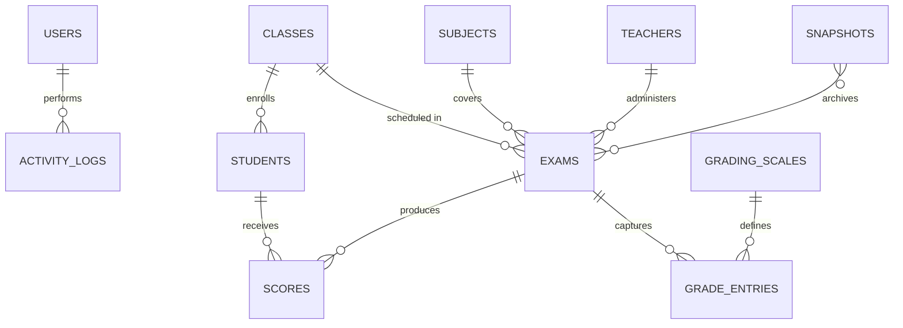

# Exam Analytics

**Offline Exam Analytics — Windows + Android**

_Companion module in the BrightPath ecosystem — desktop + tablet, fully offline, classroom-grade analysis._

---

## The Problem

Many schools in the BrightPath target market need to:

- Process **classroom assessment data** without uploading student records to a cloud (parent / regulatory comfort).
- Run on **whatever device is available** — a laptop in the principal's office, a tablet in the classroom.
- Produce **printable, PDF-ready reports** (rankings, score distributions, per-subject analytics) on demand.
- Survive complete loss of internet for weeks at a time.

BrightPath's SaaS core handles the institution-wide flow (enrollment, fees, comms); Exam Analytics is the focused tool for the teacher-level / department-level analysis subproblem.

---

## The Solution

A Flutter app targeting Windows desktop and Android, with **SQLite + drift** as the local-only data store. PIN-gated user auth (bcrypt-hashed), Riverpod for state, fl_chart for distribution visualizations, and the `pdf` + `printing` packages for native report generation.

### Tech Stack

| Layer                   | Technology                                | Rationale                                                       |
| ----------------------- | ----------------------------------------- | --------------------------------------------------------------- |
| **Framework**           | Flutter (Dart 3.3+)                       | Cross-platform UI; Windows + Android from one codebase           |
| **Database**            | SQLite via `drift` ORM                    | Embedded, fully offline, type-safe queries                       |
| **State**               | `flutter_riverpod` 2.5                    | Compile-safe reactive state, providers for repositories          |
| **Navigation**          | `go_router` 14                            | Declarative routing matching the analytics tab structure          |
| **Auth**                | `bcrypt` (pure-Dart) PIN hashing          | No cloud auth — local PIN gates access to records                |
| **PDF / Print**         | `pdf` + `printing`                        | Native PDF generation for reports + print dialogs                |
| **Charts**              | `fl_chart`                                | Score distributions, ranking visualizations                       |
| **Import / Export**     | `file_picker` + `open_filex`              | Structured imports + open exported files in OS default app       |
| **Window management**   | `window_manager`                          | Desktop minimum-size enforcement                                  |
| **Codegen**             | `freezed_annotation` + `json_annotation` + `build_runner` | Immutable models + JSON serialization                |

---

## Data Model

Tables (drift): `users`, `activity_logs`, `school_config`, `classes`, `students`, `subjects`, `teachers`, `exams`, `scores`, `grade_entries`, `grading_scales`, `snapshots`.

---

## Feature Surface

- **Authentication & permissions** — PIN-gated; per-user activity log; role-based access to feature areas (`lib/core/permissions/`).
- **Setup & school config** — first-run school metadata, class structure, grading scales.
- **Exams** — schedule, weight, grading-scale binding.
- **Scores & grading** — bulk entry, per-student edit, automated letter-grade resolution against the configured scale.
- **Analytics** — distribution charts, class-vs-class comparison, subject-level breakdowns.
- **Rankings** — per-exam and term aggregate, exportable.
- **Reports** — PDF generation via `pdf` + `printing`, printable to physical printer or saved as PDF.
- **Import / export** — file-picker driven, with snapshot table for historic backups.

---

## Key Engineering Decisions

### 1. SQLite-only, no cloud sync

**Decision**: Use drift + SQLite for the entire persistence layer. No remote API, no Firebase.

**Why?** The target deployment is "the laptop in the principal's office." Student grades are sensitive data; many target schools (and their parent communities) explicitly want them **not** in the cloud. An offline-first model removes that objection and removes the operational burden of running a server.

### 2. PIN auth via bcrypt (no cloud auth provider)

**Decision**: Local PIN with bcrypt hashing for user access. No OAuth, no SSO.

**Why?** Consistent with the no-cloud architecture. bcrypt-Dart works on every Flutter target (no native plugin issues). The activity log captures every authenticated action so post-hoc audit is possible.

### 3. Feature-folder code layout (not layer-folder)

**Decision**: `lib/features/<feature>/` mirrors the user-facing surface (exams, scores, rankings, reports, analytics, settings, setup, my_account, import_export, activity_logs, dashboard, classes).

**Why?** This is a single-purpose app with a clear domain. Layer-folder layouts (controllers/services/models) optimize for cross-feature shared code; feature-folder layouts optimize for "everything I need to change to ship a feature lives together." On a single-developer project this dramatically reduces the cognitive cost of new work.

---

## Why this is a BrightPath ecosystem module

| Dimension                | BrightPath (core SaaS)              | Exam Analytics (this)                            |
| ------------------------ | ----------------------------------- | ------------------------------------------------ |
| **Audience**             | Multi-tenant African schools        | Teachers / department heads in the same schools   |
| **Scope**                | Full school operations               | Just exam/score analysis — focused tool           |
| **Deployment**           | Cloud SaaS                          | Windows + Android, no network needed              |
| **Data sovereignty**     | Cloud-resident (RLS-isolated)       | Local-only — never leaves the device              |
| **Why it's separate**    | "Don't put grades in the cloud" is a hard constraint for some target customers; the SaaS architecture is structurally incompatible with that |

---

[← Back to BrightPath](../README.md) · [← Back to Portfolio](../../README.md)

