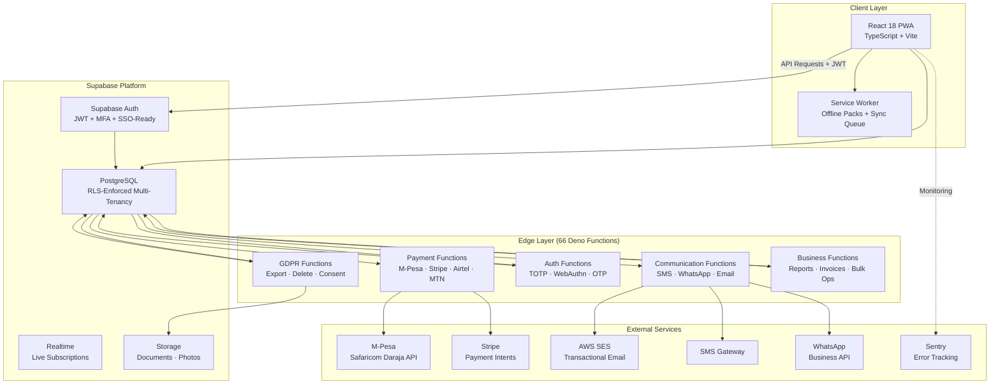
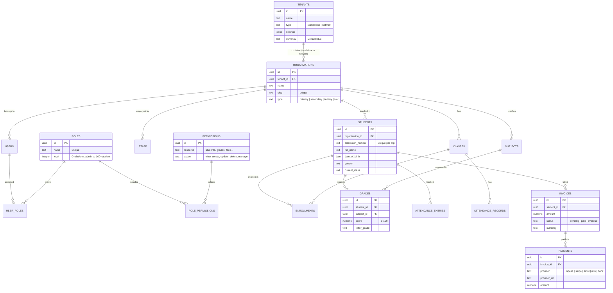
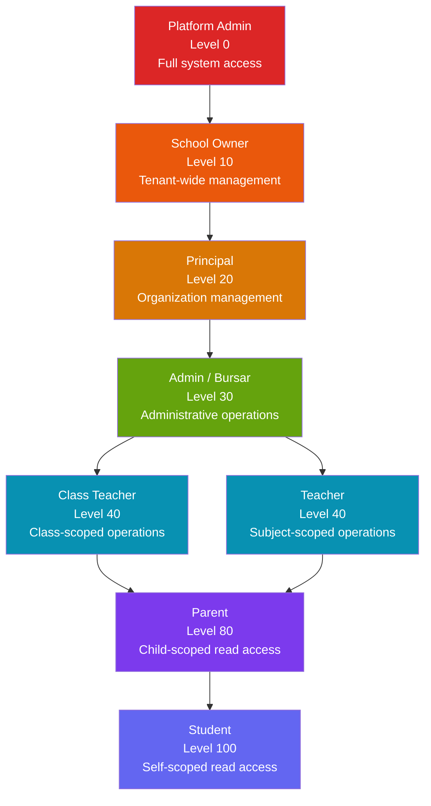
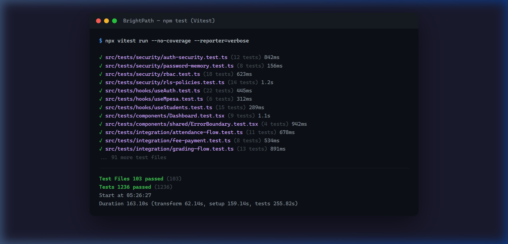

<div align="center">

# BrightPath / SchoolHub Africa

**Enterprise Multi-Tenant School Management System**

[](https://react.dev)
[](https://supabase.com)
[](https://vitest.dev)

</div>

---

## The Problem

African educational institutions — spanning primary, secondary, tertiary, and TVET — lack a unified, affordable platform for managing the full lifecycle of school operations: student enrollment, staff management, attendance tracking, grading, financial transactions (including mobile money), and parent-teacher communications.

**Key constraints:**

- Must support **multiple school types** in a single deployment (a school network may contain primary + secondary + TVET campuses)
- Must integrate **African payment providers** (M-Pesa, Airtel Money, MTN) alongside global payment rails (Stripe)
- Must comply with **African data protection regulations** (POPIA in South Africa, NDPR in Nigeria) and GDPR
- Must work **offline** (PWA) — internet connectivity in many African schools is unreliable

---

## The Solution

A production-grade, multi-tenant SaaS platform built with a modern stack optimized for the African educational context.

### Tech Stack

| Layer              | Technology                               | Rationale                                         |
| ------------------ | ---------------------------------------- | ------------------------------------------------- |
| **Frontend**       | React 18, TypeScript, Vite               | Component-based, type-safe, fast HMR              |
| **UI**             | Tailwind CSS, shadcn/ui, MUI Data Grid   | Utility-first styling + enterprise data tables    |
| **Backend**        | Supabase (PostgreSQL, Auth, RLS)         | Managed backend with database-level security      |
| **Edge Functions** | 66 Deno functions (Supabase Edge)        | Serverless business logic (payments, comms, GDPR) |
| **Payments**       | Stripe, M-Pesa (Daraja), Airtel, MTN     | Multi-provider payment orchestration              |
| **Communication**  | SMS, WhatsApp, Email (SES)               | Multi-channel parent/staff notifications          |
| **Testing**        | Vitest, Playwright, Testing Library      | Unit + E2E + accessibility testing                |
| **CI/CD**          | 11 GitHub Actions workflows              | Security, performance, accessibility, deployment  |
| **Monitoring**     | Sentry, Web Vitals, custom audit logging | Error tracking + performance + compliance         |
| **PWA**            | Workbox, Service Workers                 | Offline-first with sync queuing                   |

---

## System Architecture



---

## Database Design

The database implements **34 sequential migrations** with comprehensive Row-Level Security. The core data model supports multi-tenancy at every level.

### Entity Relationship Diagram



---

## Key Engineering Decision: RLS Over Separate Databases

**Decision**: Use PostgreSQL Row-Level Security (RLS) for tenant isolation instead of per-tenant database instances.

**Why?**

- **Cost**: Separate databases per school is prohibitively expensive in the African market. A single PostgreSQL instance with RLS provides the same isolation guarantees at a fraction of the cost.
- **Enforcement depth**: RLS is enforced at the database engine level — even a bug in the application layer cannot expose cross-tenant data.
- **Implementation scale**: 316 RLS policy references across 34 migration files. Every table with tenant-scoped data has policies that derive `tenant_id` server-side (never trusted from the client).

### RLS Policy Pattern

```sql
-- Tenant isolation: users can only see students belonging to their tenant's organizations
CREATE POLICY "tenant_isolation_select" ON students
FOR SELECT TO authenticated
USING (
    organization_id IN (
        SELECT organization_id
        FROM user_organizations
        WHERE user_id = auth.uid()
    )
);
```

**Key enforcement rule**: The `tenant_id` is derived from the authenticated user's JWT via `auth.uid()` → `user_organizations` lookup. The client never sends a `tenant_id` parameter.

---

## RBAC: Role Hierarchy

The system implements **12+ roles** with a hierarchical level system and granular `resource.action` permissions (99 RBAC-related files).



**Permission format**: `resource.action` (e.g., `students.view`, `grades.create`, `fees.manage`, `users.delete`)

---

## Payment Integration

Multi-provider payment orchestration via Supabase Edge Functions:

| Provider                      | Market              | Integration                       |
| ----------------------------- | ------------------- | --------------------------------- |
| **M-Pesa** (Safaricom Daraja) | Kenya, Tanzania     | STK Push + Webhook verification   |
| **Airtel Money**              | East/Central Africa | Payment initiation + Webhook      |
| **MTN Mobile Money**          | West/Central Africa | Payment initiation + Webhook      |
| **Stripe**                    | Global              | Payment Intents + Webhook (HMAC)  |
| **Bank Transfers**            | All markets         | Manual recording + reconciliation |

---

## Testing & CI/CD

### Testing Stack

| Type              | Tool                | Scope                                  |
| ----------------- | ------------------- | -------------------------------------- |
| **Unit**          | Vitest              | Component logic, hooks, utilities      |
| **Integration**   | Testing Library     | Component rendering, user interactions |
| **E2E**           | Playwright          | Full user flows, cross-browser         |
| **Accessibility** | axe-core + jest-axe | WCAG compliance scanning               |
| **Performance**   | Lighthouse Budget   | Bundle size + Web Vitals               |

### CI/CD Pipeline (11 GitHub Actions Workflows)

| Workflow                | Trigger         | Checks                          |
| ----------------------- | --------------- | ------------------------------- |
| `ci-comprehensive.yml`  | PR to main      | Lint + typecheck + test + build |
| `security-scan.yml`     | Push            | Dependency audit + SAST         |
| `accessibility.yml`     | PR              | axe-core accessibility checks   |
| `performance.yml`       | PR              | Lighthouse budget + bundle size |
| `schema-validation.yml` | Push            | Database schema integrity       |
| `deploy-staging.yml`    | Push to develop | Staging deployment              |
| `deploy-production.yml` | Push to main    | Production deployment           |



---

## Compliance & Data Protection

| Regulation               | Implementation                                                                                                 |
| ------------------------ | -------------------------------------------------------------------------------------------------------------- |
| **GDPR**                 | Consent management, right to erasure, data export (via `gdpr-export-data` + `gdpr-delete-data` edge functions) |
| **POPIA** (South Africa) | Data minimization, purpose limitation, security safeguards                                                     |
| **NDPR** (Nigeria)       | Data processing consent, cross-border transfer controls                                                        |
| **Audit Trail**          | Comprehensive `audit_logs` table: action, resource, user, changes (JSONB before/after), IP address, timestamp  |

---

## Offline-First (PWA)

The application implements a Progressive Web App with:

- **Workbox Service Worker** for asset caching and offline capability
- **Offline Packs** (pre-bundled data sets per school) for low-connectivity environments
- **Sync Queue** for operations performed offline — automatically replayed when connectivity returns

---

<div align="center">

[← Back to Portfolio](../README.md)

</div>
