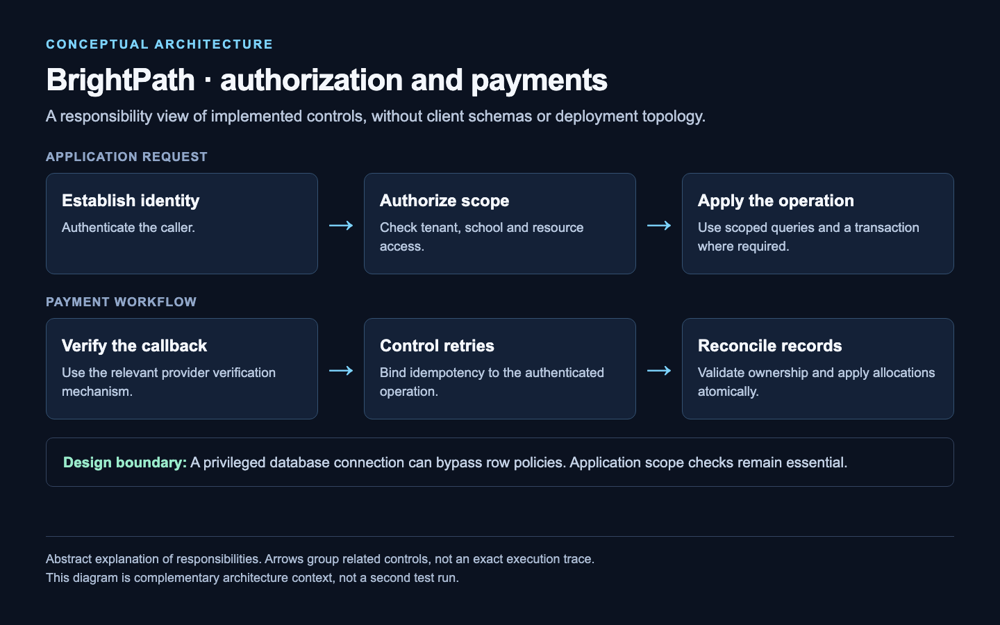
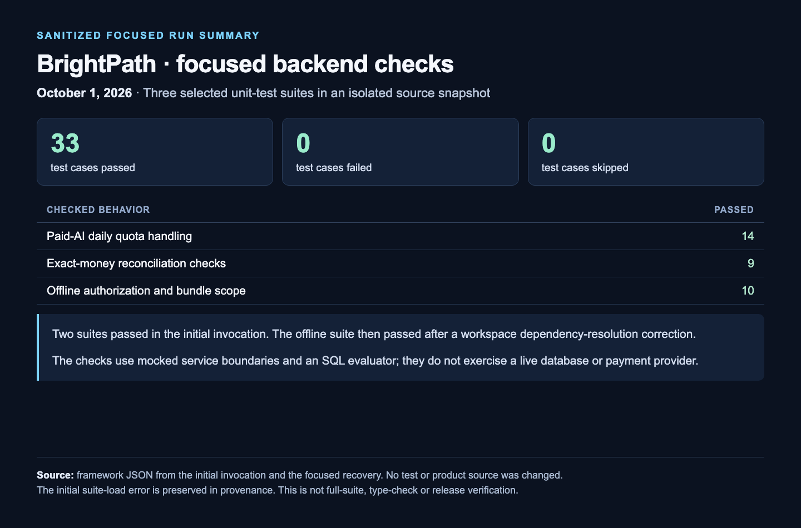
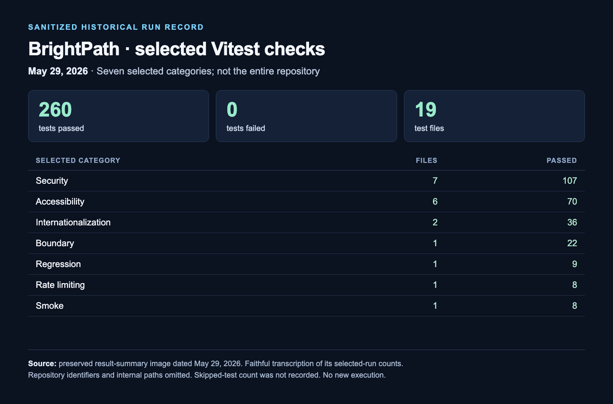

# BrightPath

**Client engagement: school operations, payments and parent communication**

**My role:** Full-Stack & Security Engineer; primary engineer. **Period:** April 2025 to present. **Source:** Private.

## Client problem and my responsibility

School staff need enrollment, grades, attendance, fees and parent communication to stay connected across schools, roles and devices. I worked across the React portal, NestJS business API, database authorization and Flutter client surfaces.

My deliverables include shared TypeScript/Dart API contracts, tenant-aware application workflows, payment retry/reconciliation logic and security test workflows. The platform remains under active development, with release gates still in place.

## Architecture in context

The diagram is a conceptual view of responsibilities, not a client deployment map or database schema.

**Technology:** TypeScript, React, NestJS, Flutter/Dart, Prisma, PostgreSQL and Supabase.

## Engineering decisions

### Enforce scope before a privileged query

A privileged Prisma connection can bypass database row policies. I therefore kept tenant, school and resource checks explicit in the API, using validated identity and authorized membership before accessing a record. RLS provides an additional boundary for database roles that enforce it; it cannot correct a missing application predicate on a bypass connection.

The application uses 12+ roles with granular capabilities. Role metadata organizes the model, while actual assignment and access decisions use explicit permissions. Client-supplied identifiers do not establish ownership by themselves.

### Make payment retries predictable

Idempotency records bind a request fingerprint to the authenticated principal, reserve work atomically, replay completed responses and reject work still in progress. This connects a retry to the original operation instead of treating every callback or repeat request as a new payment.

Invoice and payment reconciliation shares a database transaction and validates tenant/school ownership before applying allocations. These are implemented consistency controls, not a claim about payment volume or financial outcomes.

### Match verification to each provider

The integration surface includes M-Pesa Daraja, Airtel Money, MTN Mobile Money and Stripe. Verification mechanisms differ: Stripe signatures, an Airtel callback token and an MTN status re-query address different provider contracts. A single generic webhook-signature rule would not describe the implementation accurately.

### Separate shared contracts from client behavior

Generated TypeScript/Dart contracts help keep web and mobile API usage aligned. Offline work includes cached assets, school data packs and replay-queue behavior, with authorization and reconciliation still required when operations reach the server.

### Recover imports without inventing an outcome

A provider response or checkpoint acknowledgement can be lost after an effect occurs. Durable imports separate execution from recording the result: bounded workers claim ownership, checkpoint each row and retain uncertain effects for reconciliation. Cancellation cannot erase an unresolved effect. Definitive validation failures can advance the row; ambiguous failures cannot be reported as successfully completed work.

### Gate paid AI before making the request

Drafting, translation and structured homework generation pass tenant permission and plan-entitlement checks. Quota reservations happen before the paid provider call, with tenant-day rollover and concurrent initialization handled in the reservation path. This is implemented usage control, not a measured claim about model quality or cost savings.

### Keep assessment approval consistent

Department-bound approvals and conditional state transitions govern assessment release. The release transaction also locks the associated grades; bulk publishing authorizes and locks the full set before writing. Offline preload separately limits school data by staff role, tenant, school and message participation. Cached data and replay are implemented, while broader offline and backend migration work continues.

## Testing and current stage

### Focused backend checks: October 1, 2026

Three selected unit-test suites passed **33 cases**: 14 paid-AI quota checks, nine exact-money reconciliation checks and 10 offline authorization/bundle-scope checks. Final executed scopes had 0 failed and 0 skipped cases.

The first invocation passed the quota and money suites but could not load the offline suite because the isolated snapshot lacked workspace dependency resolution. After correcting that resolution, only the interrupted suite was rerun and passed; product source and assertions were unchanged. These are source-bound diagnostic unit checks using mocked service boundaries and an SQL evaluator, not live database/provider, full-suite or release verification.

An additional focused import-outcome suite passed **10 cases**, with 0 failures/skips. It checks authorization changes, definitive row rejection, uncertain provider responses and failed checkpoints using injected stores and executors. Together the four selected suites account for **43 passing cases**; the image above covers its stated first three scopes. This additional run is not a live database recovery test.

### Historical selected Vitest summary

A preserved **May 29, 2026** Vitest summary records **260 passing tests and 0 failures in 19 files**, across seven selected categories: security, accessibility, internationalization, boundary, regression, rate limiting and smoke. Skipped-test count was not recorded.

The image is a faithful transcription of the recorded summary with repository identifiers and internal paths omitted. It represents the selected historical run; the architecture image above is complementary context, not a second test result.

Configured security work includes authorization/consent tests, Semgrep, gitleaks, dependency auditing and scheduled/manual ZAP workflows. Configuration and authored tests do not by themselves establish a clean deployed system. The separately published Juice Shop lab is not a scan of this client application.

This case presents my responsibilities and engineering decisions at an abstract level. Client source, business schemas, product screens and internal run artifacts are not published here.

## Related work

- [SchoolGrid](./SchoolGrid): browser-local timetabling.
- [Exam Analytics](./ExamAnalytics): local assessment analysis and reports.
- [Security evidence index](./security/README.md): conceptual threat model, engineering patterns and a separate training-lab assessment.

[← All case studies](../README.md)
