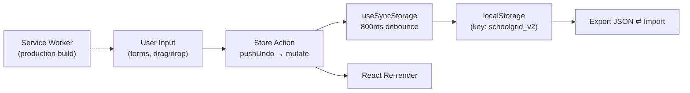

# SchoolGrid Pro

**Offline-First Timetable Generator for African Schools**

_Companion module in the BrightPath ecosystem — focused, standalone, internet-optional._

---

## The Problem

Many African schools (kindergarten through secondary) need a usable timetable tool that:

- Works **offline** — internet connectivity is unreliable in many target environments.
- Handles **flexible school structures**: nested levels → years → sections → sub-classes, with per-level break configuration (recess, lunch).
- Detects **teacher conflicts** automatically and supports **6-day weeks** (Mon–Sat).
- Costs nothing to deploy — schools deploy to any static host or run the dev server locally.

BrightPath's SaaS core covers full school administration; SchoolGrid is the focused tool for the timetabling subproblem, intentionally **backend-free**.

---

## The Solution

A React 18 + TypeScript single-page app with **localStorage-only persistence**. No server, no API calls, no auth — pure client-side. PWA-installable for offline desktop use.

### Tech Stack

| Layer            | Technology                       | Rationale                                                       |
| ---------------- | -------------------------------- | --------------------------------------------------------------- |
| **Framework**    | React 18 + Vite 7                | Fast HMR, small bundle, modern build pipeline                    |
| **Language**     | TypeScript (strict)              | Compile-time guarantees on the schedule data model               |
| **State**        | Zustand (main + undo + theme)    | Lightweight, no boilerplate, easy persistence subscriptions     |
| **Persistence**  | `localStorage` via `useSyncStorage` (800 ms debounce) | No backend — durable across sessions, exportable to JSON |
| **Validation**   | Zod                              | Type-safe import/restore from JSON backups                       |
| **Sanitization** | DOMPurify                        | All user-entered strings sanitized at the input boundary         |
| **i18n**         | react-i18next (en, fr, pt)       | Multi-language for francophone + lusophone African markets       |
| **Monitoring**   | Sentry (optional via env var)    | Production error tracking; opt-in, off by default                |
| **Tests**        | Vitest + @testing-library/react + Playwright (with `@axe-core/playwright`) | Unit, integration, E2E, accessibility |
| **CI**           | GitHub Actions: lint → typecheck → test → build → bundle-size → E2E | Full pipeline on push/PR |

---

## Architecture

**State stores (Zustand):**

- `useStore` — main app state (levels, subjects, teachers, generated grid, conflict markers)
- `useUndoStore` — snapshot stack (max 20) backing Ctrl+Z
- `useSaveStatusStore` — save indicator state machine
- `useThemeStore` — light/dark
- `useEncryptionStore` — optional AES-256-GCM for sensitive storage
- `useSyncStorage` — subscribes to changes, debounces 800 ms, persists to localStorage

---

## Key Engineering Decisions

### 1. localStorage-only (no backend)

**Decision**: Skip the API tier entirely. Persist directly to browser localStorage.

**Why?** The target user is a school administrator on an offline-prone connection running on whatever laptop is available. A backend means hosting cost, account management, and outages — none of which exist when state lives in the browser. Export/import to JSON provides the migration story between devices.

### 2. CSP enforced at the HTML level + sanitize-at-boundary

**Decision**: Restrictive Content Security Policy meta tag in `index.html` (no `unsafe-inline`, no `unsafe-eval`), plus DOMPurify on every user-text input field. Colors validated against a strict `#rrggbb` / `var(--*)` regex.

**Why?** The app accepts free-text input across school names, teacher names, subjects, and rule labels — every string is a potential XSS vector if it ever ends up in printed HTML or a future export. Sanitizing at the input boundary means downstream code can trust the data shape. CSP is verified by a Playwright E2E test (`e2e/print-csp.spec.ts`) so regressions fail CI.

### 3. Accessibility as a CI gate

**Decision**: Run `@axe-core/playwright` in `e2e/accessibility.spec.ts` on every PR.

**Why?** Public-sector and education buyers in some target markets require WCAG conformance for procurement. Gating it in CI means the bar can't slip across refactors.

---

## Testing

| Layer             | Tool                                    | Notes                                              |
| ----------------- | --------------------------------------- | -------------------------------------------------- |
| **Unit**          | Vitest                                  | Domain logic, generator strategies, validators     |
| **Component**     | @testing-library/react                  | User-interaction rendering                         |
| **E2E**           | Playwright (chromium / firefox / webkit) | Smoke, CSP, print flow                             |
| **Accessibility** | axe-core via Playwright                  | WCAG audit on key pages                            |

CI pipeline (`.github/workflows/ci.yml`): lint → typecheck → unit tests → build → bundle-size check → E2E across 3 browsers, with bundle stats uploaded as an artifact.

> Reproducible: `git clone MILTONADINA/Timetable-generator && npm install && npm test`.

---

## Why this is a BrightPath ecosystem module

| Dimension                  | BrightPath (core SaaS)                       | SchoolGrid (this)                                    |
| -------------------------- | -------------------------------------------- | ---------------------------------------------------- |
| **Audience**               | Multi-tenant African schools                 | The same African schools — single-tenant, local       |
| **Scope**                  | Full school operations (students, fees, grades, comms) | Just timetabling — focused, offline-first   |
| **Deployment**             | Cloud SaaS (Supabase + edge functions)       | Static hosting or laptop — no backend                |
| **Stack overlap**          | React + TypeScript + Zod + Vitest + Playwright | Same — same engineering vocabulary                  |
| **Why it's separate**      | Offline use case + zero-cost deployment require no backend, which is incompatible with the SaaS architecture |

---

[← Back to BrightPath](../README.md) · [← Back to Portfolio](../../README.md)

---

## In this folder
<!-- in-this-folder -->

- [`schoolgrid-vitest-passing.png`](./schoolgrid-vitest-passing.png) — 🖼️ test-run screenshot (309 tests)
