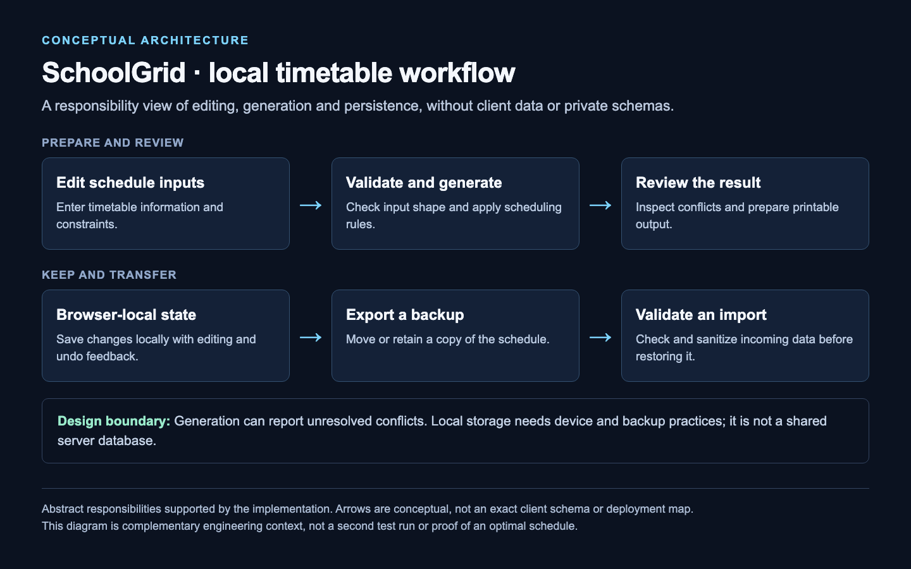
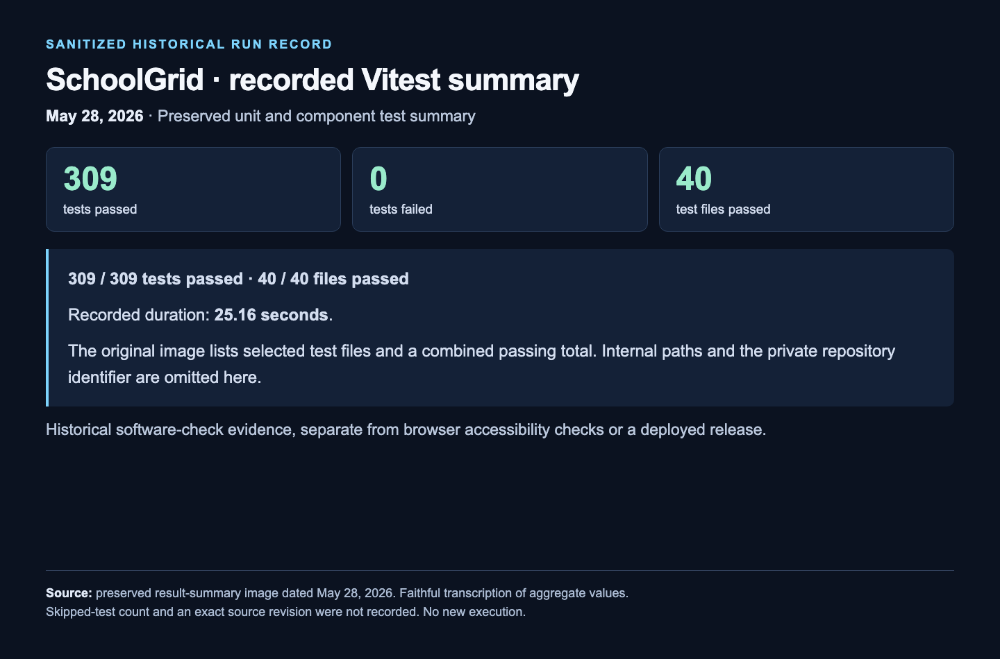

# SchoolGrid

**Related administration tool: browser-local timetabling**

School administrators need to prepare timetables and identify teacher conflicts even when connectivity is unreliable. I implemented a React/TypeScript application with browser-local persistence, import/export, timetable generation and printable output.

## Conceptual workflow

This diagram explains implementation responsibilities without client data or an internal schema. Generation can flag unresolved conflicts; the diagram does not claim an optimal schedule or represent a test run.

## Engineering decisions

- **Local state:** Keeping schedule data in browser storage avoids a required server round trip for editing. Export/import provides a way to move or back up data; browser storage still needs appropriate device and backup practices.
- **Input and output boundaries:** Validation and sanitization address imported/user-entered content. CSP checks target the generated print surface, where a separate browser window creates an additional rendering boundary.
- **State and recovery:** Dedicated state responsibilities support editing, undo behavior and save feedback without exposing the underlying client data structure here.
- **Accessibility:** Playwright and axe-core checks cover selected rendered pages and themes. Automated checks are scoped evidence, not a claim of complete WCAG conformance.

**Technology:** React, TypeScript, Vite, Zustand, Zod, DOMPurify, Vitest and Playwright.

## Historical evidence

The preserved **May 28, 2026** summary records **309 passing tests, 0 failures and 40 passing files**, with a reported duration of **25.16 seconds**. Skipped-test count and an exact source revision were not recorded.

This image faithfully transcribes the original summary's aggregate values. Private repository identifiers and internal test paths are omitted. It is historical unit/component-test evidence, not a new run, browser-accessibility result or release verification. The private source and product interface remain confidential.

SchoolGrid is related to BrightPath by its school-administration use case; it is a separate browser-local tool rather than a shared deployment of the SaaS backend.

[← BrightPath](../README.md) · [All case studies](../../README.md)
