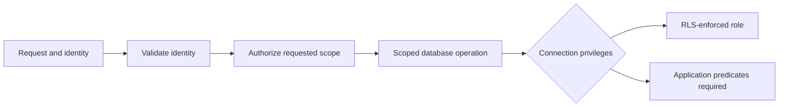

# Application Security Patterns

These are abstract engineering patterns from my application work. They explain control placement and tradeoffs without reproducing client code, business schemas or operational settings. The [evidence index](./README.md) distinguishes these design notes from the separate Juice Shop training assessment.

## Identity and authorization are separate checks

Provider authentication establishes who is making a request. The application must still decide whether that identity can access the requested account, tenant, school or record. Server handlers apply membership, role and resource checks before querying or changing data; interface visibility is not an authorization boundary.

For CMS work, authenticated staff membership gates mutations. For multi-tenant APIs, a caller-supplied record ID still needs an ownership check. Native device-owner authentication is a separate feature gate and does not establish account identity or age.

## Database privileges affect row-policy protection

PostgreSQL row policies apply to roles that enforce them. A privileged backend connection can bypass RLS, which makes application predicates a critical boundary. Policy counts and ORM use do not prove tenant isolation.

This is a conceptual distinction, not a representation of a client's deployment or exact policies.

## Validate data at the boundary that consumes it

Input schemas constrain accepted request shapes. Parameterized queries address query construction; escaping and sanitization address content rendering. Rich-text handling needs an explicit policy because markup has a different risk profile from plain text.

Schema validation does not establish authorization or prove that every accepted value is nonsensitive. The operation still needs caller checks and appropriate data minimization.

## Make retries and external events explicit

Payment idempotency can bind a request fingerprint to the authenticated caller, reserve work and replay a completed result. Transactional reconciliation keeps related database updates together.

Webhook authentication follows the provider's contract. Signature checks, callback tokens and provider status queries are different mechanisms. Replay protection and event-processing state need separate treatment; a verified callback alone does not prove exactly-once processing.

## Apply privacy controls through concrete mechanisms

Versioned field encryption separates stored ciphertext from the operator's current key choice. Signed reads keep private report access bounded. Application-role restrictions can prevent updates/deletions through that role while leaving database-administrator access as a separate trust boundary.

Consent, export and erasure are workflows with user requests, authorization and data operations. Their implementation supports privacy engineering; it is not by itself a legal-compliance determination.

## Use automation as scoped evidence

| Control family | Purpose | Evidence boundary |
|---|---|---|
| Semgrep | Identify selected source patterns and rule violations. | Rules and findings do not prove absence of vulnerabilities. |
| gitleaks | Detect configured secret patterns in repository content/history. | Rotation and response to an exposed secret remain operational work. |
| Dependency audit and SBOM | Surface dependency findings and describe components. | A generated inventory is not a remediation or clean-runtime result. |
| Browser/CSP/accessibility tests | Assert specific page and response behaviors. | Coverage depends on the pages, states and assertions exercised. |
| Rate limiting | Bound selected request flows. | Per-process limits do not become distributed or volumetric protection. |
| ZAP baseline | Spider and passively inspect a target. | The published result here is a local Juice Shop lab only. |

Client workflow/source excerpts are not included. The [STRIDE design note](./threat-models/BrightPath-STRIDE-threat-model.md) identifies trust boundaries and follow-up verification needs; the [lab assessment](./scans/OWASP-JuiceShop-ZAP-assessment.md) contains the independent training run.

[← Security evidence](./README.md) · [All case studies](../../README.md)
