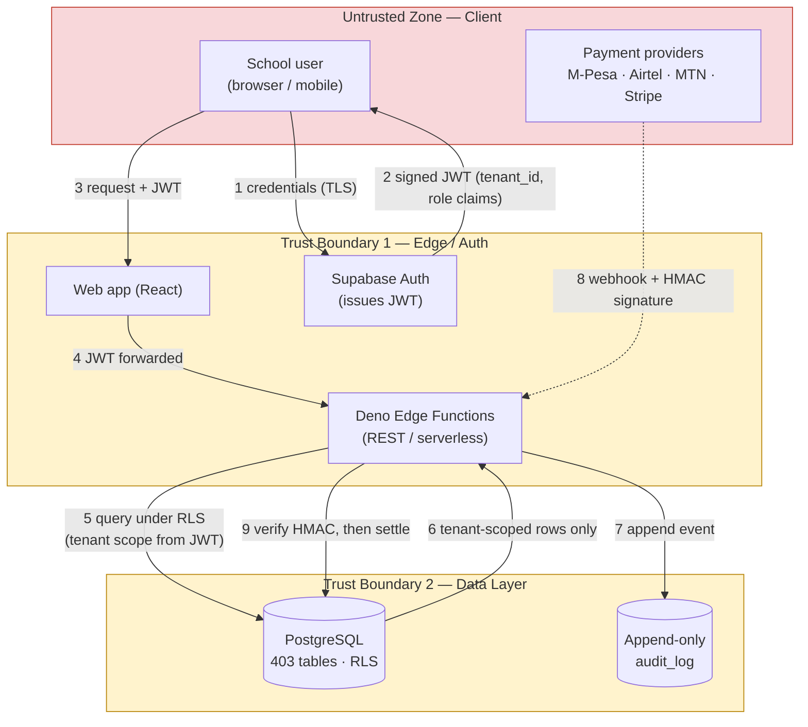

# BrightPath — STRIDE Threat Model & Data-Flow Diagram

> **Scope & disclaimer.** BrightPath is a multi-tenant school-management SaaS built for a private
> client; **source code is not public**. This document is a *sanitized* security-design artifact —
> it describes the architecture, trust boundaries, and the STRIDE analysis of the controls that
> were actually implemented. No client data, secrets, tenant identities, or proprietary code are
> included. Diagrams and control descriptions are reconstructed from the production architecture.
>
> Author: Milton Adina Shisia · Method: Microsoft STRIDE over a data-flow diagram (DFD) with
> explicit trust boundaries.

---

## 1. System overview

BrightPath is a multi-tenant SaaS where each tenant is a school. The security model rests on three
load-bearing decisions:

1. **Tenant scope is derived server-side from the JWT** — never read from a request body, header, or
   query parameter the client controls.
2. **Authorization is enforced in the database** via PostgreSQL Row-Level Security (RLS) — 1,063
   policies across 403 tables — so a missed check in application code cannot leak cross-tenant data.
3. **The audit log is append-only at the data layer** (`REVOKE UPDATE, DELETE`), proven by an
   automated immutability test, so security-relevant events cannot be silently rewritten.

## 2. Data-flow diagram (with trust boundaries)

**Trust boundaries**
- **TB-0 (client → edge):** everything from the browser/mobile/payment-provider is untrusted.
- **TB-1 (edge → data):** the edge layer authenticates the caller and forwards the JWT; it never
  fabricates tenant scope.
- **TB-2 (data layer):** RLS is the final, authoritative authorization gate.

## 3. STRIDE analysis

Each row maps a threat to the **element/flow** it targets, the **implemented control**, and a
**residual-risk** note.

### S — Spoofing (identity)
| # | Threat | Control implemented | Residual risk |
|---|--------|---------------------|---------------|
| S1 | Attacker impersonates a user | Supabase Auth issues short-lived signed JWTs over TLS; passwords hashed with bcrypt | Phishing of end-user credentials (out of app scope) → mitigated by short token TTL |
| S2 | Forged/altered JWT to change `tenant_id` or `role` | JWT signature verified server-side; tenant scope + role read **only** from verified claims, never from client input | Key compromise → mitigated by rotation + secrets kept out of source |
| S3 | Spoofed payment webhook | **HMAC signature verification** on every M-Pesa/Airtel/MTN/Stripe webhook before any state change | Replay → mitigated by event-id idempotency |

### T — Tampering (data integrity)
| # | Threat | Control implemented | Residual risk |
|---|--------|---------------------|---------------|
| T1 | Client tampers with `tenant_id`/`role` in the request | Server **ignores** client-supplied tenant scope; derives it from the JWT | Low |
| T2 | Direct cross-tenant row modification | RLS `USING` + `WITH CHECK` policies on all 403 tables bind every read/write to the JWT tenant | Policy gap → mitigated by RLS regression tests in CI |
| T3 | Tampering with audit history | `REVOKE UPDATE, DELETE` on `audit_log`; append-only, enforced by an **immutability test** | DB-superuser abuse (operational, not app-surface) |

### R — Repudiation (non-deniability)
| # | Threat | Control implemented | Residual risk |
|---|--------|---------------------|---------------|
| R1 | User denies a security-relevant action | Append-only audit log records actor, tenant, action, timestamp | Clock skew → server-authoritative timestamps |
| R2 | Disputed payment settlement | Webhook events + settlement writes are logged immutably | Provider-side disputes (external) |

### I — Information disclosure (confidentiality)
| # | Threat | Control implemented | Residual risk |
|---|--------|---------------------|---------------|
| I1 | Cross-tenant data leak (the #1 multi-tenant risk) | **RLS as the authoritative gate** — a missed app-layer check still cannot return another tenant's rows | New table without RLS → CI check fails build |
| I2 | Secret leakage in repo | **gitleaks** secret scanning in CI; secrets in env, not source | Pre-existing committed secret → remediate + rotate (see notes) |
| I3 | Over-broad child-data exposure (COPPA) | Consent/age-gate flows tested with custom Playwright scripts; data-minimized queries | Policy drift → covered by E2E suite |
| I4 | PII in logs | Structured logging excludes PII fields | Accidental log of payload → review in PR |

### D — Denial of service (availability)
| # | Threat | Control implemented | Residual risk |
|---|--------|---------------------|---------------|
| D1 | Endpoint abuse / floods | Rate-limited API endpoints | Volumetric L3/4 (infra/CDN concern) |
| D2 | Expensive unbounded queries | Pagination + indexed, tenant-scoped queries | Hot-tenant skew → monitoring |

### E — Elevation of privilege
| # | Threat | Control implemented | Residual risk |
|---|--------|---------------------|---------------|
| E1 | Horizontal escalation (act as another tenant) | Tenant scope from JWT + RLS; no client-controlled tenant id | Low |
| E2 | Vertical escalation (low role → admin action) | 12+ hierarchical roles enforced in RLS `WITH CHECK`, not just UI | Role-mapping bug → authorization tests |
| E3 | Vulnerable dependency → RCE | Dependency **CVE auditing** + **Semgrep** SAST + **OWASP ZAP** baseline in CI/CD | Zero-day → SBOM (CycloneDX) enables fast triage |

## 4. Control-to-threat coverage summary

| Control | Threats it addresses |
|---------|----------------------|
| JWT-derived server-side tenant scope | S2, T1, I1, E1 |
| PostgreSQL Row-Level Security (1,063 policies) | T2, I1, E1, E2 |
| Append-only audit log (`REVOKE UPDATE/DELETE` + immutability test) | R1, R2, T3 |
| HMAC webhook verification | S3, R2 |
| CI/CD AppSec gate (Semgrep, gitleaks, OWASP ZAP, CVE audit, CycloneDX SBOM) | I2, E3 |
| Rate limiting + pagination | D1, D2 |
| Playwright consent/age-gate tests (COPPA) | I3 |

## 5. Top residual risks & next actions
1. **Secrets hygiene:** rotate any historically-committed secret and confirm `.env` is git-ignored. *(Tracked.)*
2. **RLS coverage as an invariant:** keep the "every table has RLS" check as a hard CI gate so new tables can't ship unprotected.
3. **Webhook replay:** ensure event-id idempotency keys are enforced for all four payment providers.

---
*STRIDE methodology: Microsoft Threat Modeling (Spoofing, Tampering, Repudiation, Information
disclosure, Denial of service, Elevation of privilege). This artifact documents design-level
controls only; it contains no client data or proprietary source.*
