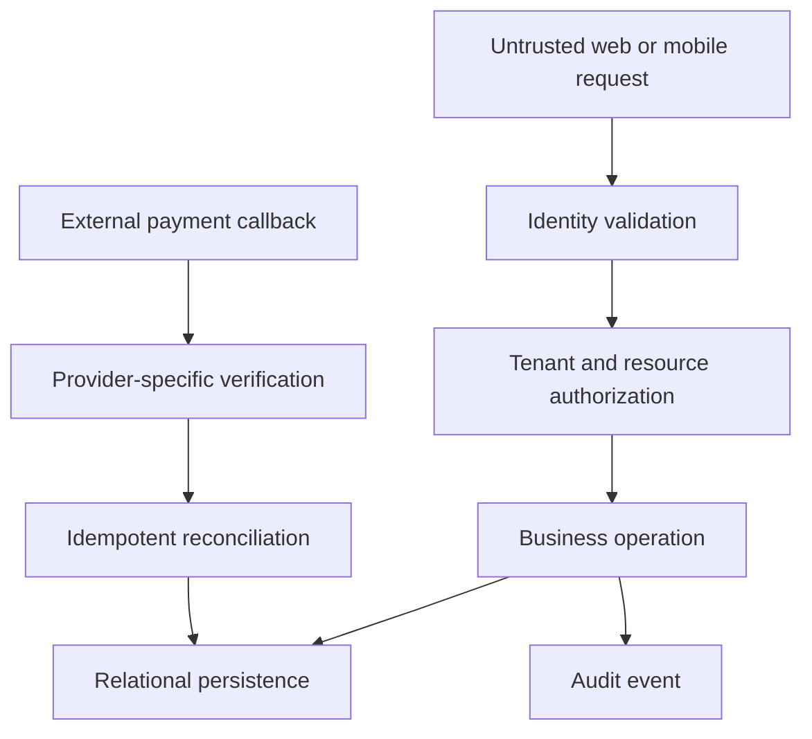

# STRIDE Threat Model: School-Platform Authorization

**Author:** Milton Adina Shisia. **Method:** STRIDE applied to a conceptual data-flow diagram.

This design note summarizes trust boundaries considered in my BrightPath work. It uses abstract components rather than the client's schema, source, deployment configuration or records. The table distinguishes implemented control families from operational checks that still need evidence.

## System and trust boundaries

Authenticated web/mobile requests reach a business API. The API validates identity and authorizes the requested tenant, school and resource before using privileged database access. Row policies provide a separate boundary for database roles that enforce RLS.

```mermaid
flowchart TB
    User[Untrusted web or mobile request] --> Auth[Identity validation]
    Auth --> Scope[Tenant and resource authorization]
    Scope --> API[Business operation]
    API --> DB[Relational persistence]
    API --> Audit[Audit event]
    Provider[External payment callback] --> Verify[Provider-specific verification]
    Verify --> Payment[Idempotent reconciliation]
    Payment --> DB
```

- **Client to API:** Request fields and identifiers are untrusted. A requested scope must be authorized against validated identity and membership.
- **API to database:** Privileged connections can bypass RLS, so application predicates remain essential.
- **Provider to application:** Callback verification and replay handling are separate checks.
- **Application to audit storage:** Caller privileges, event completeness, retention and administrator access each need consideration.

## STRIDE analysis

| Category | Threat | Control family | Residual risk and verification boundary |
|---|---|---|---|
| Spoofing | Impersonation using stolen credentials or tokens | Provider authentication and server-side token validation. | Short token lifetime limits some replay exposure; it does not prevent phishing. MFA, revocation and recovery depend on identity-provider configuration. |
| Spoofing | Altered token or unauthorized requested scope | Validate token integrity and establish authorization from identity/membership. | Signing-key custody/rotation and scope derivation need configuration and handler review. |
| Spoofing | Forged payment callback | Provider-specific callback verification and request/event handling. | Review each provider contract; do not assume every provider uses an HMAC signature. |
| Tampering | Cross-tenant record changes | Explicit tenant/school/resource predicates; RLS for non-bypass roles. | A missing predicate on a privileged connection is not repaired by row policies. |
| Tampering | Changed audit history | Restrict direct client-role access and control audit writes. | Backend and database-administrator privileges remain separate trust boundaries. |
| Repudiation | Disputed action or payment | Actor/action event records and transaction-scoped reconciliation. | Event completeness, retention, storage access and provider-side disputes need operational verification. |
| Information disclosure | Unauthorized record access | Server-side ownership checks and scoped queries. | Review endpoint coverage, stale membership and privileged data paths. |
| Information disclosure | Secrets in source/history | Configured secret scanning and environment-based configuration. | Scanner coverage is not proof of clean history; an exposed secret requires response and rotation. |
| Information disclosure | Sensitive information in logs | Data-minimization requirements and explicit logging boundaries. | Field population, caller payloads, redaction and log sinks need review. Universal PII exclusion is not established. |
| Denial of service | Excessive requests or expensive queries | Selected request limits, pagination and query-design controls. | Endpoint coverage, distributed limiting, query plans and infrastructure capacity require separate verification. |
| Elevation of privilege | Caller accesses another user's or higher-role operation | Server-side role/resource checks; interface guards remain presentation controls. | Role mappings, ownership predicates and direct invocation paths need testing. |
| Elevation of privilege | Vulnerable dependency or unsafe code path | Configured dependency checks, SAST and component inventory. | Configuration is not proof of remediation or a clean runtime. The published ZAP run targets Juice Shop only. |

## Follow-up checks

1. Review tenant/resource predicates together with actual connection privileges, rather than treating policy counts as coverage.
2. Confirm identity-provider token lifetime, MFA, revocation and recovery settings for each deployed surface.
3. Review callback verification and idempotency against each provider's contract and retry behavior.
4. Check logging call sites, sensitive fields, retention and storage access before making an operational assurance claim.
5. Keep deployment and configuration verification separate from source/design review and training-lab results.

[← Security evidence index](../README.md) · [BrightPath case](../../README.md)
