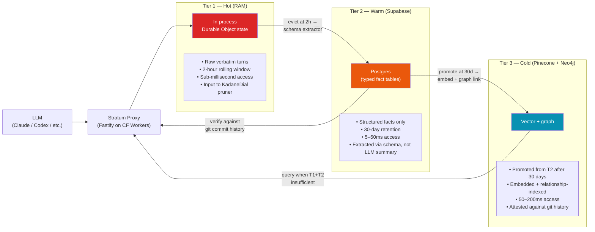
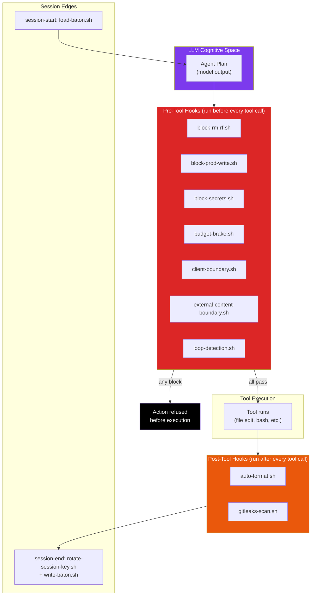

<div align="center">

# DevOPs + Stratum

**Agent Operating System and Memory Backend**

_A verification-first DevOps workflow for AI coding agents — and the context-pruning memory backend that powers it._

[](https://www.typescriptlang.org)
[](https://workers.cloudflare.com)
[](https://www.rust-lang.org)
[](https://supabase.com)

</div>

---

## Status

**Active development.** DevOPs is the productized surface; Stratum is the memory + context-pruning backend it depends on. Both private; both treated as a single project for resume + portfolio purposes.

---

## The Problem

Across 591 documented production agent failures (2023 – 2026), **88% trace to infrastructure gaps, not model quality.** The recurring failure modes:

| Rank | Failure mode          | Share | Representative incident                                                                |
| ---- | --------------------- | ----- | -------------------------------------------------------------------------------------- |
| 1    | Context Blindness     | 31.6% | Agent forgets a decision made 50 turns ago                                              |
| 2    | Rogue Actions         | 30.3% | Production environment deleted by an agent; 13-hour outage                              |
| 3    | Silent Degradation    | 24.9% | Output quality drifts week-over-week, unnoticed                                         |
| 4    | Memory Corruption     | 8.1%  | Persistent memory poisoned by adversarial input                                         |
| 5    | Runaway Execution     | 5.1%  | Subagent burned 27M tokens in a 4.6-hour infinite loop                                  |

Production coding agents — Claude Code, Codex CLI, Cursor, Antigravity, Kiro, Gemini CLI, Copilot, Windsurf — each ship their own version of the cognitive layer (the model + tool use). They do **not** ship the verification-first infrastructure layer that prevents these failure modes. DevOPs is that layer.

---

## Architectural Solution

Two tightly-coupled artifacts:

### DevOPs — the productized surface

A self-configuring operating system for coding agents, deployable on any of the listed tools via standard formats (`CLAUDE.md`, `AGENTS.md`, `.cursorrules`, SKILL.md).

```
                ┌──────────────────────────────────────┐
                │  Your code, your project             │
                ├──────────────────────────────────────┤
                │  Skills (model-invoked playbooks)    │ ← Tier 3 stack-specific
                │  Subagents (specialized roles)       │
                │  Slash commands                      │
                ├──────────────────────────────────────┤
                │  Constitution (immutable principles) │ ← Tier 1 universal
                │  Modes & Lifecycle states            │
                │  Universal process skills            │
                ├──────────────────────────────────────┤
                │  Hooks (deterministic, always fire)  │ ← Safety floor
                │  Budget brakes, loop detection       │
                │  Pre/post-tool, session-start/end    │
                ├──────────────────────────────────────┤
                │  Memory: Stratum + Zep + file-based  │ ← Persistence
                │  Verification: claim-validator       │
                │  Observability: Langfuse + OTel      │
                └──────────────────────────────────────┘
```

The Constitution sits **above** every skill and **below** every action. Hooks execute **outside the LLM cognitive space** — they fire regardless of what the agent intends.

### Stratum (CQ) — the memory backend

A high-fidelity middleware proxy between the agent and the LLM API. Prunes irrelevant context using a **CQ-Extended KadaneDial** algorithm (extending DyCP, [arXiv:2601.07994](https://arxiv.org/abs/2601.07994)), stores history as attested structured facts (not lossy summaries), and verifies the agent's memory against git commit history in real time.

- **Tier 1:** working memory (current session)
- **Tier 2:** episodic memory (captured sessions awaiting promotion)
- **Tier 3:** ground-truth memory (promoted, attested, verifiable)

### Three-Tier Memory Pipeline



> **Design principle**: every promotion step writes **structured facts**, never LLM summaries. Schema-based extractor converts raw exchanges into typed records (`FunctionDeprecation`, `PolicyUpdate`, `TechDecision`, …). Each fact is a hard, auditable data point — wrong facts are caught by the audit engine; "vaguely right" summaries never enter the system.

### Hooks as a Deterministic Safety Floor



The hook layer sits **outside** the LLM cognitive space. The Constitution sits **above** every skill and **below** every action. You cannot ask the agent if it's about to break things — you must prove it mathematically. The hook names in this diagram are the real files at `hooks/universal/{pre,post,session-start,session-end}/`.

---

## Tech Stack

| Layer            | Technology                              | Rationale                                                                |
| ---------------- | --------------------------------------- | ------------------------------------------------------------------------ |
| **Proxy**        | TypeScript on Fastify                   | Production-grade HTTP; first-class plugins for rate limit + CORS         |
| **Edge runtime** | Cloudflare Workers (wrangler)            | Global low-latency, JS-native, fits the proxy shape                     |
| **Hot path**     | Rust + WASM (`rust/hot-path`)            | Tokenizer + scoring on the critical path — every microsecond counts     |
| **Datastores**   | Supabase Postgres · Pinecone · Neo4j     | Structured + vector + graph for three-tier memory                       |
| **Inference**    | ONNX Runtime (Node)                      | Local relevance scoring; no cloud round-trip                            |
| **Provider SDK** | Anthropic SDK + tokenizer                | Direct provider integration                                              |
| **Validation**   | Zod                                      | Schema-validated proxy boundary                                          |
| **Observability**| Langfuse + OpenTelemetry                 | Token spend, prune-rate, drift detection                                 |

---

## Key Engineering Decisions

### 1. Constitution + Hooks as a safety floor *outside* the LLM

**Decision:** The Constitution and deterministic hooks execute regardless of what the agent decides to do. Hooks intercept pre-tool, post-tool, session-start, and session-end, and can refuse, modify, or terminate.

**Why?** You cannot ask an agent if it is in a loop — you must prove it mathematically. Asking the model to police itself fails predictably and asymmetrically (it fails worst when it's broken). Hooks are written in deterministic code that doesn't depend on the model's cognition.

### 2. Three-tier memory with attestation, not summary

**Decision:** Memory promotes through Tier 1 (working) → Tier 2 (episodic) → Tier 3 (ground-truth), with each Tier 3 entry attested against an external source (git commit history, file hashes).

**Why?** Summaries-of-summaries hallucinate compoundingly over months. Attestation against an external source converts "the agent thinks decision X was made" into "decision X was made at commit `abc1234` because the diff says so." This is the fix for **Context Blindness** and **Memory Corruption** simultaneously.

### 3. Extend DyCP — don't roll a new algorithm

**Decision:** The CQ-Extended KadaneDial pruning algorithm extends DyCP (arXiv:2601.07994) rather than starting from scratch.

**Why?** Building on a published, peer-evaluated algorithm gives the system an anchored evaluation surface (the paper's benchmarks become the baseline) and a credibility surface (the algorithm is not "trust me, it works").

### 4. Universal portability via standard formats

**Decision:** Single install works across Claude Code, Codex CLI, Cursor, Antigravity, Kiro, Gemini CLI, Copilot, Windsurf, and local LLMs — via standard `CLAUDE.md`, `AGENTS.md`, `.cursorrules`, and SKILL.md formats.

**Why?** Lock-in to one agent tool is a strategic dead end: tools come and go on a quarterly cadence. The investment in DevOPs has to survive the tool churn. Standard formats are the only stable surface.

### 5. Cloudflare Workers for the proxy, Rust + WASM for the hot path

**Decision:** Workers host the bulk of the proxy. The tokenization + scoring inner loop is Rust compiled to WASM, called from Workers.

**Why?** The proxy is on the critical path of every LLM request — latency budget is tight. Rust hot-path code lets the latency-sensitive work happen in microseconds, while keeping the orchestration layer in TypeScript where iteration speed matters more.

### 6. Token-arbitrage pricing

**Decision:** Charge 20% of measured token savings — never more than the customer saves.

**Why?** Aligns incentives perfectly: if Stratum stops saving tokens, the customer stops paying. This is the only pricing model where the vendor's incentives match the customer's.

---

## Documentation Surface

DevOPs and Stratum together carry an extensive doc surface, including:

- `docs/BLUEPRINT.md` — full system architecture, data flow, invariants
- `docs/TECHNICAL_SPEC.md` — TypeScript interfaces, Postgres DDL, data models
- `docs/MEMORY_ARCHITECTURE.md` — three-tier memory design
- `docs/ALGORITHM.md` — CQ-Extended KadaneDial formal specification
- `docs/SECURITY.md` — ZK-Context and TEE architecture
- `docs/AUDIT_ENGINE.md` — git-attestation and escalating audit logic
- `docs/EVAL_FRAMEWORK.md` — pruning accuracy measurement methodology
- `docs/ROADMAP.md` — phase-by-phase build plan with acceptance criteria
- `docs/BUSINESS_MODEL.md` — token-arbitrage pricing and revenue projections
- `docs/PITCH.md` — one-page investor brief
- `docs/GLOSSARY.md` — authoritative definition of all project terms

---

<div align="center">

[← Back to Portfolio](../README.md)

</div>
