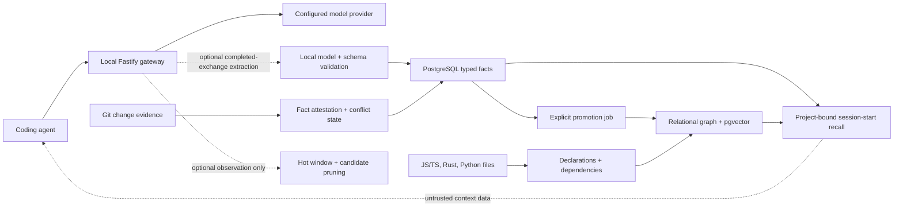
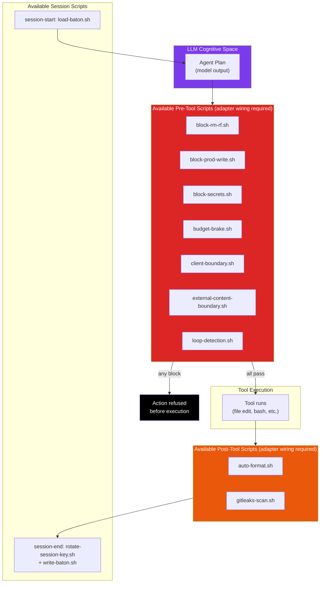

<div align="center">

# DevOPs

**Open-Source Agent Workflow and Integrated Local Runtime**

_A verification-first DevOps workflow for AI coding agents, with an integrated proxy, structured memory, and an experimental context-pruning pipeline._

[](https://www.typescriptlang.org)
[](https://github.com/MILTONADINA/DevOPs/tree/main/runtime)
[](https://github.com/MILTONADINA/DevOPs/blob/3ac20df17ebfc8e7f1614c23a1bbeecbaff7084e/runtime/rust/hot-path/src/lib.rs)
[](https://github.com/MILTONADINA/DevOPs/tree/main/runtime)

</div>

---

## Project and ownership

**Independent open-source project · Systems Engineer · 2026 to present**

I built DevOPs as a repository-aware workflow and local memory runtime for developers using coding agents. My implementation includes a multi-role coding workflow, completion-claim records, a model gateway, typed memory, source dependency graphs, Git-backed fact checks and the Claude Code adapter.

**Active development.** DevOPs includes an integrated backend under [`runtime/`](https://github.com/MILTONADINA/DevOPs/tree/main/runtime). The [source repository](https://github.com/MILTONADINA/DevOPs) is MIT-licensed. The current direction is one local-first platform, with no hosted service or project subscription. Existing billing-code removal remains in progress. **Claude Code is the implemented adapter**; other agent adapters remain planned.

**Current engineering:** proof-of-work validation binds claims to reproducibility hashes and exit-code evidence; typed memory uses server-trusted foreign-key injection and fail-closed validation; the proxy supports provider-specific usage measurement; and the project analyzer recommends tools from manifest and README indicators. Those recommendations do not establish compliance or resolve unknown security risks. [PR #219](https://github.com/MILTONADINA/DevOPs/pull/219) restricts the local proxy to loopback by default. The KadaneDial pruner remains **shadow-mode**, pending passing judged evaluation; the normal message route forwards the full request. [Fresh scoped checks](verification-2026-10-01.md) cover memory, retrieval, source indexing, provider resolution and Jev failure judgments.

---

## The Problem

Developers need to inspect an agent's work, preserve useful context and control retries across a session. The workflow addresses those needs through explicit records, memory boundaries and configurable checks.

| Failure mode | Engineering response |
|--------------|----------------------|
| Context blindness | Persistent handoff files and structured memory |
| Unsafe actions | Deterministic pre-tool checks |
| Silent degradation | Evidence-backed completion claims and evaluation gates |
| Memory corruption | Typed records, trusted scope injection, and validation |
| Runaway execution | Available budget-brake and loop-detection scripts, enabled through adapter configuration |

DevOPs builds on the host agent's native hooks, skills, and subagents. Its contribution is the concrete rule set, claim-verification code, project analyzer, and integrated memory workflow.

---

## Architectural Solution

Two integrated layers:

### DevOPs - the productized surface

A repository-aware workflow for coding agents using standard instruction and skill formats. Claude Code has the current adapter; portability to the other listed tools is a design goal.

```
                ┌──────────────────────────────────────┐
                │  Your code, your project             │
                ├──────────────────────────────────────┤
                │  Skills (model-invoked playbooks)    │ ← Tier 3 stack-specific
                │  Subagents (specialized roles)       │
                │  Slash commands                      │
                ├──────────────────────────────────────┤
                │  Constitution (immutable principles) │ ← Tier 1 universal
                │  Modes & Lifecycle states            │
                │  Universal process skills            │
                ├──────────────────────────────────────┤
                │  Hooks (run when wired by adapter)  │ ← Safety floor
                │  Budget brakes, loop detection       │
                │  Pre/post-tool, session-start/end    │
                ├──────────────────────────────────────┤
                │  Memory: local DB + file-based      │ ← Persistence
                │  Verification: claim-validator       │
                │  Observability: Langfuse + OTel      │
                └──────────────────────────────────────┘
```

The Constitution defines the workflow's operating rules. Hook scripts execute deterministic checks outside model reasoning when the host adapter invokes them; a written instruction alone does not install a hook.

### Integrated memory backend

The integrated runtime, developed under the internal name Stratum, is a local Fastify middleware proxy between the agent and provider APIs. The runtime includes typed fact storage, audit infrastructure, and a **CQ-Extended KadaneDial** context-pruning implementation. Pruning is evaluated in shadow mode and is not yet a verified live request-path optimization.

- **Tier 1:** hot, in-memory conversation turns
- **Tier 2:** warm, typed fact records with trusted ownership and schema validation
- **Tier 3:** cold vector and graph retrieval; stored facts still require evidence review

### Three-Tier Memory Pipeline

The current implementation combines local PostgreSQL fact tables, a relational graph and pgvector. Request-path extraction is optional and needs a configured local model. Session-start recall is separate from experimental context selection; neither implies that live requests are being shortened.


```mermaid
flowchart LR
    Agent["Coding agent"] --> Proxy["Local Fastify gateway"]
    Proxy --> Provider["Configured model provider"]
    Proxy -. "optional completed-exchange extraction" .-> Extract["Local model + schema validation"]
    Extract --> Warm["PostgreSQL typed facts"]
    Warm --> Promote["Explicit promotion job"]
    Promote --> Graph["Relational graph + pgvector"]
    Source["JS/TS, Rust, Python files"] --> Index["Declarations + dependencies"]
    Index --> Graph
    Git["Git change evidence"] --> Audit["Fact attestation + conflict state"]
    Audit --> Warm
    Warm --> Recall["Project-bound session-start recall"]
    Graph --> Recall
    Recall -. "untrusted context data" .-> Agent
    Proxy -. "optional observation only" .-> Shadow["Hot window + candidate pruning"]
```

The standalone hot/warm memory manager extracts evicted exchanges and retries failed persistence using the same fact IDs. Its deterministic retention test recalls a decision after 50 later turns with a fake model and database. That demonstrates the composition and retry logic, not live-model recall accuracy.

> **Design principle**: preserve typed, attributable facts rather than relying only on recursive summaries. Current validation binds fact records to trusted server scope; successful schema validation does not itself prove a fact is semantically true.

### Hooks as a Deterministic Safety Floor


```mermaid
graph TB
    subgraph Cognitive["LLM Cognitive Space"]
        Agent["Agent Plan<br/>(model output)"]
    end

    subgraph PreTool["Available Pre-Tool Scripts (adapter wiring required)"]
        H1["block-rm-rf.sh"]
        H2["block-prod-write.sh"]
        H3["block-secrets.sh"]
        H4["budget-brake.sh"]
        H5["client-boundary.sh"]
        H6["external-content-boundary.sh"]
        H7["loop-detection.sh"]
    end

    subgraph Tool["Tool Execution"]
        ToolRun["Tool runs<br/>(file edit, bash, etc.)"]
    end

    subgraph PostTool["Available Post-Tool Scripts (adapter wiring required)"]
        P1["auto-format.sh"]
        P2["gitleaks-scan.sh"]
    end

    subgraph SessionEdges["Available Session Scripts"]
        SS["session-start: load-baton.sh"]
        SE["session-end: rotate-session-key.sh<br/>+ write-baton.sh"]
    end

    SS --> Agent
    Agent --> PreTool
    PreTool -->|"all pass"| ToolRun
    PreTool -->|"any block"| Refused["Action refused<br/>before execution"]
    ToolRun --> PostTool
    PostTool --> SE

    style Cognitive fill:#7c3aed,color:#fff
    style PreTool fill:#dc2626,color:#fff
    style PostTool fill:#ea580c,color:#fff
    style Refused fill:#000000,color:#fff
```

The diagram shows available scripts under `hooks/universal/{pre-tool,post-tool,session-start,session-end}/`, not the active hook set of every installation. At the reviewed revision, the committed Claude configuration wires selected session-start checks, Bash sealed-reference/deployment gates, and a post-edit date-sync hook. Budget, loop-detection, and secret-check scripts are present but are not all wired by that configuration. [Review the exact adapter configuration](https://github.com/MILTONADINA/DevOPs/blob/3ac20df17ebfc8e7f1614c23a1bbeecbaff7084e/.claude/settings.json).

---

## Tech Stack

| Layer            | Technology                              | Rationale                                                                |
| ---------------- | --------------------------------------- | ------------------------------------------------------------------------ |
| **Proxy**        | TypeScript on Fastify                   | HTTP routing with rate-limit and CORS plugins                            |
| **Runtime**      | Local Node.js/Fastify + Docker PostgreSQL | Loopback-default proxy; Cloudflare remains an earlier deployment design |
| **Experimental module** | Rust + WASM (`runtime/rust/hot-path`) | SHA-256 hashing function and a WASM build target; not wired into the proxy request path |
| **Datastores**   | PostgreSQL, pgvector, and graph-store adapters | Typed records, scoped vector retrieval, and relational graph storage |
| **Inference**    | ONNX Runtime (Node)                      | Local relevance scoring; no cloud round-trip                            |
| **Providers** | Anthropic SDK; OpenAI-compatible and Gemini transports | Model routing, response/stream translation, explicit token-estimate labels |
| **Validation**   | Zod                                      | Schema-validated proxy boundary                                          |
| **Observability**| Capture records, dashboards + optional OpenTelemetry/Langfuse | Usage and latency records; shadow metrics are separate from live savings |

---

## Implemented Systems

### Structured workflow, continuation and failure judgment

The [sprint workflow](https://github.com/MILTONADINA/DevOPs/blob/3ac20df17ebfc8e7f1614c23a1bbeecbaff7084e/.claude/workflows/sprint-cycle.js) coordinates preflight, planning, coding/testing, review, security and validation. Its readiness result is a conjunction of the relevant outcomes. Missing or inconsistent results stay **INDETERMINATE**. The workflow returns a result for review; it does not itself commit, push or deploy.

Journal-based continuation carries forward completed task results. Preflight checks distinguish toolchain problems from code failures, with narrowly registered reversible repairs and recorded blocked states. A separate read-only loopback dashboard presents workflow journals and event updates.

[Jev integration](https://github.com/MILTONADINA/DevOPs/blob/3ac20df17ebfc8e7f1614c23a1bbeecbaff7084e/scripts/jev.mjs) adds optional typed judgments through TypeSafe's System One API. Deterministic fault signatures take precedence; residual errors and failed-proof records can be classified with a confidence threshold. Uncertain or unavailable answers escalate. The client refuses known credential shapes and bounds retries/timeouts. This is an integration with a third-party model, not a new model or an automatic authority over the entire conversation history.

### Typed records and bounded session recall

The extractor validates six record kinds: **FunctionChange, TechDecision, PolicyUpdate, Todo, VariableChange and OperationalReference**. Ownership, IDs and provenance come from trusted server context. Concrete operational references must appear in the source turns; schema validity alone does not establish factual truth.

The configured [session-start bridge](https://github.com/MILTONADINA/DevOPs/blob/3ac20df17ebfc8e7f1614c23a1bbeecbaff7084e/runtime/scripts/session-start-context.ts) combines up to **three recent and three relevant facts**. It checks the exact project root, organization and endpoint allowlist, then combines bounded warm candidates, scoped lexical search and local embedding similarity. Suppressed and superseded decisions are filtered, and returned facts are marked as untrusted data. Recent facts remain usable when semantic retrieval is unavailable.

Authenticated message processing can extract completed exchanges with a configured local model. Memory writes are nonblocking and can fail independently of a successful provider response. Trusted conversation and exchange IDs connect facts to their source; this does not yet provide comprehensive extraction of tool-heavy transcripts.

### Source graph and currentness checks

The [source indexer](https://github.com/MILTONADINA/DevOPs/blob/3ac20df17ebfc8e7f1614c23a1bbeecbaff7084e/runtime/src/memory/source-graph.ts) extracts top-level declarations and local dependencies from JS/TS, Rust and Python. An explicit ingestion command writes File/Function entities, declaration/dependency edges and local embeddings. Graph endpoints support scoped snapshots, fuzzy or semantic search, neighboring entities, paginated files/dependencies and related facts. This is bounded structural indexing, not complete semantic understanding of every language construct.

The [Git-attestation core](https://github.com/MILTONADINA/DevOPs/blob/3ac20df17ebfc8e7f1614c23a1bbeecbaff7084e/runtime/src/audit/git-attestation.ts) compares supported code facts against indexed declaration changes. It distinguishes confirmed, unverified and conflicting facts, with persistent conflict state and suppression. The source indexer and Git indexer have different jobs: one maps current declarations/dependencies; the other supplies change evidence for memory claims.

### Gateway, storage and recovery boundaries

The [model router](https://github.com/MILTONADINA/DevOPs/blob/3ac20df17ebfc8e7f1614c23a1bbeecbaff7084e/runtime/src/proxy/providers/router.ts) supports configured Anthropic, OpenAI, OpenRouter, Gemini and local OpenAI-compatible endpoints behind an Anthropic-shaped interface. Provider-specific modules translate requests, responses and streams. Preflight estimates remain distinct from upstream-confirmed usage. This provider coverage is separate from Claude Code being the only shipped coding-agent adapter.

Optional API-key mode derives organization/project scope from authenticated keys. Explicit route filters and scoped SQL functions are essential because the database service role bypasses row-level policies. Backup/export checks pagination completeness; restore validates relationships, follows dependency order and restores API keys inactive by default. Session-erasure inspection reports a local database inventory, not completed deletion of every copy.

### Context selection and release gates

KadaneDial relevance/temporal selection, supersession checks and a provenance-gated candidate selector are implemented. The latter adds dead-fact exclusion, successor transfer, query rescue and exchange completion. It is still a pure experimental module; optional shadow observation records candidate behavior without changing the forwarded request.

The evaluation harness compares full and selected context, tracks evidence survival, summarizes repeated judged scores and rejects empty or incomplete published-dataset runs. Full passing judged gates remain open. Automatic long-history replacement is proposed/gated work; the existing session-start fact recall should not be mistaken for that future request transformation.

## Scoped Execution Evidence

On **October 1, 2026**, at public main revision **`3ac20df`**:

- **187 tests passed** across 11 selected runtime files, covering typed-memory persistence/recall, graph promotion, source parsing, provider resolution, in-process message-memory routing, Git attestation and shadow/provenance selection.
- **44 tests passed** across four Jev/triage/classifier files, covering injected responses, confidence escalation, credential-shape refusal, retries and timeouts.
- A read-only run of the actual indexer over **116 tracked runtime/Rust/evaluation source files** produced **116 File entities, 459 Function entities, 232 dependency edges and 459 declaration edges**, with **zero unresolved endpoints**.

These are scoped deterministic and in-process checks. They do not use a live provider/model/database or establish full-suite success, deployed savings or a passing benchmark release gate. [Commands, per-file counts and source links](verification-2026-10-01.md) make the scope inspectable.

---

## Key Engineering Decisions

### 1. Constitution + Hooks as a safety floor *outside* the LLM

**Decision:** Express workflow rules in instructions and implement enforceable checks as hook scripts. The host adapter selects which pre-tool, post-tool, session-start, and session-end hooks actually run.

**Why?** Tool-name/argument hashes and budget-ledger totals give the scripts explicit refusal conditions. Those checks can operate independently of a generated completion summary, provided the adapter calls them with the required inputs.

### 2. Three-tier memory with attestation, not summary

**Decision:** Separate hot turns, warm typed facts, and cold retrieval. The typed-fact boundary validates schema and trusted identity; the Git-attestation core can classify supported code-related facts as confirmed, unverified, or conflicting against indexed changes.

**Why?** Retaining structured fields and associated commit evidence makes memory claims inspectable. Schema validity is not semantic truth: unsupported claims stay unverified, and a conflict needs review. Local model extraction and explicit promotion are implemented; model-assisted audit escalation and broader release claims retain their own gates.

### 3. Extend DyCP - don't roll a new algorithm

**Decision:** The CQ-Extended KadaneDial pruning algorithm extends DyCP (arXiv:2601.07994) rather than starting from scratch.

**Why?** An explicit algorithm and evaluation harness provide a baseline for measuring retrieval and output quality. The current pruner still needs passing full judged evaluation before release quality or savings can be claimed.

### 4. Universal portability via standard formats

**Decision:** Target portability through standard instruction and skill formats. **Only Claude Code currently has a real adapter**; the remaining integrations are planned.

**Why?** Lock-in to one agent tool is a strategic dead end: tools come and go on a quarterly cadence. The investment in DevOPs has to survive the tool churn. Standard formats are the only stable surface.

### 5. Local runtime, with an experimental Rust + WASM module

**Decision:** Run the integrated Fastify proxy locally with PostgreSQL and loopback-default access. Retain a separate Rust/WASM hashing module and build target for experimentation; the earlier Workers topology is no longer the launch architecture.

**Why?** Local operation keeps runtime setup and memory under the operator's control. TypeScript implements the current orchestration and pruning logic. The Rust module currently exposes SHA-256 hashing; no tokenizer, scoring integration, or measured request-path speedup is claimed.

### 6. Open-source, local-first operation

**Decision:** MIT licensing, no project payment, and no hosted service. The September 2026 decision supersedes the former token-arbitrage business model; legacy billing-code removal is still underway.

**Why?** Users run the workflow and memory on their own machines and pay any optional provider directly. Usage measurement remains useful independently of billing.

---

## Documentation Surface

DevOPs and its integrated runtime carry an extensive doc surface. Retained documents below live under `runtime/docs/`; some describe earlier architecture or planned work. Removed historical documents are identified explicitly. The current source [README](https://github.com/MILTONADINA/DevOPs) and [runtime README](https://github.com/MILTONADINA/DevOPs/tree/main/runtime) state implementation limits.

- `docs/BLUEPRINT.md` - full system architecture, data flow, invariants
- `docs/TECHNICAL_SPEC.md` - TypeScript interfaces, Postgres DDL, data models
- `docs/MEMORY_ARCHITECTURE.md` - three-tier memory design
- `docs/ALGORITHM.md` - CQ-Extended KadaneDial formal specification
- `docs/SECURITY.md` - ZK-Context and TEE architecture
- `docs/AUDIT_ENGINE.md` - git-attestation and escalating audit logic
- `docs/EVAL_FRAMEWORK.md` - pruning accuracy measurement methodology
- `docs/ROADMAP.md` - phase-by-phase build plan with acceptance criteria
- `docs/BUSINESS_MODEL.md` - removed historical token-arbitrage proposal, superseded by the local-first decision
- `docs/PITCH.md` - removed historical investor brief
- `docs/GLOSSARY.md` - authoritative definition of all project terms

---

<div align="center">

[← Back to Portfolio](../README.md)

</div>
