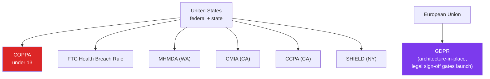

# Flourish — Compliance-Engineered Child-Health Platform

**Developmental milestone tracking and decision-support for parents of children 3 months – 6 years.**

_HIPAA-ready posture. FDA SaMD-avoidance. Multi-jurisdiction privacy by design._

---

## Status

**Phase 0 — Foundation / monorepo scaffold (active development).** Documentation, compliance posture, and engineering architecture in place; feature surface in build-out.

**Client:** Private client (Healthcare / Child Development domain).

---

## The Problem

Parents of children 3 months to 6 years lack a single, trustworthy tool to:

- **Track developmental milestones** (motor, language, social-emotional, cognitive) over time, in their context.
- **Get a Red / Yellow / Green decision-support signal** when patterns suggest a specialist conversation is warranted.
- **Surface a relevant specialist _type_ and nearby providers** when warranted — without ever crossing into diagnosis.

The hard part isn't the milestone library or the UI. The hard part is doing this without crossing the line into:

- A **medical device** (FDA SaMD jurisdiction).
- A **PHI processor** without HIPAA controls.
- A **children's data processor** without COPPA + state-law controls.

Flourish is **explicitly not** a medical device, diagnostic tool, or substitute for evaluation by a qualified healthcare professional. The architecture is designed around that boundary as a first-class constraint.

---

## Architectural Solution

A cross-platform mobile + web + API monorepo, with compliance and security work standing on equal footing with feature work.

### Tech Stack

| Layer            | Technology                            | Rationale                                                    |
| ---------------- | ------------------------------------- | ------------------------------------------------------------ |
| **Monorepo**     | pnpm 10 + Turborepo                   | Per-package boundaries; shared internal packages              |
| **Mobile**       | Expo (React Native) + RN Paper v5 (M3) | Single iOS + Android codebase; managed workflow              |
| **Web**          | Next.js 16 (App Router) + MUI v7 (M3) | RSC for marketing + auth flows; CSR islands where needed     |
| **API**          | Fastify 5 + tRPC v11                  | End-to-end type safety; small surface; production-grade perf  |
| **Database**     | PostgreSQL (Supabase) + Drizzle ORM   | RLS for tenant + minor-data isolation; type-safe schema       |
| **Auth**         | Clerk                                 | Production-ready MFA + session management; webhook to RLS     |
| **Hosting**      | Vercel (web + api) + Supabase (DB) + AWS us-east-1 |                                            |
| **Pre-commit**   | Lefthook                              | Format + lint gates before code reaches CI                    |
| **Test runner**  | Vitest                                | Same runner across all packages                               |
| **Web E2E**      | Playwright                            | Cross-browser end-to-end                                      |
| **Mobile E2E**   | Maestro                               | Native flow testing                                           |
| **Lint**         | ESLint 10 (flat config) + Prettier 3  | Modern flat-config tooling                                    |

---

## Compliance Posture

This is the section that drives architectural decisions.

### HIPAA — "ready, not certified"

| Safeguard category    | Implementation                                                            |
| --------------------- | ------------------------------------------------------------------------- |
| **Administrative**    | Documented data classification, access policy, breach-response runbook    |
| **Physical**          | Cloud-only — no physical infrastructure in scope                         |
| **Technical**         | TLS in transit; AES envelope encryption at rest for PHI fields; Clerk MFA |
| **Audit**             | Full audit-log infrastructure: who-did-what-when-where, JSONB diff        |
| **Marketing language**| "HIPAA-grade controls" — **never** "HIPAA compliant"                      |

The architecture aligns with the HIPAA Security Rule. Certification requires a licensed compliance auditor and a Business Associate Agreement workflow — both are explicitly out of MVP scope and on the launch-readiness checklist.

### FDA SaMD — "designed to stay out"

| Boundary                    | How it's enforced                                                                 |
| --------------------------- | --------------------------------------------------------------------------------- |
| **No diagnosis claims**     | Disclaimer language locked at 7 verbatim touchpoints across UI + marketing       |
| **No "treat / cure"**       | Non-prescriptive language style guide; lints enforce forbidden terms              |
| **No prescriptive output**  | Output is a Red / Yellow / Green pattern signal + specialist _type_, never a diagnosis or treatment plan |
| **Decision pathway**        | Always: "consider talking to a pediatrician about X" — never: "the child has X"   |

### Multi-Jurisdiction Privacy

All accounted for from day one. The GDPR architecture is in place; EU deployment is gated on a legal sign-off in the launch-readiness checklist.

---

## Security CI Pipeline

Real workflows running on push, PR, and scheduled cron:

| Workflow                  | Tool                       | Purpose                                                      |
| ------------------------- | -------------------------- | ------------------------------------------------------------ |
| `semgrep.yml`             | Semgrep OSS                | SAST — security audit + OWASP Top 10 + Node.js + secrets    |
| `secret-scan.yml`         | gitleaks-action@v2         | Secret leakage in commits — push, PR, daily cron            |
| `dependency-audit.yml`    | pnpm audit                 | Known-vulnerable dependency detection                        |
| `sbom.yml`                | CycloneDX (`cdxgen`)       | Software Bill of Materials for every release                 |
| `ci.yml`                  | Vitest + tsc + ESLint      | Build + typecheck + lint + test on PR                        |

CodeQL was evaluated and explicitly deferred (D-019 in the decision log): Semgrep OSS rulesets cover the same ground on the JS/TS surface without requiring the $49/committer/month GitHub Advanced Security subscription. Decision is revisitable at Phase 6 pre-launch hardening.

See [`../Security-Evidence/`](../Security-Evidence) for sanitized excerpts of each workflow.

---

## Key Engineering Decisions

(Selected from a 30+ entry decision log + 20+ ADRs.)

### 1. Clerk over Auth.js for HIPAA-adjacent auth

**Decision (ADR-0006):** Clerk for primary auth, not Auth.js / NextAuth.

**Why?** Clerk ships production-grade MFA, session management, account-recovery flows, and a webhook surface mature enough to bridge into the RLS layer (D-024). Building these to HIPAA-grade quality on Auth.js is months of work that buys nothing differentiating. The Clerk → RLS bridge is captured as its own ADR.

### 2. Drizzle over Prisma

**Decision (ADR-0004):** Drizzle for the ORM.

**Why?** RLS is the security perimeter (D-020). Drizzle's SQL-first model means RLS-aware queries are explicit and reviewable; Prisma's higher abstraction makes it harder to reason about which RLS context applies to a given query. Migration ergonomics are also better suited to forward-only production migrations (D-018 addendum).

### 3. Expo (managed workflow) over native iOS + Android

**Decision (ADR-0002):** Expo for mobile.

**Why?** Single Dart-less codebase, OTA updates for non-native changes, managed credential pipeline, and EAS for builds. Phase 0 is monorepo + foundations — getting to a builds-on-both-platforms state in days, not weeks, is the right trade-off for an MVP that's not pushing platform limits.

### 4. Server-delivered clinical content

**Decision (ADR-0017):** Clinical content (milestone library, decision-support rules) is **server-delivered**, never bundled into the app.

**Why?** Two reasons: (a) the rules can be updated post-launch without app-store cycles, which matters when a clinical reviewer flags a rule; (b) the rules-as-data pattern (ADR-0008) means a rule change is a content change, reviewable by a clinician without engineer involvement.

### 5. Envelope crypto, direct KMS at MVP

**Decision (ADR-0015 + D-026):** Field-level encryption for PHI uses envelope encryption with direct KMS calls at MVP, deferred to a managed crypto provider post-MVP.

**Why?** The direct-KMS path is the simplest defensible architecture for MVP. The provider switch is a single boundary, well-isolated in `@flourish/crypto`, and switchable without changing call sites.

---

## Documentation Surface

| Folder                            | Purpose                                              |
| --------------------------------- | ---------------------------------------------------- |
| `docs/00-project/`                | Charter, decision log (30+ entries), RACI, risks    |
| `docs/01-product/`                | PRD, user stories, NFRs, feature specs              |
| `docs/02-clinical/`               | Clinical content, disclaimer language guidelines     |
| `docs/03-architecture/`           | System overview, **20+ ADRs**                        |
| `docs/04-engineering/`            | Local dev setup, runbooks                            |
| `docs/06-privacy-compliance/`     | HIPAA readiness posture, attorney-engagement plan    |
| `docs/07-regulatory/`             | FDA SaMD classification analysis, intended-use stmt  |
| `docs/tasks/`                     | Phase-by-phase task lists                            |

> All compliance documents in the repository are foundational engineering artifacts, **not legal advice**. A licensed healthcare attorney is engaged in the launch-readiness path.

---

[← Back to Portfolio](../README.md)

