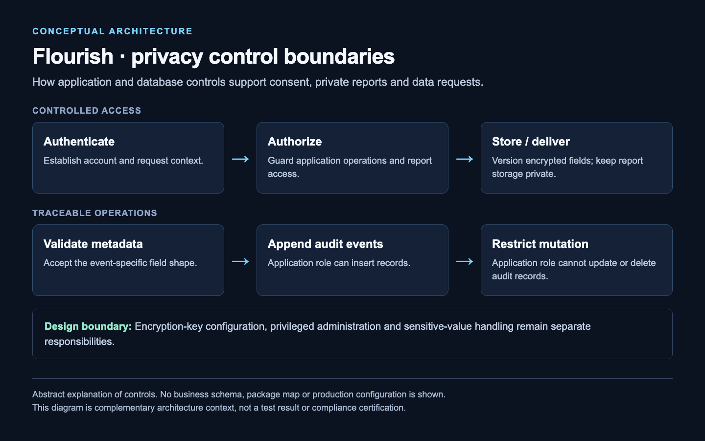
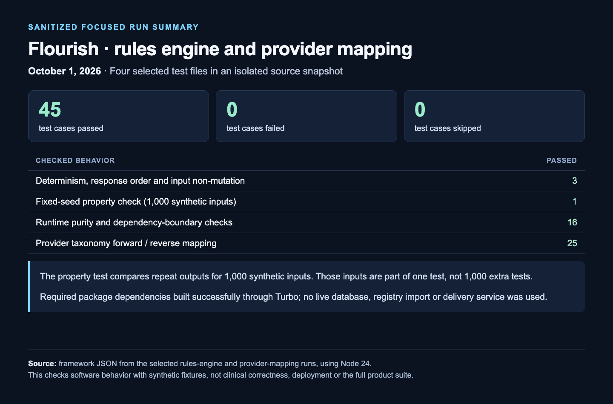
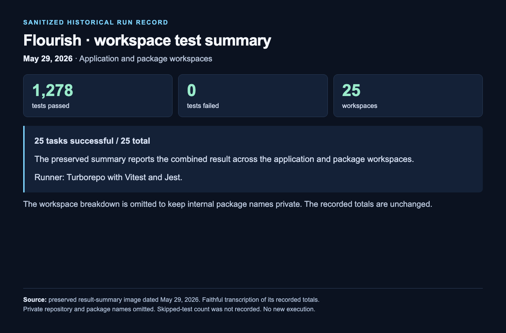

# Flourish

**Client engagement: versioned family check-ins, private reports and supporting workflows**

**My role:** Full-Stack & Compliance Engineer. **Source:** Private. **Stage:** Implemented workflows; clinical-content approval and launch remain gated.

## Client problem and my responsibility

Parents need a consistent way to record developmental observations and prepare information for a professional conversation. My work connects check-ins, traceable results, private reports and supporting administration across a TypeScript web, mobile and API monorepo.

The implementation includes a deterministic rules engine, encrypted result persistence, provider-directory ingestion, controlled reminders, consent/deletion handling and administrative data-request workflows. Separating evaluation from infrastructure keeps the rules testable without a database, encryption service or mobile runtime.

**Technology:** TypeScript, Next.js, Expo/React Native, Fastify, tRPC, Drizzle, PostgreSQL, Clerk and Vercel Blob.

## From a check-in to a traceable result

The client fetches age-appropriate questions with their content version. The API validates submitted answers against that version, invokes the rules engine and stores the result with catalog, rules and engine versions, an input hash and encrypted reasoning traces.

A client token makes submission repeatable: an atomic insert reserves the check-in, and a duplicate returns the prior result. Responses, domain results and trace values are encrypted before persistence. Authentication supplies the account context for the transaction, keeping access control separate from evaluation logic.

## A deterministic engine with versioned content

The synchronous TypeScript engine receives its inputs explicitly. It normalizes response order, applies age/date-scoped rules, aggregates domain results, selects configured activities/referral types and returns the contributing rule trace. Server-side hashing, encryption and database operations stay outside the engine.

The content loader validates catalogs and rules with Zod, computes canonical checksums and enforces markers on development content. The checked-in catalogs are synthetic fixtures; clinical wording and approval belong to the client's domain experts. Generated regression snapshots establish output stability rather than independent clinical correctness.

History-based rules exist in the engine. The current submission path evaluates the supplied check-in without a history input, so that capability is separate from the active submission workflow.

## Private reports and explicit security boundaries

The diagram summarizes responsibilities without reproducing the client's schema, package layout or operational configuration. It provides architecture context, not another test run.

- **Version encrypted fields.** AES-256-GCM records a format version and key identifier. Writes use the current operator-configured key; reads resolve the stored key ID. Key management remains an operational responsibility.
- **Authorize before generating a report.** The handler checks account access and that the requested result belongs to the selected record before decryption and PDF generation. Reports use the selected result's domain statuses and methodology version.
- **Separate rendering from storage.** A storage adapter supports private uploads and expiring signed access. The configured Blob adapter keeps provider operations out of the report service.
- **Restrict audit mutation.** Database privileges let the application append audit records without updating or deleting them. Strict per-event schemas validate metadata shape; privileged database administration and sensitive-value handling remain separate boundaries.

## Directory refreshes and controlled reminders

The provider-ingestion path parses public registry data, filters supported taxonomy/geography and batches updates. It preserves staff-curated fields when source data changes. An advisory lock prevents overlapping ingestion work, while result records retain counts and the source-version label. Parsing consumes a stream but collects accepted rows before batching; it is not described as a bounded-memory pipeline.

Reminder scheduling applies quiet hours and idempotent enqueueing. Before delivery, the worker rechecks opt-in, the latest check-in cadence and frequency limits. Permanently invalid push tokens are cleared, and delivery outcomes are recorded. These implemented paths are distinct from a verified live import or push delivery.

## Administration, consent and data requests

Consent grant and withdrawal handle concurrent requests. Deletion requests have a cancellation window; a row-locked worker then replaces sensitive values and records fulfillment. Administrative data-request handling records an outcome and optional export-response link. It does not automatically generate an export file.

Administrative operations have explicit scopes and recent-reauthentication checks for sensitive actions. A separate-approver publishing gate is available behind a feature flag. Subscription state uses a free-preview framework; billing mutations and Stripe activation remain deferred.

## Focused validation: October 1, 2026

**45 unit checks passed across four test files, with 0 failed and 0 skipped cases.** The selected scope tests deterministic software behavior and provider mapping using synthetic fixtures.

| Selected behavior | Passed checks |
|---|---:|
| Repeat outputs, response order and input non-mutation | 3 |
| Fixed-seed property test covering 1,000 synthetic inputs | 1 |
| Runtime purity and dependency-boundary checks | 16 |
| Provider taxonomy forward/reverse mapping and exclusions | 25 |

The 1,000 inputs belong to one property test, not 1,000 extra tests. Required package dependencies built through Turbo in an isolated snapshot using Node 24. Framework JSON records the results. This was not a coverage run, full product suite, live database/provider check or clinical validation.

## Historical workspace result

The preserved **May 29, 2026** summary records **1,278 passing tests, 0 failures and 25 successful tasks across 25 application/package workspaces**. Skipped-test count was not recorded.

This image transcribes the preserved totals while omitting private repository and package names. It remains a dated historical summary, separate from the focused October result.

## Delivery and confidentiality

The engineering outcome is implemented application workflows with reproducible software checks. Clinical-content approval and operational launch requirements remain separate gates. No clinical efficacy, customer outcome or compliance certification is claimed.

Client identities, source, product screens, schemas and unredacted internal artifacts remain private. The [security patterns](../BrightPath/security/patterns.md) explain general boundaries used across my work.

[← All case studies](../README.md)
