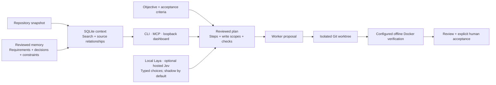

# Graph Engineering

**Source-Backed Engineering Context and Controlled Agent Execution**

_A collaborative public project connecting persistent context, Laya/Jev decision controls, reviewed plans, and isolated execution._

---

## Status & Contribution Scope

**Active development, September 2026–Present.** I collaborate with the original author of [NdahayoKevin25/graph-engineering](https://github.com/NdahayoKevin25/graph-engineering) and develop the extended public fork. The original project supplies the template/scaffolding foundation; my contributions add the TypeScript context/execution engine, SQLite retrieval and reviewed memory, React dashboard, MCP access, local Laya service, hosted Jev adapter, and template/authentication work. The [platform addition](https://github.com/MILTONADINA/graph-engineering/commit/2ce7afbf6635d303fb79d3c1e9b76c27ad1651e6) identifies that work in the public history.

Use the fork's **[`dev` branch](https://github.com/MILTONADINA/graph-engineering/tree/dev)** for this work. As of October 1, 2026, upstream [PR #1](https://github.com/NdahayoKevin25/graph-engineering/pull/1) and [PR #2](https://github.com/NdahayoKevin25/graph-engineering/pull/2) are **open**. The releases below are merged into my fork.

The implementation described here is at revision [`5b88af9`](https://github.com/MILTONADINA/graph-engineering/tree/5b88af9787f9da00e312268847aee27053be8555). The original `create-graph-app` package is MIT licensed; the platform does not yet have a project-root license.

## The Problem

Switching coding tools or starting a fresh session can lose project decisions and constraints. Repeating an entire repository or chat history is expensive and can expose information unnecessarily. This platform retains reviewed knowledge locally, retrieves relevant source evidence, and coordinates bounded changes while keeping verification and human acceptance independent of model recommendations.

## Architectural Solution

| Area | Engineering work |
|------|------------------|
| **Context** | Local repository indexing, lexical/vector retrieval, source-backed context packets, and reviewed private/shared memory |
| **Memory lifecycle** | Separate proposal, acceptance, sharing and exact-text export consent; source freshness, typed contradictions, supersession and retained provenance |
| **Decision controls** | Local Laya and optional hosted Jev rank explicit candidates; bounded batches, deterministic baselines, export screening and durable cost reservations |
| **Interfaces** | CLI, authenticated loopback dashboard/API, and MCP access to scoped context and execution |
| **Execution** | Explicit DAG steps, write scopes, isolated worktrees, patch validation, cancellation, and retained-state reconciliation |
| **Verification** | Configured offline checks and evidence records; cached proposals rerun required verification |
| **Templates** | Extended fine-grained template kit with 53 implemented renderer registrations, retaining the existing scaffolder as a separate schema |

Reviewed executable-identity binding for native workers is **opt-in**. Plan approval is enforced when required by the project's approval policy or publication path; local execution is not described as universally requiring manual approval.

## Key Engineering Decisions

### 1. Keep source-backed context across coding sessions

Local SQLite stores content-hashed snapshots, files, symbols, relationships, chunks and reviewed memory. FTS5 handles lexical lookup; graph traversal expands source relationships; optional asset-verified local Jina embeddings add vector retrieval. When no embedding model is provisioned, retrieval reports its fallback rather than downloading one implicitly.

Context packets cite paths, line ranges and content hashes. Accepted requirements and constraints remain mandatory regardless of the query; a budget too small to hold them causes an explicit refusal. Deterministic file/directory/repository summaries and exact solution caching reduce repeated work while invalidating affected results when source, policy or inputs change. A cache hit does not authorize a patch and still requires the run's checks.

An October 1 real-CLI demonstration launched eight separate processes against synthetic source. An accepted constraint survived restart and appeared in retrieval. Editing its evidence triggered `source-changed` and `requiresReview: true`, while the constraint remained mandatory. Broad automatic Git-history or conversation ingestion remains a goal, not a demonstrated feature. [Context lifecycle](https://github.com/MILTONADINA/graph-engineering/blob/5b88af9787f9da00e312268847aee27053be8555/docs/context-lifecycle.md).

### 2. Make memory review and cloud export explicit

Memories start as private proposals. Acceptance, sharing and export consent are separate operations. Source hashes support freshness checks; typed assertions can detect exact scoped contradictions without deciding which assertion is true. Supersession retains history, concurrent updates use transactional comparisons, and retention protects snapshots cited by memory.

A required memory reaches a cloud-backed client only when it is shared, sourced inside the export policy and authorized for its exact text hash. Otherwise the whole packet is refused. Credential-pattern screening is an additional boundary, not a guarantee that every sensitive fact is recognized. [Memory assertions and consent](https://github.com/MILTONADINA/graph-engineering/blob/5b88af9787f9da00e312268847aee27053be8555/docs/memory-assertions.md).

### 3. Use Laya and Jev for bounded decisions

The decision layer ranks explicit choices for worker, workflow, effort, context budget, retrieval, review scope, recovery and memory writes. It batches up to 12 independent questions per provider request. In default **shadow mode**, answers are recorded while deterministic baselines remain selected. Promotion requires separate category-specific evidence and authority; model confidence cannot waive mandatory context, tests, permissions or human acceptance.

**Laya** runs through a Python HTTP sidecar with a pinned SDK/checkpoint, explicit offline provisioning, bearer authentication, bounded input and serialized inference. The real runtime observes model forward hooks and requires one forward pass per independent batch. Its nine passing tests from October 1, 2026 use fake predictors and real loopback HTTP; they verify service contracts rather than model quality.

**Jev** is an optional hosted provider. It receives separately supplied exportable state. Numeric spending caps require reviewed positive pricing and a durable reservation before dispatch; a batch is accounted for once, missing usage remains unknown, and ambiguous failures retain conservative accounting. No live Jev call is part of the October 1 checks. [Decision protocol, controls and accounting](https://github.com/MILTONADINA/graph-engineering/blob/5b88af9787f9da00e312268847aee27053be8555/docs/decisions.md).

### 4. Bind approval to the plan that was reviewed

[Fork PR #118](https://github.com/MILTONADINA/graph-engineering/pull/118) ties required approval to exact plan content and preserves scoped repair boundaries. When approval is required, a changed plan needs fresh approval; an agent does not approve its own plan through MCP.

### 5. Bind execution to reviewed workers and checks

[Fork PR #122](https://github.com/MILTONADINA/graph-engineering/pull/122) binds reviewed native-worker identities to plans. [PR #123](https://github.com/MILTONADINA/graph-engineering/pull/123) binds the selected verification checks while preserving mandatory checks. Changed worker/check bindings invalidate the previous reviewed plan rather than silently inheriting approval.

### 6. Keep recovery explicit

Runs retain checkpoints and structured events. Cancellation stops execution, while ambiguous publication/recovery state requires reconciliation. A previous pass, classifier score, or generated patch is not treated as human acceptance.

[Fork PR #125](https://github.com/MILTONADINA/graph-engineering/pull/125) adds completion-driven decision and verification settings. Removing one fixed deadline retains explicit cancellation and independent cost, export, resource and required-check gates. A changed deadline changes the policy binding and requires a fresh plan; it does not silently update an already approved run.

### 7. Extend language support without overstating semantic coverage

[Fork PR #119](https://github.com/MILTONADINA/graph-engineering/pull/119) adds Dart indexing, Pub lockfile inventory, isolated analyzer work, and offline generator steps. Syntax relationships, heuristic call candidates, and compiler-backed bindings are distinguished; the graph is not a complete runtime call graph.

Syntax indexing covers TypeScript, JavaScript, Python, Go, Rust, Java, C# and Dart. Each bounded compiler/analyzer adapter has specific prerequisites and unsupported cases. The TypeScript host uses indexed source and inert configuration without executing project plugins or loading arbitrary installed dependencies. Unavailable analyzers and ambiguous bindings remain explicit.

## Public Contribution Evidence

| Submission | Scope | Status checked October 1, 2026 |
|------------|-------|--------------------------------|
| [Upstream #1](https://github.com/NdahayoKevin25/graph-engineering/pull/1) | Local context and controlled execution platform | Open |
| [Upstream #2](https://github.com/NdahayoKevin25/graph-engineering/pull/2) | Template-kit update, OAuth PKCE/ID-token verification, account/session/role infrastructure | Open |
| [Fork #118](https://github.com/MILTONADINA/graph-engineering/pull/118) | Exact-plan approval and scoped repair | Merged September 30 |
| [Fork #119](https://github.com/MILTONADINA/graph-engineering/pull/119) | Dart support and offline generators | Merged September 30 |
| [Fork #122](https://github.com/MILTONADINA/graph-engineering/pull/122) | Reviewed worker identity | Merged October 1 UTC |
| [Fork #123](https://github.com/MILTONADINA/graph-engineering/pull/123) | Reviewed verification selection | Merged October 1 UTC |
| [Fork #125](https://github.com/MILTONADINA/graph-engineering/pull/125) | Completion-driven verification and decision calls | Merged October 1 UTC |

## Verification & Boundaries

### Fresh focused verification: October 1, 2026

The current public `dev` commit was cloned into a disposable directory. Node 24.18.0, the locked dependencies, native SQLite/vector loading, and dependency/engine builds were checked before running the selected tests. No private project, provider key, model download, deployment or paid call was used.

| Scope | Passed | Evidence boundary |
|-------|-------:|-------------------|
| Context database, maintenance and TS/JS binding | 26 | Real local SQLite and compiler behavior with synthetic source; vector repair uses a test double |
| Typed memory and CLI-to-MCP integration | 25 | Persistence, supersession, concurrent edits and local synthetic export flow |
| Decisions, batching, controls and deadlines | 58 | Mocked provider transports; promotion-controller seams are not real promotion authority |
| Verification deadlines | 21 | Injected worker/verifier and Docker command seams; no fresh container-runtime claim |
| Laya Python sidecar | 9 | Fake predictor plus loopback HTTP, not real inference |

**130 engine tests across 13 selected files and 9 sidecar tests passed, with no failures or skips in those runs.** This is not the full repository suite. The separate eight-process context demonstration is recorded as scenario evidence, not added to the test count. [Machine-readable verification summary](evidence/focused-verification-2026-10-01.json).

### One bounded synthetic indexing measurement

At the same source revision, the repository's benchmark generated **1,000 TypeScript files / 2,000 functions** on an Apple M5 Max, macOS ARM64. Cold indexing took **728.837 ms**, unchanged indexing **176.043 ms**, and indexing after one file changed **570.058 ms**. Lexical and graph lookup took **1.828 ms** and **4.019 ms** respectively; all three retrieval modes returned the expected file. Embeddings were absent, so hybrid used lexical/graph fallback. [Original measurement receipt](evidence/context-benchmark-1000-2026-10-01.json).

This single generated workload is not a production throughput, coding-accuracy or token-saving benchmark. The retained snapshots used approximately 38.2 MB of database plus 19.6 MB of live WAL for 307 KB of generated source, making retention an actual storage tradeoff. The older 10,000-file receipt predates compiler-backed binding and is not presented as today's result.

### Dated real-runtime evidence

- **September 23:** a real split-UTF-8 subprocess defect initially failed one of four regressions. One local Qwen worker call with three Laya decisions proposed the repair; all four unchanged tests passed in the pinned offline verifier. The owner reported acceptance September 24. This is one recorded real task, not held-out calibration or an independently signed review. [Retained repair receipt](https://github.com/MILTONADINA/graph-engineering/blob/5b88af9787f9da00e312268847aee27053be8555/evaluation/real-utf8-repair-2026-09-23.json).
- **September 25:** Jev answered two planning questions in one shadow call, recording 516 input tokens while retaining the baseline despite a differing suggestion. Subsequent autonomous export-revocation attempts failed and the feature was implemented directly in a normal PR. [Pilot including failures](https://github.com/MILTONADINA/graph-engineering/blob/5b88af9787f9da00e312268847aee27053be8555/docs/local-validation.md#L231-L273).
- A dated warm Laya observation recorded two questions in one actual model forward pass, with 275.38 ms inference on MPS. This is one observation, not a latency distribution or an engineering-accuracy score. [Runtime observations](https://github.com/MILTONADINA/graph-engineering/blob/5b88af9787f9da00e312268847aee27053be8555/docs/local-validation.md#L327-L383).

The linked PRs retain their historical code/review/CI records separately from these local results. Local storage does not make a cloud-backed worker offline, and successful generation or verification does not prove production readiness, autonomous reliability or human acceptance. These focused local checks do not establish full-suite CI success.

Public documentation: [platform guide](https://github.com/MILTONADINA/graph-engineering/blob/dev/docs/platform.md), [installed-worker limits](https://github.com/MILTONADINA/graph-engineering/blob/dev/docs/installed-workers.md), and [DAG/template runtime](https://github.com/MILTONADINA/graph-engineering/blob/dev/docs/dag-and-template-runtime.md).

---

[← Back to Portfolio](../README.md) · [Open-source contributions](../Contributions/README.md)
