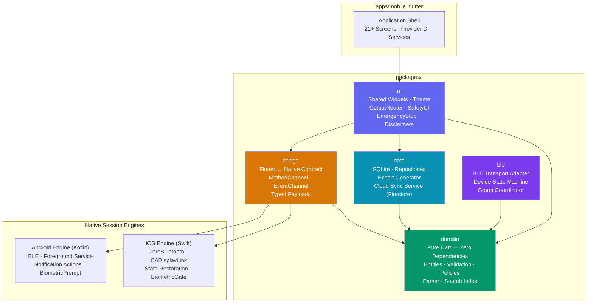
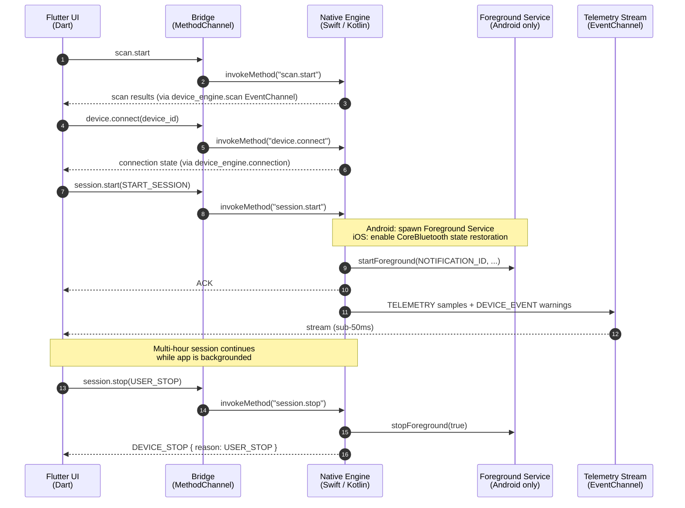
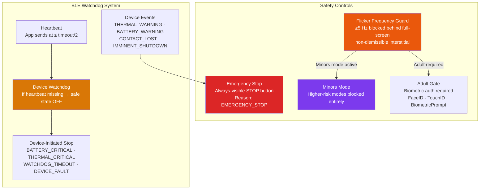
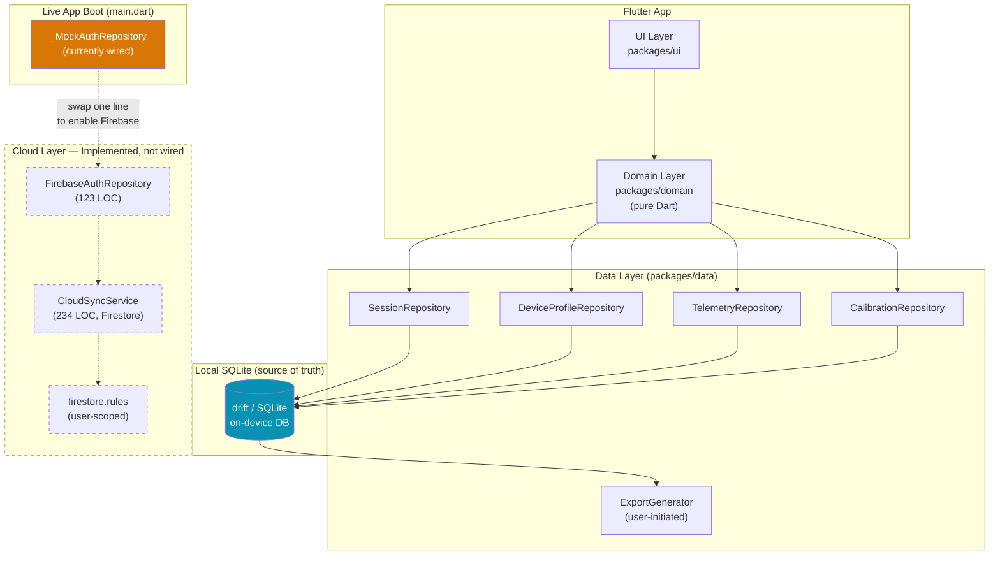

<div align="center">

# Light Routines

**Cross-Platform Flutter App with Native iOS/Android Session Engines**

[](https://flutter.dev)
[](https://developer.apple.com/swift/)
[](https://kotlinlang.org)
[](.)

</div>

---

## The Problem

A cross-platform mobile app where the **session-execution path must be reliable enough to run for hours in the background**, on both iOS and Android, with optional BLE-connected hardware accessories. Three structural constraints drive the architecture:

- **Long-running background sessions**: A Flutter app suspends when backgrounded. Multi-hour session reliability needs native foreground services (Android) and CoreBluetooth state restoration (iOS) — not platform channels into Dart.
- **Hardware abstraction without coupling**: BLE accessories are a v2 surface. The domain layer must be testable and shippable without any of the BLE code being present.
- **Offline-first by default**: The app must function with the network unreachable. Any cloud surface (auth, sync) is opt-in and the local SQLite database is the source of truth at all times.

---

## The Solution

A **5-package Flutter monorepo** with native iOS/Android session engines bridged through typed MethodChannel + EventChannel contracts. Clean Architecture boundaries enforced by Dart's package system — `domain` literally cannot import Flutter or platform code, the analyzer prevents it.

### Tech Stack

| Layer              | Technology                                            | Rationale                                                       |
| ------------------ | ----------------------------------------------------- | --------------------------------------------------------------- |
| **UI**             | Flutter (Dart 3.3+) — Provider for DI                 | Cross-platform UI, hot reload, single codebase                  |
| **iOS Engine**     | Swift (CoreBluetooth, CADisplayLink)                  | Background BLE state restoration, vsync-stable rendering        |
| **Android Engine** | Kotlin (BLE, Foreground Service, BiometricPrompt)     | Background session reliability via foreground service           |
| **BLE Transport**  | `flutter_reactive_ble` 5.3 (in `packages/ble`)        | Reactive BLE adapter, isolated in its own package                |
| **Persistence**    | SQLite (drift) — local source of truth                | Embeddable, no server dependency, offline-first                  |
| **Cloud (opt-in)** | Firebase Auth + Firestore — implemented, not yet live | Auth + sync code complete; runtime currently uses mock auth     |
| **CI/CD**          | GitHub Actions: analyze → test → build APK + iOS      | Per-package quality gates, dual-platform builds                  |

---

## Multi-Package Architecture


```mermaid
graph TB
    subgraph App["apps/mobile_flutter"]
        AppShell["Application Shell<br/>21+ Screens · Provider DI · Services"]
    end

    subgraph Packages["packages/"]
        UI["ui<br/>Shared Widgets · Theme<br/>OutputRouter · SafetyUI<br/>EmergencyStop · Disclaimers"]
        Domain["domain<br/>Pure Dart — Zero Dependencies<br/>Entities · Validation · Policies<br/>Parser · Search Index"]
        Data["data<br/>SQLite · Repositories<br/>Export Generator<br/>Cloud Sync Service (Firestore)"]
        Bridge["bridge<br/>Flutter ↔ Native Contract<br/>MethodChannel · EventChannel<br/>Typed Payloads"]
        BLE["ble<br/>BLE Transport Adapter<br/>Device State Machine<br/>Group Coordinator"]
    end

    subgraph Native["Native Session Engines"]
        iOS["iOS Engine (Swift)<br/>CoreBluetooth · CADisplayLink<br/>State Restoration · BiometricGate"]
        Android["Android Engine (Kotlin)<br/>BLE · Foreground Service<br/>Notification Actions · BiometricPrompt"]
    end

    AppShell --> UI
    UI --> Domain & Data & Bridge
    Data --> Domain
    Bridge --> Domain
    BLE --> Domain

    Bridge --> iOS & Android

    style Domain fill:#059669,color:#fff
    style Data fill:#0891b2,color:#fff
    style Bridge fill:#d97706,color:#fff
    style BLE fill:#7c3aed,color:#fff
    style UI fill:#6366f1,color:#fff
```

### Package Dependency Rules

| Package               | Depends On                 | Rationale                                                   |
| --------------------- | -------------------------- | ----------------------------------------------------------- |
| `domain`              | **Nothing**                | Pure Dart. Business logic testable without Flutter SDK.     |
| `data`                | `domain`                   | Implements repository interfaces defined in domain.         |
| `bridge`              | `domain`                   | Converts domain models to/from native payloads.             |
| `ble`                 | `domain`                   | BLE adapter implements domain transport abstractions.       |
| `ui`                  | `domain`, `data`, `bridge` | Composes all layers into user-facing widgets.               |
| `apps/mobile_flutter` | **All packages**           | Wires DI, provides screens, owns native engine directories. |

---

## Key Engineering Decision: Clean Architecture with 5 Packages

**Decision**: Split the codebase into 5 independent Dart packages instead of a monolithic `lib/` folder.

**Why?**

- **Enforced boundaries**: Dart's package system physically prevents `domain` from importing Flutter or platform code. A developer literally cannot break the dependency rule — the analyzer catches it.
- **Independent testing**: `domain` has tests that run without a Flutter SDK. `data` and `ble` each have their own test suites. **354 tests passed across 5 packages** in the fresh 2026-05-29 run (domain 313, data 3, bridge 3, ble 34, ui 1), 0 analyzer issues.
- **Future-proof**: When BLE accessory hardware ships, only `ble` and the native engines change. `domain` (validation, safety policies) and `data` (persistence) remain untouched.

---

## Key Engineering Decision: Dual Native Engines

**Decision**: Flutter handles UI/UX. Session-critical operations run natively (Swift on iOS, Kotlin on Android).

**Why?**

- **Background reliability**: A Flutter app suspends when backgrounded. BLE heartbeats (every ~5 seconds) and multi-hour accessory sessions must continue. Android Foreground Services and iOS CoreBluetooth state restoration solve this natively.
- **Vsync-stable rendering**: Phone-screen output requires frame-accurate timing for the rendering pipeline. `CADisplayLink` (iOS) and Choreographer (Android) provide frame-accurate timing that Flutter's render pipeline cannot guarantee for full-screen single-color modes.
- **Biometric gates**: FaceID/TouchID (iOS) and BiometricPrompt (Android) are native APIs. Wrapping them through platform channels gives consistent, OS-level security.

**Implementation surface** (real LOC, not scaffold):

| Component                        | Language | LOC | Path                                                                 |
| -------------------------------- | -------- | --: | -------------------------------------------------------------------- |
| Android `DeviceEngine`           | Kotlin   | 362 | `apps/mobile_flutter/android/.../DeviceEngine.kt`                    |
| Android `SessionService` (FGS)   | Kotlin   | 343 | `apps/mobile_flutter/android/.../SessionService.kt`                  |
| iOS `DeviceEngine`               | Swift    | 418 | `apps/mobile_flutter/ios/Runner/DeviceEngine.swift`                  |

---

## Flutter ↔ Native Contract

Communication uses 4 stable channels:

| Channel                    | Type          | Direction        | Purpose                                                                                  |
| -------------------------- | ------------- | ---------------- | ---------------------------------------------------------------------------------------- |
| `device_engine.method`     | MethodChannel | Flutter → Native | Low-frequency commands: scan, connect, session start/stop, screen start/stop, adult gate |
| `device_engine.telemetry`  | EventChannel  | Native → Flutter | Telemetry samples, device events, device stop, errors                                    |
| `device_engine.scan`       | EventChannel  | Native → Flutter | BLE scan results                                                                         |
| `device_engine.connection` | EventChannel  | Native → Flutter | Connection state changes                                                                 |

> **Hard rule**: Telemetry is **never** streamed via MethodChannel. EventChannel is non-blocking and UI-friendly.

### Native Bridge Sequence — Session Lifecycle


```mermaid
sequenceDiagram
    autonumber
    participant UI as Flutter UI<br/>(Dart)
    participant BR as Bridge<br/>(MethodChannel)
    participant N as Native Engine<br/>(Swift / Kotlin)
    participant FGS as Foreground Service<br/>(Android only)
    participant TX as Telemetry Stream<br/>(EventChannel)

    UI->>BR: scan.start
    BR->>N: invokeMethod("scan.start")
    N-->>UI: scan results (via device_engine.scan EventChannel)
    UI->>BR: device.connect(device_id)
    BR->>N: invokeMethod("device.connect")
    N-->>UI: connection state (via device_engine.connection)

    UI->>BR: session.start(START_SESSION)
    BR->>N: invokeMethod("session.start")
    Note over N,FGS: Android: spawn Foreground Service<br/>iOS: enable CoreBluetooth state restoration
    N->>FGS: startForeground(NOTIFICATION_ID, ...)
    N-->>UI: ACK
    N->>TX: TELEMETRY samples + DEVICE_EVENT warnings
    TX-->>UI: stream (sub-50ms)
    Note over UI,N: Multi-hour session continues<br/>while app is backgrounded

    UI->>BR: session.stop(USER_STOP)
    BR->>N: invokeMethod("session.stop")
    N->>FGS: stopForeground(true)
    N-->>UI: DEVICE_STOP { reason: USER_STOP }
```

The 4-channel split (one `MethodChannel` + three `EventChannel`s) is real and named exactly as shown — `device_engine.method`, `device_engine.scan`, `device_engine.connection`, `device_engine.telemetry`. Command names (`scan.start`, `device.connect`, `session.start`, `session.stop`, `adult_gate.request`, etc.) are real `case` labels in the native code.

---

## Safety System Architecture


```mermaid
graph TB
    subgraph SafetyControls["Safety Controls"]
        FlickerGuard["Flicker Frequency Guard<br/>≥5 Hz blocked behind full-screen<br/>non-dismissible interstitial"]
        MinorsMode["Minors Mode<br/>Higher-risk modes blocked entirely"]
        AdultGate["Adult Gate<br/>Biometric auth required<br/>FaceID · TouchID · BiometricPrompt"]
        EStop["Emergency Stop<br/>Always-visible STOP button<br/>Reason: EMERGENCY_STOP"]
    end

    subgraph Watchdog["BLE Watchdog System"]
        Heartbeat["Heartbeat<br/>App sends at ≤ timeout/2"]
        DeviceWatchdog["Device Watchdog<br/>If heartbeat missing → safe state OFF"]
        DeviceEvents["Device Events<br/>THERMAL_WARNING · BATTERY_WARNING<br/>CONTACT_LOST · IMMINENT_SHUTDOWN"]
        DeviceStop["Device-Initiated Stop<br/>BATTERY_CRITICAL · THERMAL_CRITICAL<br/>WATCHDOG_TIMEOUT · DEVICE_FAULT"]
    end

    FlickerGuard -->|"Minors mode active"| MinorsMode
    FlickerGuard -->|"Adult required"| AdultGate

    Heartbeat --> DeviceWatchdog
    DeviceWatchdog --> DeviceStop
    DeviceEvents --> EStop

    style EStop fill:#dc2626,color:#fff
    style FlickerGuard fill:#ea580c,color:#fff
    style DeviceWatchdog fill:#d97706,color:#fff
    style MinorsMode fill:#7c3aed,color:#fff
```

| Safety Feature                | Implementation                                                                    |
| ----------------------------- | --------------------------------------------------------------------------------- |
| **Flicker frequency guard**   | Output above 5 Hz blocked behind a full-screen, non-dismissible interstitial      |
| **Minors mode**               | Higher-risk output modes blocked entirely                                          |
| **Adult gate**                | Biometric auth (FaceID/TouchID/BiometricPrompt) required for gated functionality   |
| **Emergency stop**            | Always-visible button in any active session; ends with reason `EMERGENCY_STOP`     |
| **BLE watchdog**              | Device enters safe state `OFF` if heartbeat lost > timeout                         |

---

## Data Layer: SQLite Persistence (offline-first source of truth)

### Offline-First Data Flow


```mermaid
graph TB
    subgraph App["Flutter App"]
        UI["UI Layer<br/>packages/ui"]
        Domain["Domain Layer<br/>packages/domain<br/>(pure Dart)"]
    end

    subgraph Data["Data Layer (packages/data)"]
        SessRepo["SessionRepository"]
        ProfRepo["DeviceProfileRepository"]
        TelRepo["TelemetryRepository"]
        CalRepo["CalibrationRepository"]
        Export["ExportGenerator<br/>(user-initiated)"]
    end

    subgraph LocalStore["Local SQLite (source of truth)"]
        DB[("drift / SQLite<br/>on-device DB")]
    end

    subgraph CloudOptIn["Cloud Layer — Implemented, not wired"]
        FAuth["FirebaseAuthRepository<br/>(123 LOC)"]
        Sync["CloudSyncService<br/>(234 LOC, Firestore)"]
        Rules["firestore.rules<br/>(user-scoped)"]
    end

    subgraph LiveBoot["Live App Boot (main.dart)"]
        MockAuth["_MockAuthRepository<br/>(currently wired)"]
    end

    UI --> Domain
    Domain --> SessRepo & ProfRepo & TelRepo & CalRepo
    SessRepo & ProfRepo & TelRepo & CalRepo --> DB
    DB --> Export

    MockAuth -.->|"swap one line<br/>to enable Firebase"| FAuth
    FAuth -.-> Sync
    Sync -.-> Rules

    style DB fill:#0891b2,color:#fff
    style MockAuth fill:#d97706,color:#fff
    style CloudOptIn stroke-dasharray: 5 5
    style FAuth stroke-dasharray: 5 5
    style Sync stroke-dasharray: 5 5
    style Rules stroke-dasharray: 5 5
```

**Read this honestly**: the solid edges are what runs in the current build — every repository writes to the local SQLite database and that is the source of truth. The dashed edges are the cloud surface — fully implemented in source (~550 LOC + a production-shape Firestore rules file) but not wired into the auth flow yet. `main.dart` currently boots with `_MockAuthRepository`. The cutover is a single line change.

| Repository                | Responsibility                                                    |
| ------------------------- | ----------------------------------------------------------------- |
| `SessionRepository`       | Session history with start/stop times, reasons, duration          |
| `TelemetryRepository`     | Sensor samples (opt-in, OFF by default)                           |
| `DeviceProfileRepository` | Cached device capabilities for offline validation                 |
| `CalibrationRepository`   | Sensor calibration profiles                                        |
| `DeviceGroupRepository`   | Multi-device group coordination                                    |
| `ExportGenerator`         | Human-readable JSON export with ISO timestamps and explicit units  |

### Cloud Sync (opt-in, implemented but not wired into live auth)

| Component                | Status                                                                        |
| ------------------------ | ----------------------------------------------------------------------------- |
| `FirebaseAuthRepository` | Implemented (123 LOC) — anonymous, email, Google, Apple sign-in               |
| `CloudSyncService`       | Implemented (234 LOC) — Firestore routine upload, session sync, user-scoped   |
| `firestore.rules`        | Production-shape user-scoped + shared-routines rules                          |
| **Live wiring**          | App `main.dart` currently uses `_MockAuthRepository` — Firebase path ready but not active |

This is honest framing: the cloud surface is **implemented production code**, but the app currently boots with a mock auth repository. The cutover from mock to Firebase is a single line in `main.dart` once the v2 auth flow is approved.

---

## BLE Protocol Surface

11 message types organized into two planes (control + telemetry). All messages use a common envelope: `protocol_version`, `type`, `msg_id` (monotonic), `ts_ms`, `device_id`, `session_id`.

```
── Control Plane (App → Device) ──────────────────
HELLO              Device handshake
CAPABILITIES       Device identity + outputs + sensors + safety declaration
START_SESSION      Program segments with safety config
STOP_SESSION       Stop reason: USER_STOP | EMERGENCY_STOP | APP_SHUTDOWN
SET_OUTPUT         Real-time output changes
HEARTBEAT          Periodic keepalive (≤ timeout/2)
ACK                Confirmation
ERROR              Transport/protocol error

── Telemetry Plane (Device → App) ────────────────
TELEMETRY          Sensor samples (temp, battery, skin contact, output)
DEVICE_EVENT       Warnings: THERMAL | BATTERY | CONTACT_LOST | IMMINENT_SHUTDOWN
DEVICE_STOP        Device-initiated stop: BATTERY_CRITICAL | THERMAL_CRITICAL | WATCHDOG
```

---

## Testing & CI/CD

### Test Coverage

| Package   | Focus                                                                                     |
| --------- | ----------------------------------------------------------------------------------------- |
| `domain`  | Validation, safety policies, parser, search index, protocol messages                      |
| `data`    | SQLite repositories, export generator                                                     |
| `ble`     | BLE adapter, device state machine, group coordinator                                      |
| `bridge`  | Contract tests, payload serialization                                                     |
| **Total** | **354 tests passed across 5 packages (real `flutter test` run 2026-05-29), 0 analyzer issues** |

### CI Pipeline (GitHub Actions)

| Job                   | Steps                                                                |
| --------------------- | -------------------------------------------------------------------- |
| **Quality Check**     | `flutter pub get` → `flutter analyze` → `flutter test` (per package) |
| **Build Android APK** | Java 17 → `flutter build apk --debug` → upload artifact              |
| **Build iOS**         | `pod install` → `flutter build ios --no-codesign --simulator`        |


> The numbers above are from a fresh `flutter test` run across the 5 packages on 2026-05-29 — `domain: 313`, `data: 3`, `bridge: 3`, `ble: 34`, `ui: 1`. 354 is the green-bar count from the actual run.

---

## Platform Targets

**Production**: iOS, Android. Flutter scaffolding for macOS, Linux, and Windows is present in the repo but those are not production targets.

---

## Code Footprint

| Metric                       | Value                                                  |
| ---------------------------- | ------------------------------------------------------ |
| Dart LOC (lib + tests)       | ~28,200 across 150+ files                             |
| Native Kotlin LOC (bridge)   | 740 (`DeviceEngine`, `SessionService`, `MainActivity`) |
| Native Swift LOC (bridge)    | 475 (`DeviceEngine`, `AppDelegate`, `RunnerTests`)     |
| Packages                     | 5 (`domain`, `data`, `bridge`, `ble`, `ui`)            |
| Apps                         | 1 (`apps/mobile_flutter`)                              |

---

<div align="center">

[← Back to Portfolio](../README.md)

</div>
