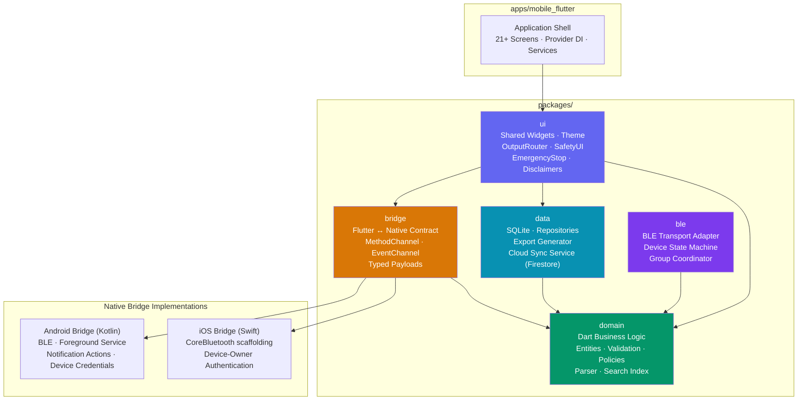
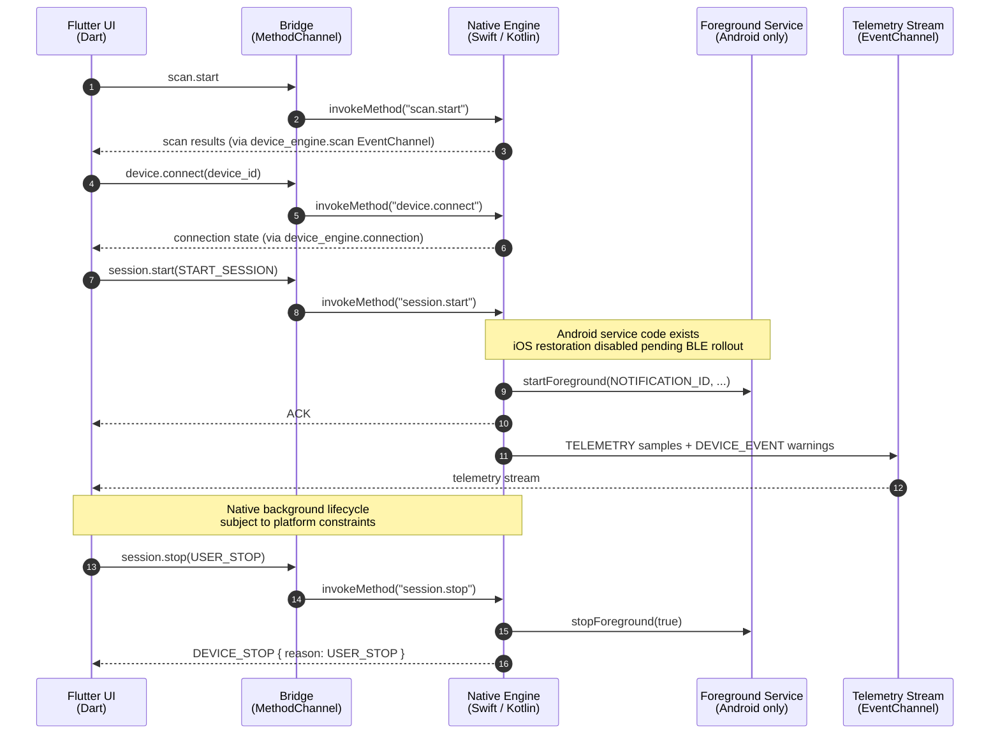
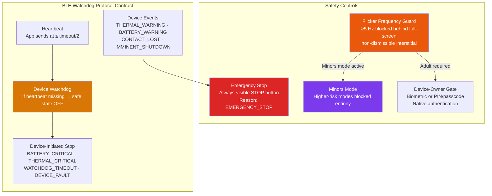
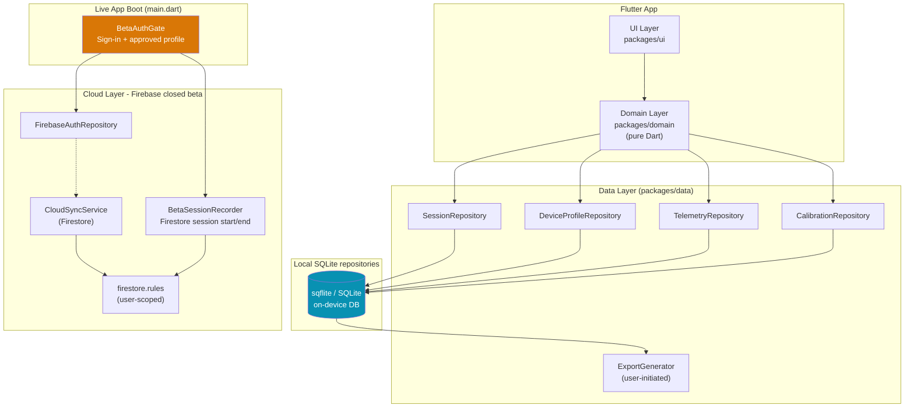
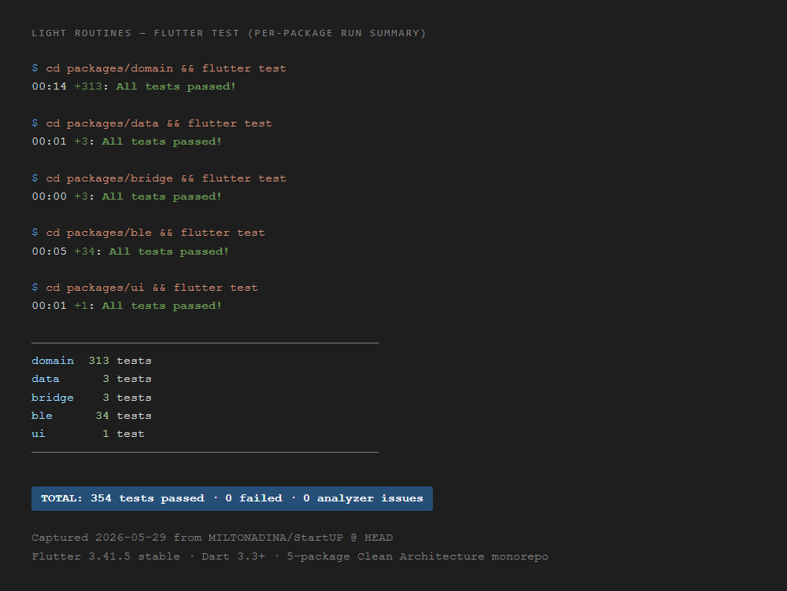
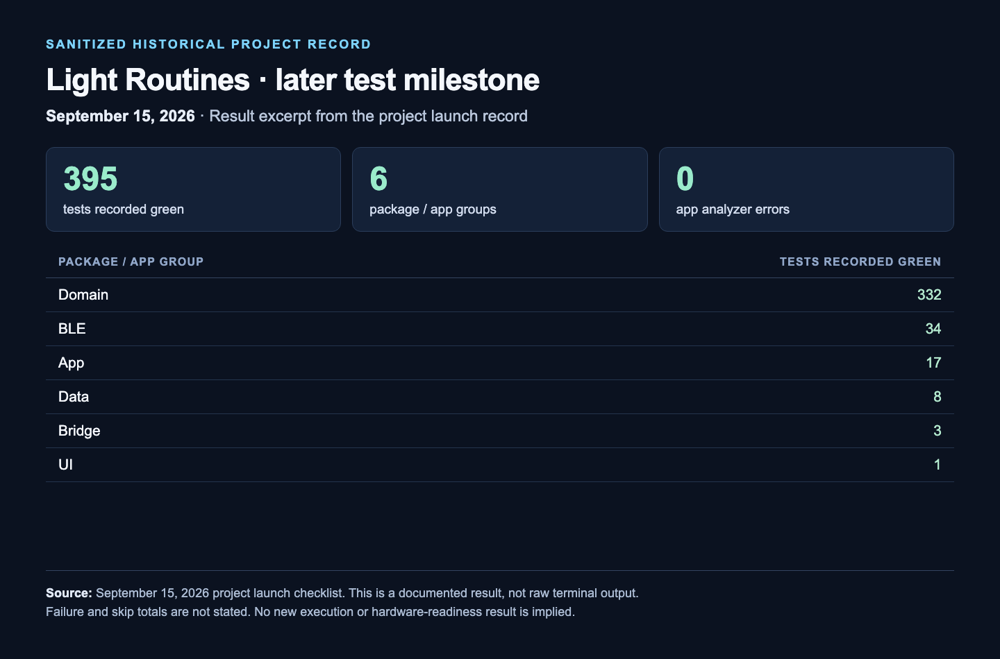

<div align="center">

# Light Routines

**Cross-Platform Flutter App with Native iOS/Android Bridges**

[](https://flutter.dev)
[](https://developer.apple.com/swift/)
[](https://kotlinlang.org)
[](#testing--cicd)

</div>

---

## Product and ownership

**Independent product · Founder & Sole Engineer · December 2025 to present · Private source**

I built the Flutter app, session policies, local repositories, Firebase beta-access workflow and native bridge prototypes. The beta gives approved users sign-in, timed-session controls and recorded history; native accessory work is a separate implementation surface.

**Current status:** Closed beta, with Firebase Auth and Firestore live. The September 15, 2026 launch record documents Android Play internal build `1.0.0+21` and the earlier June 29 TestFlight upload `1.0.0+11`; current iOS distribution availability is not established by that record. Working title: **Light Routines**.

## The Problem

A cross-platform mobile app where the **session-execution path must be reliable enough to run for hours in the background**, on both iOS and Android, with optional BLE-connected hardware accessories. Three structural constraints drive the architecture:

- **Background execution constraints**: Accessory sessions need platform-specific lifecycle handling. Android foreground-service code exists; iOS BLE restoration is currently disabled, and multi-hour hardware execution remains a design target.
- **Hardware abstraction without coupling**: BLE accessories are a v2 surface. The domain layer must be testable and shippable without any of the BLE code being present.
- **Offline-capable core**: Local SQLite repositories support offline workflows. The closed-beta experience adds Firebase sign-in, approved-user gating, and Firestore session recording; it is not an entirely offline authentication flow.

---

## The Solution

A **5-package Flutter monorepo** with separate domain, data, UI, BLE, and native-bridge responsibilities. Typed MethodChannel + EventChannel contracts connect Dart to Kotlin/Swift code. The domain implementation currently avoids Flutter imports, but its manifest depends on Flutter; package organization does not make forbidden imports impossible.

### Tech Stack

| Layer              | Technology                                            | Rationale                                                       |
| ------------------ | ----------------------------------------------------- | --------------------------------------------------------------- |
| **UI**             | Flutter (Dart 3.3+) - Provider for DI                 | Cross-platform UI, hot reload, single codebase                  |
| **iOS Bridge**     | Swift (CoreBluetooth, LocalAuthentication)           | BLE connection scaffolding and device-owner authentication; restoration disabled |
| **Android Bridge** | Kotlin (BLE, Foreground Service, BiometricPrompt)     | Native service and authentication code; hardware protocol serialization remains incomplete |
| **BLE Transport**  | `flutter_reactive_ble` 5.3 (in `packages/ble`)        | Reactive BLE adapter, isolated in its own package                |
| **Persistence**    | SQLite via `sqflite`                                 | Local repositories; beta cloud records use a separate path       |
| **Cloud / beta**   | Firebase Auth + Firestore - live closed beta | Sign-in, approved-user gating, session history, and sync |
| **CI/CD**          | GitHub Actions: analyze → test → build APK + iOS      | Per-package quality gates, dual-platform builds                  |

---

## Multi-Package Architecture

The package/native-engine diagram describes the broader codebase. The **current phone beta session path** uses a Dart `BetaSessionController` and a Firestore-backed recorder. Native Swift/Kotlin bridge implementations remain a separate engineering surface; their presence does not establish that the beta routes all sessions through native background execution.


```mermaid
graph TB
    subgraph App["apps/mobile_flutter"]
        AppShell["Application Shell<br/>21+ Screens · Provider DI · Services"]
    end

    subgraph Packages["packages/"]
        UI["ui<br/>Shared Widgets · Theme<br/>OutputRouter · SafetyUI<br/>EmergencyStop · Disclaimers"]
        Domain["domain<br/>Dart Business Logic<br/>Entities · Validation · Policies<br/>Parser · Search Index"]
        Data["data<br/>SQLite · Repositories<br/>Export Generator<br/>Cloud Sync Service (Firestore)"]
        Bridge["bridge<br/>Flutter ↔ Native Contract<br/>MethodChannel · EventChannel<br/>Typed Payloads"]
        BLE["ble<br/>BLE Transport Adapter<br/>Device State Machine<br/>Group Coordinator"]
    end

    subgraph Native["Native Bridge Implementations"]
        iOS["iOS Bridge (Swift)<br/>CoreBluetooth scaffolding<br/>Device-Owner Authentication"]
        Android["Android Bridge (Kotlin)<br/>BLE · Foreground Service<br/>Notification Actions · Device Credentials"]
    end

    AppShell --> UI
    UI --> Domain & Data & Bridge
    Data --> Domain
    Bridge --> Domain
    BLE --> Domain

    Bridge --> iOS & Android

    style Domain fill:#059669,color:#fff
    style Data fill:#0891b2,color:#fff
    style Bridge fill:#d97706,color:#fff
    style BLE fill:#7c3aed,color:#fff
    style UI fill:#6366f1,color:#fff
```

### Package Dependency Rules

Internal package relationships are summarized below; manifests also declare SDK and third-party dependencies. This is an organization boundary, not a custom analyzer restriction.

| Package               | Depends On                 | Rationale                                                   |
| --------------------- | -------------------------- | ----------------------------------------------------------- |
| `domain`              | Flutter SDK declared; test dependencies include bridge/data | Business logic is written in Dart; the manifest does not enforce SDK independence. |
| `data`                | `domain`                   | Implements repository interfaces defined in domain.         |
| `bridge`              | `domain`                   | Converts domain models to/from native payloads.             |
| `ble`                 | `domain`                   | BLE adapter implements domain transport abstractions.       |
| `ui`                  | `domain`, `data`, `bridge` | Composes all layers into user-facing widgets.               |
| `apps/mobile_flutter` | **All packages**           | Wires DI, provides screens, owns native engine directories. |

---

## Key Engineering Decision: Five-Package Modular Architecture

**Decision**: Split the codebase into 5 independent Dart packages instead of a monolithic `lib/` folder.

**Why?**

- **Separated responsibilities**: Domain entities and policies, persistence, UI, BLE, and platform channels live in dedicated packages. Import boundaries still require code review; the current domain manifest allows Flutter.
- **Package-level testing**: The preserved 2026-05-29 summary records **354 passing tests across 5 packages** (domain 313, data 3, bridge 3, ble 34, ui 1) and 0 analyzer issues. Its commands use `flutter test`, not an SDK-independent domain build.
- **Extension boundary**: BLE transport and native interfaces have dedicated packages, limiting where device-specific changes belong. A future hardware release can still require changes to shared policies, data, or UI; that integration is not complete.

---

## Key Engineering Decision: Native Bridges and Session Runtime

**Decision**: Keep platform services behind a native bridge while the current phone beta runs its session controller in Dart. Android includes foreground-service code; native accessory execution is a separate, incomplete path.

**Why?**

- **Lifecycle control**: Android service code provides an OS-managed execution surface. iOS source explicitly disables BLE state restoration until the required background-mode configuration and real BLE rollout are ready.
- **Explicit implementation limits**: The iOS `session.start` path contains placeholder payload/acknowledgement logic and `session.stop` is a no-op; Android protocol serialization also retains TODOs. This is not evidence of completed native session execution or measured timing guarantees.
- **Device-owner authentication**: Native APIs support biometrics **or device PIN/passcode fallback**. The gate authenticates the device owner; it does not independently establish age.

**Implementation surface** (May 2026 source inventory):

| Component                        | Language | LOC | Path                                                                 |
| -------------------------------- | -------- | --: | -------------------------------------------------------------------- |
| Android `DeviceEngine`           | Kotlin   | 362 | `apps/mobile_flutter/android/.../DeviceEngine.kt`                    |
| Android `SessionService` (FGS)   | Kotlin   | 343 | `apps/mobile_flutter/android/.../SessionService.kt`                  |
| iOS `DeviceEngine`               | Swift    | 418 | `apps/mobile_flutter/ios/Runner/DeviceEngine.swift`                  |

---

## Flutter ↔ Native Contract

Communication uses 4 stable channels:

| Channel                    | Type          | Direction        | Purpose                                                                                  |
| -------------------------- | ------------- | ---------------- | ---------------------------------------------------------------------------------------- |
| `device_engine.method`     | MethodChannel | Flutter → Native | Scan, connect, session command contracts, and device-owner gate; native session handlers remain incomplete |
| `device_engine.telemetry`  | EventChannel  | Native → Flutter | Telemetry samples, device events, device stop, errors                                    |
| `device_engine.scan`       | EventChannel  | Native → Flutter | BLE scan results                                                                         |
| `device_engine.connection` | EventChannel  | Native → Flutter | Connection state changes                                                                 |

> **Channel contract**: Telemetry uses EventChannel streams; MethodChannel carries discrete commands and responses.

### Native Bridge Sequence - Session Lifecycle

This sequence preserves the **intended native bridge contract**. Hardware payload serialization and iOS session start/stop are incomplete; the current beta uses a mock BLE adapter and the separate Dart session controller below. Background duration and device behavior are unverified design expectations.


```mermaid
sequenceDiagram
    autonumber
    participant UI as Flutter UI<br/>(Dart)
    participant BR as Bridge<br/>(MethodChannel)
    participant N as Native Engine<br/>(Swift / Kotlin)
    participant FGS as Foreground Service<br/>(Android only)
    participant TX as Telemetry Stream<br/>(EventChannel)

    UI->>BR: scan.start
    BR->>N: invokeMethod("scan.start")
    N-->>UI: scan results (via device_engine.scan EventChannel)
    UI->>BR: device.connect(device_id)
    BR->>N: invokeMethod("device.connect")
    N-->>UI: connection state (via device_engine.connection)

    UI->>BR: session.start(START_SESSION)
    BR->>N: invokeMethod("session.start")
    Note over N,FGS: Android service code exists<br/>iOS restoration disabled pending BLE rollout
    N->>FGS: startForeground(NOTIFICATION_ID, ...)
    N-->>UI: ACK
    N->>TX: TELEMETRY samples + DEVICE_EVENT warnings
    TX-->>UI: telemetry stream
    Note over UI,N: Native background lifecycle<br/>subject to platform constraints

    UI->>BR: session.stop(USER_STOP)
    BR->>N: invokeMethod("session.stop")
    N->>FGS: stopForeground(true)
    N-->>UI: DEVICE_STOP { reason: USER_STOP }
```

The 4-channel split (one `MethodChannel` + three `EventChannel`s) is real and named exactly as shown - `device_engine.method`, `device_engine.scan`, `device_engine.connection`, `device_engine.telemetry`. Command names (`scan.start`, `device.connect`, `session.start`, `session.stop`, `adult_gate.request`, etc.) are real `case` labels in the native code.

### Closed-Beta Session Lifecycle

The beta auth gate routes unsigned users to sign-in, pending profiles to approval, and approved users into the app. `BetaSessionController` manages `idle → running ↔ paused → ended`, guards repeated transitions, records session start/end through Firestore, and ends a session after the configured pause timeout. This is the shipped beta workflow described in the September launch record.

Elapsed time comes from a monotonic `Stopwatch`, and the default pause timeout is 60 seconds. Stop changes state and notifies the display **before** awaiting the Firestore write; cloud persistence cannot delay the output-off transition. The screen pauses active sessions when backgrounded, restores brightness on exit, and keeps the emergency stop visible while other controls hide. Normal completion, early stop, emergency stop and pause timeout produce distinct history outcomes.

`BetaRoutineBuilder` turns curated steps into screen segments, expanding a rotating-frequency step by cycle and deriving its gate requirements from the actual segment content. The renderer and displayed rate account for the screen's refresh-rate limit. These are implementation mechanisms, not measured hardware timing guarantees. Persistence is best-effort; a failed history write does not block shutdown.

---

## Safety System Architecture


```mermaid
graph TB
    subgraph SafetyControls["Safety Controls"]
        FlickerGuard["Flicker Frequency Guard<br/>≥5 Hz blocked behind full-screen<br/>non-dismissible interstitial"]
        MinorsMode["Minors Mode<br/>Higher-risk modes blocked entirely"]
        AdultGate["Device-Owner Gate<br/>Biometric or PIN/passcode<br/>Native authentication"]
        EStop["Emergency Stop<br/>Always-visible STOP button<br/>Reason: EMERGENCY_STOP"]
    end

    subgraph Watchdog["BLE Watchdog Protocol Contract"]
        Heartbeat["Heartbeat<br/>App sends at ≤ timeout/2"]
        DeviceWatchdog["Device Watchdog<br/>If heartbeat missing → safe state OFF"]
        DeviceEvents["Device Events<br/>THERMAL_WARNING · BATTERY_WARNING<br/>CONTACT_LOST · IMMINENT_SHUTDOWN"]
        DeviceStop["Device-Initiated Stop<br/>BATTERY_CRITICAL · THERMAL_CRITICAL<br/>WATCHDOG_TIMEOUT · DEVICE_FAULT"]
    end

    FlickerGuard -->|"Minors mode active"| MinorsMode
    FlickerGuard -->|"Adult required"| AdultGate

    Heartbeat --> DeviceWatchdog
    DeviceWatchdog --> DeviceStop
    DeviceEvents --> EStop

    style EStop fill:#dc2626,color:#fff
    style FlickerGuard fill:#ea580c,color:#fff
    style DeviceWatchdog fill:#d97706,color:#fff
    style MinorsMode fill:#7c3aed,color:#fff
```

| Safety Feature                | Implementation                                                                    |
| ----------------------------- | --------------------------------------------------------------------------------- |
| **Flicker frequency guard**   | Settings at or above 5 Hz require the device-owner gate and warning step on the adult path; minors mode blocks them |
| **Minors mode**               | Higher-risk output modes blocked entirely                                          |
| **Adult gate**                | Device-owner authentication: biometrics or OS PIN/passcode fallback; not age verification |
| **Emergency stop**            | Always-visible beta button ends with `emergency`; the separate native protocol uses `EMERGENCY_STOP` |
| **BLE watchdog**              | Protocol specifies `OFF` after a heartbeat timeout; hardware execution remains unverified |

The gate uses a monotonic 30-minute authentication cache and progressive lockout after repeated failures. Strong biometrics or a device PIN/passcode authenticate the device owner; they do not independently establish age. The October focused tests below verify policy and controller behavior.

---

## Data Layer: SQLite Repositories and Firebase Beta Persistence

### Local Data and Closed-Beta Cloud Flow


```mermaid
graph TB
    subgraph App["Flutter App"]
        UI["UI Layer<br/>packages/ui"]
        Domain["Domain Layer<br/>packages/domain<br/>(pure Dart)"]
    end

    subgraph Data["Data Layer (packages/data)"]
        SessRepo["SessionRepository"]
        ProfRepo["DeviceProfileRepository"]
        TelRepo["TelemetryRepository"]
        CalRepo["CalibrationRepository"]
        Export["ExportGenerator<br/>(user-initiated)"]
    end

    subgraph LocalStore["Local SQLite repositories"]
        DB[("sqflite / SQLite<br/>on-device DB")]
    end

    subgraph CloudOptIn["Cloud Layer - Firebase closed beta"]
        FAuth["FirebaseAuthRepository"]
        Sync["CloudSyncService<br/>(Firestore)"]
        Rules["firestore.rules<br/>(user-scoped)"]
        Recorder["BetaSessionRecorder<br/>Firestore session start/end"]
    end

    subgraph LiveBoot["Live App Boot (main.dart)"]
        BetaGate["BetaAuthGate<br/>Sign-in + approved profile"]
    end

    UI --> Domain
    Domain --> SessRepo & ProfRepo & TelRepo & CalRepo
    SessRepo & ProfRepo & TelRepo & CalRepo --> DB
    DB --> Export

    BetaGate --> FAuth
    BetaGate --> Recorder
    FAuth -.-> Sync
    Sync --> Rules
    Recorder --> Rules

    style DB fill:#0891b2,color:#fff
    style BetaGate fill:#d97706,color:#fff
```

The diagram distinguishes local SQLite repositories from the live beta's Firebase authentication and session-recording path. Cloud sync remains a separate service; an implemented repository is not evidence that every beta screen uses that path. The earlier mock-auth description was superseded by the June–September beta rollout.

| Repository                | Responsibility                                                    |
| ------------------------- | ----------------------------------------------------------------- |
| `SessionRepository`       | Session history with start/stop times, reasons, duration          |
| `TelemetryRepository`     | Sensor samples (opt-in, OFF by default)                           |
| `DeviceProfileRepository` | Cached device capabilities for offline validation                 |
| `CalibrationRepository`   | Sensor calibration profiles                                        |
| `DeviceGroupRepository`   | Multi-device group coordination                                    |
| `ExportGenerator`         | Human-readable JSON export with ISO timestamps and explicit units  |

### Firebase Authentication and Cloud Services

| Component                | Status                                                                        |
| ------------------------ | ----------------------------------------------------------------------------- |
| `FirebaseAuthRepository` | Implemented authentication methods; beta routes through Firebase sign-in |
| `CloudSyncService`       | Firestore routine upload and user-scoped session sync service |
| `firestore.rules`        | Rules and indexes recorded as deployed in the September launch checklist |
| **Live wiring**          | `BetaAuthGate` handles configuration, sign-in, pending approval, and approved-user states |
| **App Check**            | Activation implemented; September project record says backend enforcement is not enabled |
| **Approval email**       | Function implemented but recorded as undeployed; manual approval and in-app welcome are the beta flow |

Rules deny self-approval and changes to protected identity/approval fields, restrict session access to the approved authenticated owner, validate allowed session fields and outcomes, and deny all client writes to curated routines. Unpublished routines cannot be fetched again from history. On October 1, all 44 existing rules tests passed against an actual local Firestore emulator with synthetic users; no production backend was accessed.

The closed beta is active. Provider availability, current store distribution, and broader native/hardware release readiness are separate checks; this case study does not infer them from the existence of implementation code.

---

## BLE Protocol Surface

The message types describe the protocol model. Native payload serialization remains incomplete, so this table is not a hardware interoperability result.

11 message types organized into two planes (control + telemetry). All messages use a common envelope: `protocol_version`, `type`, `msg_id` (monotonic), `ts_ms`, `device_id`, `session_id`.

```
── Control Plane (App → Device) ──────────────────
HELLO              Device handshake
CAPABILITIES       Device identity + outputs + sensors + safety declaration
START_SESSION      Program segments with safety config
STOP_SESSION       Stop reason: USER_STOP | EMERGENCY_STOP | APP_SHUTDOWN
SET_OUTPUT         Real-time output changes
HEARTBEAT          Periodic keepalive (≤ timeout/2)
ACK                Confirmation
ERROR              Transport/protocol error

── Telemetry Plane (Device → App) ────────────────
TELEMETRY          Sensor samples (temp, battery, skin contact, output)
DEVICE_EVENT       Warnings: THERMAL | BATTERY | CONTACT_LOST | IMMINENT_SHUTDOWN
DEVICE_STOP        Device-initiated stop: BATTERY_CRITICAL | THERMAL_CRITICAL | WATCHDOG
```

---

## Testing & CI/CD

### Test Coverage

| Package   | Focus                                                                                     |
| --------- | ----------------------------------------------------------------------------------------- |
| `domain`  | Validation, safety policies, parser, search index, protocol messages                      |
| `data`    | SQLite repositories, export generator                                                     |
| `ble`     | BLE adapter, device state machine, group coordinator                                      |
| `bridge`  | Contract tests, payload serialization                                                     |
| `ui`      | Shared warning/interstitial widget                                                       |
| **Total** | **354 tests passed across 5 packages in the recorded May 29, 2026 summary; 0 analyzer issues** |

### Current Focused Execution: October 1, 2026

A clean temporary snapshot of private revision `6587fb6` was tested with Flutter **3.47.4** and Dart **3.13.3**. Package dependencies resolved from the existing offline cache. The authorization tests used the actual Firestore emulator with a local demo project, synthetic identities and no production credentials.

| Scope | Passed | What the run establishes |
|-------|-------:|--------------------------|
| Selected domain policies, beta data parsing and routine builder | 56 | Gate thresholds, lockout/cache policy, parsing and segment construction |
| Beta session controller | 15 | Guarded transitions, output-off before persistence, completion, pause timeout and teardown with a fake recorder |
| Firestore authorization rules | 44 | Allowed flows and denied self-approval, cross-user access, protected-field edits and invalid session writes on the local emulator |
| **Focused total** | **115** | **No failures or skips; selected scope, not the full suite** |

No real-device BLE, biometric prompt, native timing, APK/store distribution or live Firebase behavior was newly verified. No analyzer run is claimed for this focused execution. [Sanitized execution receipt and exact commands](./evidence/focused-verification-2026-10-01.json).

### CI Pipeline (GitHub Actions)

| Job                   | Steps                                                                |
| --------------------- | -------------------------------------------------------------------- |
| **Quality Check**     | `flutter pub get` → `flutter analyze` → `flutter test` (per package) |
| **Build Android APK** | Java 17 → debug and release APK builds; CI explicitly permits an unsigned-release configuration without the upload keystore |
| **Build iOS**         | PR-only: `pod install` → `flutter build ios --no-codesign --simulator` |



The unchanged image preserves the **May 29, 2026** recorded summary across five packages: `domain: 313`, `data: 3`, `bridge: 3`, `ble: 34`, `ui: 1`.



A distinct **September 15, 2026** launch-checklist entry records **395 tests green**: 332 domain, 34 BLE, 17 app, 8 data, 3 bridge and 1 UI, plus **0 app analyzer errors**. This second image is a sanitized transcription of that project record, not raw terminal output. Failure and skip totals are not stated. Neither image represents a new execution.

> **Artifact correction:** The retained inventory text incorrectly totals those five values as 333; they sum to **354**, matching the image. Its introductory statement that tests were not run conflicts with its appended run summary. The files are preserved as historical records, without treating their conflicting prose as independent verification.

---

## Platform Targets

**Mobile targets:** iOS and Android. Release evidence covers the Firebase closed beta and an Android internal release. Flutter scaffolding for macOS, Linux, and Windows is present in the repo but those are not release targets.

---

## Code Footprint

Historical May 2026 inventory, retained alongside the original evidence artifacts:

| Metric                       | Value                                                  |
| ---------------------------- | ------------------------------------------------------ |
| Dart LOC (lib + tests)       | ~28,200 across 150+ files                             |
| Native Kotlin LOC (bridge)   | 740 (`DeviceEngine`, `SessionService`, `MainActivity`) |
| Native Swift LOC (bridge)    | 475 (`DeviceEngine`, `AppDelegate`, `RunnerTests`)     |
| Packages                     | 5 (`domain`, `data`, `bridge`, `ble`, `ui`)            |
| Apps                         | 1 (`apps/mobile_flutter`)                              |

---

<div align="center">

[← Back to Portfolio](../README.md)

</div>

---

## In this folder
<!-- in-this-folder -->

Everything documenting this project lives here:

- [`lightroutines-flutter-test.png`](./lightroutines-flutter-test.png): original May 29, 2026 recorded summary.
- [`evidence/lightroutines-september-record.png`](./evidence/lightroutines-september-record.png): sanitized September 15, 2026 project-record excerpt.
- [`evidence/focused-verification-2026-10-01.json`](./evidence/focused-verification-2026-10-01.json): 56 domain, 15 controller and 44 actual local emulator rules tests; scope and commands.
- [`lightroutines-test-inventory.txt`](./lightroutines-test-inventory.txt) - 📋 source-tree / test inventory
