<div align="center">

# Light Routines

**Cross-Platform Wellness App — Flutter + Native Engines**

[](https://flutter.dev)
[](https://developer.apple.com/swift/)
[](https://kotlinlang.org)
[](.)

</div>

---

## The Problem

A cross-platform mobile app needs to encode a published color protocol library (**331 color schedules covering 600+ health conditions**) and let users execute guided "tonation" sessions via their phone screen — with future support for external BLE accessories.

**Key constraints:**

- **Safety-critical**: Certain light frequencies (≥5 Hz flicker) carry photosensitivity risk. The architecture must enforce hardware guardrails, not rely on UI-only warnings.
- **Offline-first**: The full protocol library must be bundled with the app. No internet required for core functionality.
- **Future BLE accessory support**: The architecture must cleanly accommodate external devices without rewriting the domain layer. Accessories run sessions for hours while the app is backgrounded.
- **Dual-platform native engines**: Session reliability (BLE heartbeat, background sessions, vsync-stable rendering) requires native code — Flutter alone is insufficient.

---

## The Solution

A **Dual-Engine Mobile Architecture** (Flutter UI + Native Session Engines) organized as a multi-package monorepo with Clean Architecture principles.

### Tech Stack

| Layer              | Technology                           | Rationale                                            |
| ------------------ | ------------------------------------ | ---------------------------------------------------- |
| **UI**             | Flutter (Dart)                       | Cross-platform UI, hot reload, widget composition    |
| **iOS Engine**     | Swift (CoreBluetooth, CADisplayLink) | Background BLE, vsync-stable rendering, biometrics   |
| **Android Engine** | Kotlin (BLE, Foreground Service)     | Background session reliability, notification actions |
| **Persistence**    | SQLite (drift)                       | Offline-first, embeddable, no server dependency      |
| **Protocol Data**  | Bundled JSON asset                   | 331 schedules, parsed at runtime, zero network       |
| **Auth**           | Firebase Auth                        | User accounts, future cloud sync                     |
| **CI/CD**          | GitHub Actions                       | Analyze → Test → Build (APK + iOS)                   |

---

## Multi-Package Architecture

```mermaid
graph TB
    subgraph App["apps/mobile_flutter"]
        AppShell["Application Shell<br/>21 Screens · Provider DI · Services"]
    end

    subgraph Packages["packages/"]
        UI["ui<br/>Shared Widgets · Theme<br/>OutputRouter · SafetyUI<br/>EmergencyStop · Disclaimers"]
        Domain["domain<br/>Pure Dart — Zero Dependencies<br/>Entities · Validation · Policies<br/>Spectro Parser · Search Index"]
        Data["data<br/>SQLite · Repositories<br/>Export Generator<br/>Cloud Sync Service"]
        Bridge["bridge<br/>Flutter ↔ Native Contract<br/>MethodChannel · EventChannel<br/>Typed Payloads"]
        BLE["ble<br/>BLE Transport Adapter<br/>Device State Machine<br/>Group Coordinator"]
    end

    subgraph Native["Native Session Engines"]
        iOS["iOS Engine (Swift)<br/>CoreBluetooth · CADisplayLink<br/>State Restoration · BiometricGate"]
        Android["Android Engine (Kotlin)<br/>BLE · Foreground Service<br/>Notification Actions · BiometricPrompt"]
    end

    AppShell --> UI
    UI --> Domain & Data & Bridge
    Data --> Domain
    Bridge --> Domain
    BLE --> Domain

    Bridge --> iOS & Android

    style Domain fill:#059669,color:#fff
    style Data fill:#0891b2,color:#fff
    style Bridge fill:#d97706,color:#fff
    style BLE fill:#7c3aed,color:#fff
    style UI fill:#6366f1,color:#fff
```



### Package Dependency Rules

| Package               | Depends On                 | Rationale                                                   |
| --------------------- | -------------------------- | ----------------------------------------------------------- |
| `domain`              | **Nothing**                | Pure Dart. Business logic is testable without Flutter SDK.  |
| `data`                | `domain`                   | Implements repository interfaces defined in domain.         |
| `bridge`              | `domain`                   | Converts domain models to/from native payloads.             |
| `ble`                 | `domain`                   | BLE adapter implements domain transport abstractions.       |
| `ui`                  | `domain`, `data`, `bridge` | Composes all layers into user-facing widgets.               |
| `apps/mobile_flutter` | **All packages**           | Wires DI, provides screens, owns native engine directories. |

---

## Key Engineering Decision: Clean Architecture with 5 Packages

**Decision**: Split the codebase into 5 independent Dart packages instead of a monolithic `lib/` folder.

**Why?**

- **Enforced boundaries**: Dart's package system physically prevents `domain` from importing Flutter or platform code. A developer literally cannot break the dependency rule — the analyzer catches it.
- **Independent testing**: `domain` has 248+ tests that run without a Flutter SDK. `data` and `ble` each have their own test suites. Total: **278+ passing tests, 0 analyzer issues**.
- **Future-proof**: When BLE accessories ship, only `ble` and the native engines change. `domain` (validation, safety policies) and `data` (persistence) remain untouched.

---

## Key Engineering Decision: Dual Native Engines

**Decision**: Flutter handles UI/UX. Session-critical operations run natively (Swift on iOS, Kotlin on Android).

**Why?**

- **Background reliability**: A Flutter app suspends when backgrounded. BLE heartbeats (every ~5 seconds) and multi-hour accessory sessions must continue. Android Foreground Services and iOS CoreBluetooth state restoration solve this natively.
- **Vsync-stable rendering**: Phone-screen sessions display solid colors at precise frequencies. `CADisplayLink` (iOS) and Choreographer (Android) provide frame-accurate timing that Flutter's rendering pipeline cannot guarantee for single-color full-screen modes.
- **Biometric gates**: FaceID/TouchID (iOS) and BiometricPrompt (Android) are native APIs. Wrapping them through platform channels gives consistent, OS-level security.

---

## Flutter ↔ Native Contract

Communication uses 4 stable channels:

| Channel                    | Type          | Direction        | Purpose                                                                                  |
| -------------------------- | ------------- | ---------------- | ---------------------------------------------------------------------------------------- |
| `device_engine.method`     | MethodChannel | Flutter → Native | Low-frequency commands: scan, connect, session start/stop, screen start/stop, adult gate |
| `device_engine.telemetry`  | EventChannel  | Native → Flutter | Telemetry samples, device events, device stop, errors                                    |
| `device_engine.scan`       | EventChannel  | Native → Flutter | BLE scan results                                                                         |
| `device_engine.connection` | EventChannel  | Native → Flutter | Connection state changes                                                                 |

> **Hard rule**: Telemetry is **never** streamed via MethodChannel. EventChannel is non-blocking and UI-friendly.

### Command Reference

```
── Device Discovery ──────────────────────────────
scan.start(filters?)         → ok
scan.stop()                  → ok
pair.start()                 → {device_id, display_name}

── Connection ────────────────────────────────────
device.connect(device_id)    → ok
device.disconnect(device_id) → ok
device.read_capabilities()   → CAPABILITIES payload

── Session Control ───────────────────────────────
session.start(START_SESSION) → ACK | ERROR
session.stop(STOP_SESSION)   → ACK | ERROR
output.set(SET_OUTPUT)       → ACK | ERROR

── Phone-Screen Sessions ─────────────────────────
screen.start(color_rgb, intensity, flicker_hz?) → ok
screen.stop()                                    → ok

── Safety ────────────────────────────────────────
watchdog.configure(device_id, timeout_ms, safe_state=OFF) → ok
adult_gate.request(purpose)  → {authorized: true/false}
```

---

## Safety System Architecture

```mermaid
graph TB
    subgraph SafetyControls["Safety Controls"]
        FlickerDefault["Flicker Default: OFF<br/>Must be explicitly enabled"]
        FlickerGuard["≥5 Hz Flicker Guard<br/>Full-screen interstitial<br/>Cannot tap-dismiss"]
        MinorsMode["Minors Mode<br/>High-risk flicker blocked entirely"]
        AdultGate["Adult Gate<br/>Biometric auth required<br/>FaceID · TouchID · BiometricPrompt"]
        EStop["Emergency Stop<br/>Always-visible STOP button<br/>Reason: EMERGENCY_STOP"]
    end

    subgraph Watchdog["BLE Watchdog System"]
        Heartbeat["Heartbeat<br/>App sends at ≤ timeout/2"]
        DeviceWatchdog["Device Watchdog<br/>If heartbeat missing → safe state OFF"]
        DeviceEvents["Device Events<br/>THERMAL_WARNING · BATTERY_WARNING<br/>CONTACT_LOST · IMMINENT_SHUTDOWN"]
        DeviceStop["Device-Initiated Stop<br/>BATTERY_CRITICAL · THERMAL_CRITICAL<br/>WATCHDOG_TIMEOUT · DEVICE_FAULT"]
    end

    FlickerDefault --> FlickerGuard
    FlickerGuard -->|"Minors mode active"| MinorsMode
    FlickerGuard -->|"Adult required"| AdultGate

    Heartbeat --> DeviceWatchdog
    DeviceWatchdog --> DeviceStop
    DeviceEvents --> EStop

    style EStop fill:#dc2626,color:#fff
    style FlickerGuard fill:#ea580c,color:#fff
    style DeviceWatchdog fill:#d97706,color:#fff
    style MinorsMode fill:#7c3aed,color:#fff
```



| Safety Feature                | Implementation                                                                    |
| ----------------------------- | --------------------------------------------------------------------------------- |
| **Flicker OFF by default**    | Must be explicitly enabled by user                                                |
| **≥5 Hz safety interstitial** | Full-screen, non-dismissible; requires explicit "I Understand the Risk"           |
| **Minors mode**               | High-risk flicker completely blocked (`SafetyRiskLevel.restricted`)               |
| **Adult gate**                | Biometric auth (FaceID/TouchID/BiometricPrompt). If unavailable: features blocked |
| **Emergency stop**            | Always-visible button in any active session; ends with reason `EMERGENCY_STOP`    |
| **BLE watchdog**              | Device enters safe state `OFF` if heartbeat lost > timeout                        |

---

## Domain Layer: Core Entities

The domain package contains **pure Dart** entities and logic with zero external dependencies:

| Category     | Components                                                                                                                                                               |
| ------------ | ------------------------------------------------------------------------------------------------------------------------------------------------------------------------ |
| **Entities** | Routine, Condition, Schedule, Tonation, SpectroChrome Color (12 colors), Color Attribute (78), Body Area (22), Device Profile, Calibration Profile, Device Group         |
| **Logic**    | Routine Validator, Spectro Parser, Condition Search (alias resolution + medical name matching), Forecast Calculator (NOAA solar position + lunar phase), Begin Tonations |
| **Policies** | Flicker Guardrails, Text Sanitizer (non-prescriptive language), Adult Gate Policy                                                                                        |
| **Protocol** | Protocol v1.2 Messages (11 types), Parser, BLE Framing                                                                                                                   |
| **Output**   | Light Output, Output Type (SCREEN/DEVICE), Session Mode                                                                                                                  |

---

## Data Layer: SQLite Persistence

| Repository                | Responsibility                                                    |
| ------------------------- | ----------------------------------------------------------------- |
| `SessionRepository`       | Session history with start/stop times, reasons, and duration      |
| `TelemetryRepository`     | Sensor samples (opt-in, OFF by default)                           |
| `DeviceProfileRepository` | Cached device capabilities for offline validation                 |
| `SpectroRepository`       | Protocol data access (331 schedules, 600+ conditions)             |
| `CalibrationRepository`   | Sensor calibration profiles                                       |
| `DeviceGroupRepository`   | Multi-device group sessions                                       |
| `ExportGenerator`         | Human-readable JSON export with ISO timestamps and explicit units |

**Export rule**: Never label results "normal" or "healthy." Export is factual: numbers + units only.

---

## BLE Protocol v1.2

11 message types organized into two planes:

```
── Control Plane (App → Device) ──────────────────
HELLO              Device handshake
CAPABILITIES       Device identity + outputs + sensors + safety declaration
START_SESSION      Program segments with safety config
STOP_SESSION       Stop reason: USER_STOP | EMERGENCY_STOP | APP_SHUTDOWN
SET_OUTPUT         Real-time output changes
HEARTBEAT          Periodic keepalive (≤ timeout/2)
ACK                Confirmation
ERROR              Transport/protocol error

── Telemetry Plane (Device → App) ────────────────
TELEMETRY          Sensor samples (temp, battery, skin contact, output)
DEVICE_EVENT       Warnings: THERMAL | BATTERY | CONTACT_LOST | IMMINENT_SHUTDOWN
DEVICE_STOP        Device-initiated stop: BATTERY_CRITICAL | THERMAL_CRITICAL | WATCHDOG
```

All messages use a common envelope: `protocol_version`, `type`, `msg_id` (monotonic), `ts_ms`, `device_id`, `session_id`.

---

## Testing & CI/CD

### Test Coverage

| Package   | Tests            | Focus                                                                                     |
| --------- | ---------------- | ----------------------------------------------------------------------------------------- |
| `domain`  | 248+             | Routine validation, flicker guardrails, spectro parser, condition search, safety policies |
| `data`    | ✓                | SQLite repositories, export generator                                                     |
| `ble`     | ✓                | BLE adapter, device state machine, group coordinator                                      |
| `bridge`  | ✓                | Contract tests, payload serialization                                                     |
| **Total** | **278+ passing** | **0 analyzer issues**                                                                     |

### CI Pipeline (GitHub Actions)

| Job                   | Steps                                                                |
| --------------------- | -------------------------------------------------------------------- |
| **Quality Check**     | `flutter pub get` → `flutter analyze` → `flutter test` (per package) |
| **Build Android APK** | Java 17 → `flutter build apk --debug` → upload artifact              |
| **Build iOS**         | `pod install` → `flutter build ios --no-codesign --simulator`        |

> 📸 **[Screenshot Placeholder]**: Place a screenshot of `flutter test` terminal output (all 278+ tests passing) as `../Test-Evidence/lightroutines-flutter-test.png`

---

## Data & Privacy

| Policy                | Implementation                                                                 |
| --------------------- | ------------------------------------------------------------------------------ |
| **Telemetry logging** | OFF by default (user opt-in)                                                   |
| **Cloud sync**        | None in v1 (local-only, SQLite)                                                |
| **Export**            | User-initiated only; pretty-printed JSON with ISO timestamps                   |
| **Diagnostic logs**   | No sensitive data included                                                     |
| **Language posture**  | Non-prescriptive; no "treat", "cure", "diagnose" language anywhere in app copy |

---

<div align="center">

[← Back to Portfolio](../README.md)

</div>
