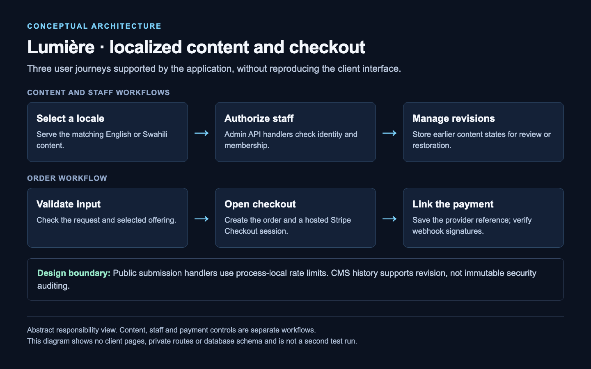
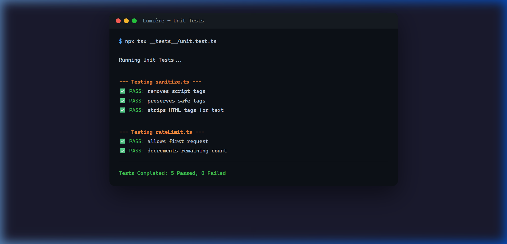

# Lumière

**Client engagement: bilingual agency content, CMS and checkout**

**My role:** Full-Stack Developer. **Period:** December 2025 to February 2026. **Source:** Private.

## Client problem and deliverables

A digital agency needed English/Swahili content, a way for staff to maintain services and portfolio material, and customer inquiry/order handling. I implemented the Next.js application, localized content model, staff administration and Stripe checkout integration.

The work includes public content pages, admin API handlers with identity and membership checks, content history and order/payment references. This case describes those responsibilities and decisions without publishing the client's interface, content, route inventory or database schema.

**Technology:** Next.js 16, React 19, TypeScript, Prisma, Supabase, Tailwind CSS and Stripe.

## Conceptual workflow

This diagram explains the interaction boundaries; it does not reproduce the client's screens or internal schema.

## Engineering decisions

### Store translations with explicit identity and locale

Localized entities use companion translation records keyed by entity and locale. A database uniqueness constraint prevents duplicate translations for the same pair. Prisma provides typed query/result shapes, while missing translations remain a runtime concern.

The public application uses locale-prefixed routing. Server Components fetch content; client components handle forms and other interactions. This keeps the rendering and interaction responsibilities clear without relying on a client-side fetch for every content view.

### Authorize staff changes on the server

Admin API handlers verify the authenticated Supabase user and admin membership before writing through Prisma. The application check sits beside the operation it protects. Database row policies are a separate boundary whose effect depends on the connection's role and request context.

Input schemas validate accepted fields, and rich-text sanitization handles content that may contain markup. These controls are applied at the relevant request/content boundaries rather than asserted as universal protection.

### Keep order creation connected to checkout

The checkout handler validates the request, resolves the selected package, creates an order and opens a Stripe Checkout session. Saving the provider session reference connects the payment workflow back to the order. The webhook handler uses Stripe signature verification.

Contact, newsletter and checkout handlers use process-local IP-based limits. These limits manage requests within the application process; they are not described as distributed rate limiting.

### Make content changes traceable

Application-level content history records earlier states so staff can review changes and restore selected content types and translations. Editorial handlers also manage draft/published state and request cache revalidation. A selected update path keeps a content record, its translations and associations within a transaction. These are CMS features, not an immutable security audit log or a claim that every rollback is atomic.

### Handle inquiries and repeat signups

Contact handling stores the inquiry before attempting staff notification and customer confirmation. Notification errors are handled separately, so a stored inquiry is not a guarantee of email delivery. Newsletter signup returns success for an existing address and handles a concurrent uniqueness conflict without creating a second subscription.

## Focused utility verification

On **October 1, 2026**, **nine offline utility checks passed with no failures**: the five existing sanitization/rate-limit checks plus four focused boundary checks. The latter cover quota exhaustion and identifier separation, expired-window reset, HTTP refusal before a handler runs, and successful response/status/header preservation.

The checks used the current private-source revision in an isolated checkout. A harness only released the recurring cleanup timers' process handles so the test process could exit; limiter and sanitizer logic were unchanged. These checks do not exercise live authentication, database writes, payments, email or deployment.

## Historical validation

The original smoke summary contains **five passing checks and 0 failures**: three sanitization checks and two rate-limit checks. The artifact was committed **February 25, 2026**; an execution timestamp is not recorded.

This unchanged image preserves a narrow historical check. The conceptual workflow above provides separate implementation context; it is not another test run or a client product screen.

[← All case studies](../README.md)
