<div align="center">

# Lumière Digital Agency

**Premium Full-Stack Agency Website with CMS Dashboard**

[](https://nextjs.org)
[](https://prisma.io)
[](https://next-intl-docs.vercel.app)

</div>

---

## The Problem

A digital agency needs a premium, high-performance web presence that:

- Serves content in **English and Swahili** for the East African market
- Provides a **CMS dashboard** for non-technical team members to manage services, portfolio, team bios, blog posts, and client testimonials — without touching code
- Handles **client inquiries and orders** with payment processing (Stripe)
- Maintains **Grade A+ security** — the admin dashboard is a high-value attack target

---

## The Solution

A monolithic Next.js 15 application leveraging the App Router for both the public-facing website and the internal admin dashboard. React Server Components (RSC) handle data fetching; Client Components hydrate only for interactive elements.

### Tech Stack

| Layer          | Technology                         | Rationale                                 |
| -------------- | ---------------------------------- | ----------------------------------------- |
| **Framework**  | Next.js 15 (App Router)            | SSR/ISR, API Routes, asset optimization   |
| **UI**         | React 19, Tailwind CSS             | Server Components + utility-first styling |
| **Animations** | Framer Motion                      | Smooth, performant micro-animations       |
| **ORM**        | Prisma                             | Type-safe schema, migration management    |
| **Database**   | PostgreSQL (Supabase)              | Relational data + RLS enforcement         |
| **Auth**       | Supabase Auth                      | JWT-based with admin whitelist            |
| **Payments**   | Stripe                             | Secure checkout, payment intents          |
| **i18n**       | next-intl                          | Route-based locale switching (EN/SW)      |
| **Monitoring** | Sentry (client + server + edge)    | Full-stack error tracking                 |
| **Security**   | Zod, DOMPurify, RLS, rate limiting | Defense-in-depth                          |

---

## System Architecture

```mermaid
graph TB
    subgraph Client["Public Website"]
        Home["Home Page<br/>RSC + Framer Motion"]
        Services["Services Page<br/>RSC → Prisma"]
        Portfolio["Portfolio Page<br/>RSC → Prisma"]
        Blog["Blog<br/>RSC → Prisma"]
        Contact["Contact Form<br/>Client Component"]
    end

    subgraph Admin["Admin Dashboard (Protected)"]
        AdminDash["Dashboard Home"]
        SvcMgr["Service Manager<br/>CRUD + Translations"]
        PortMgr["Portfolio Manager<br/>CRUD + Translations"]
        TeamMgr["Team Manager"]
        BlogMgr["Blog Editor<br/>Draft → Published"]
        OrderMgr["Order Tracker"]
        ContactMgr["Submissions Inbox"]
    end

    subgraph Middleware["Next.js Middleware"]
        I18n["Locale Detection<br/>/en vs /sw"]
        AuthGuard["Admin Auth Guard<br/>Supabase Session Check"]
    end

    subgraph Backend["Backend Layer"]
        API["API Routes<br/>POST/PUT/DELETE"]
        Prisma["Prisma ORM<br/>Type-Safe Queries"]
        Validation["Zod Validation<br/>All Inputs"]
        RateLimit["Rate Limiter<br/>IP + Token"]
    end

    subgraph Database["Data Layer"]
        PG["PostgreSQL<br/>14 Models"]
        RLS["Row-Level Security<br/>Read/Write Policies"]
        Supa["Supabase Auth<br/>JWT + Admin Whitelist"]
    end

    subgraph External["External Services"]
        Stripe["Stripe<br/>Payment Processing"]
        Mail["Nodemailer<br/>Email Notifications"]
        SentryExt["Sentry<br/>Error Monitoring"]
    end

    Client -->|"GET requests"| Middleware
    Admin -->|"All requests"| Middleware
    Middleware --> I18n & AuthGuard
    I18n --> Client
    AuthGuard -->|"Unauthenticated"| Admin

    Client -->|"RSC data fetch"| Prisma
    Admin -->|"Mutations"| API
    API --> Validation --> RateLimit --> Prisma --> PG
    PG --> RLS
    Supa --> RLS

    API --> Stripe & Mail
    Client & Admin -.-> SentryExt
```



---

## Data Model

The Prisma schema defines **14 models** with a consistent **translation pattern** — each content entity has a companion `*Translation` table keyed on `[entityId, locale]`.

### Entity Relationship Diagram


---

## Key Engineering Decision: Translation Pattern

**Decision**: Use dedicated `*Translation` tables instead of JSON columns or duplicate records per locale.

**Why?**

- **Type-safe queries**: Prisma generates typed models for each translation table. TypeScript catches missing translations at compile time.
- **Database-level constraints**: `@@unique([serviceId, locale])` prevents duplicate translations per entity/locale pair — enforced at PostgreSQL level.
- **Clean joins**: Loading a service in Swahili is a single Prisma `include` with a `where` clause on locale, not a JSONB extraction or full-table scan.
- **Indexed lookups**: Separate `@@index([locale])` on each translation table — locale filtering is O(log n).

```typescript
// Example: Fetch service with Swahili translation
const service = await prisma.service.findUnique({
  where: { slug: "web-development" },
  include: {
    translations: {
      where: { locale: "sw" },
    },
    packages: {
      include: {
        translations: { where: { locale: "sw" } },
      },
    },
  },
});
```

---

## Key Engineering Decision: Next.js Server Components Architecture

**Decision**: Use React Server Components (RSC) for all data-fetching pages; Client Components only for interactive elements.


**Why?**

- **Performance**: Public pages ship zero JavaScript for data-fetching logic. Prisma queries run on the server — no client-side waterfall.
- **Security**: Database credentials never reach the browser. Admin mutations go through API routes with `requireAdmin()` guards.
- **SEO**: Full SSR output — search engines get complete HTML without waiting for JavaScript hydration.

---

## Internationalization (i18n)

Fully bilingual (English + Swahili) implementation using `next-intl`:

| Concern             | Implementation                                              |
| ------------------- | ----------------------------------------------------------- |
| **URL structure**   | Locale prefix: `/en/services` vs `/sw/services`             |
| **Middleware**      | Auto-detects browser locale, redirects to `/en` or `/sw`    |
| **Static strings**  | `messages/en.json` (6.3 KB) and `messages/sw.json` (8.5 KB) |
| **Dynamic content** | Database translations via `*Translation` tables             |
| **Admin dashboard** | Not localized (English-only internal tool)                  |

---

## Security Architecture


**Defense-in-depth layers:**

1. **Middleware**: Session validation + admin route protection
2. **Admin whitelist**: `admin_users` table — only whitelisted user IDs can access the dashboard
3. **Zod validation**: Schema-validated inputs on every API endpoint
4. **Rate limiting**: IP + token-based rate limiter on contact and newsletter endpoints
5. **DOMPurify**: HTML sanitization for any rich-text content
6. **RLS**: PostgreSQL Row-Level Security policies block unauthorized reads/writes at the database level

---

## Content Versioning

The `ContentVersion` model provides an **audit trail** for CMS content:

| Field        | Purpose                                                                               |
| ------------ | ------------------------------------------------------------------------------------- |
| `entityType` | Which model was changed (`blog_post`, `service`, `portfolio_item`, `service_package`) |
| `entityId`   | The specific record ID                                                                |
| `snapshot`   | Full JSON snapshot of the entity state at that point in time                          |
| `createdAt`  | When the version was created                                                          |

This enables content rollback and change tracking without a full revision system.

---

## Validation

> 📸 **[Screenshot Placeholder]**: Place a screenshot of the system smoke check passing as `../Test-Evidence/lumiere-smoke-check.png`

---

<div align="center">

[← Back to Portfolio](../README.md)

</div>
