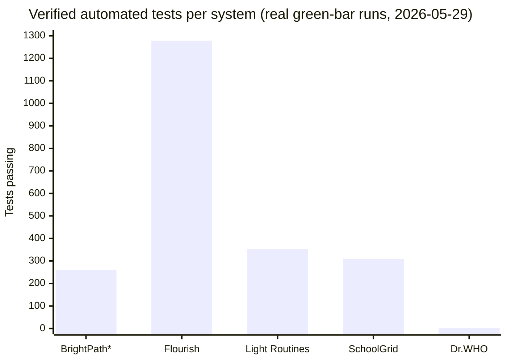

<div align="center">

# Private Projects — Technical Showcase

### Engineering depth behind proprietary client & product work

**The source for these systems is private (client work + active products).**
This repo is the **evidence folder** — architecture diagrams, database schemas, security
patterns, and *real, dated, reproducible* test-run screenshots that prove the depth behind each build.

<br/>

[](#the-portfolio)
[](./Test-Evidence)
[](./Security-Evidence)
[](#technologies)

[**BrightPath**](./BrightPath) ·
[**Lumière**](./Lumiere) ·
[**Light Routines**](./LightRoutines) ·
[**Flourish**](./Flourish) ·
[**DevOPs + Stratum**](./DevOPs)

</div>

---

> **No proprietary code is exposed.** Every diagram and schema is an abstracted representation;
> every screenshot is a capture of a real test command run against the real (private) source,
> dated and reproducible by anyone with repo access. Numbers last re-verified **2026-05-29**.

---

## The Portfolio

| # | Project | Domain | Stack | Headline engineering |
|---|---------|--------|-------|----------------------|
| 1 | [**BrightPath Suite**](./BrightPath) | Multi-tenant school SaaS (+2 companion modules) | React 18 · TypeScript · Supabase · PostgreSQL | 403-table schema · **1,063 RLS policies** · 69 edge functions · 2,228 test files |
| 2 | [**Lumière**](./Lumiere) | Bilingual agency platform | Next.js 16 · React 19 · Prisma · Supabase | 17-model CMS · 40 RSC pages · Stripe · EN/SW i18n |
| 3 | [**Light Routines**](./LightRoutines) | Cross-platform mobile + native engines | Flutter · Swift · Kotlin · SQLite · BLE | 5-package Clean Architecture · native iOS/Android session engines · **354 tests** |
| 4 | [**Flourish**](./Flourish) | Compliance-engineered health platform | Next.js 16 · Expo · Fastify · tRPC · Drizzle | HIPAA-ready · append-only audit ledger · **1,278 tests / 25 workspaces** |
| 5 | [**DevOPs + Stratum**](./DevOPs) | Agent OS + memory backend | TypeScript · Cloudflare Workers · Rust/WASM | three-tier memory · deterministic safety hooks · KadaneDial scheduler |

<sub>BrightPath ecosystem also includes [SchoolGrid](./BrightPath/SchoolGrid) (offline timetabling, 309 tests) and [Exam Analytics](./BrightPath/ExamAnalytics) (Flutter desktop, 12-table drift schema).</sub>

---

## Portfolio at a glance



<sub>*BrightPath bar = a 7-category slice (260) run live; the full repo surface is **2,228 test files / 19,639 `it`/`test()` cases**. Each number above is a real run captured in [Test-Evidence](./Test-Evidence), not an estimate.</sub>

| Portfolio metric | Value |
|---|---|
| Systems documented | 6 (5 headline + BrightPath companions) |
| Verified passing tests (sum of real green-bar runs) | **2,204** (260 + 1,278 + 354 + 309 + 3) |
| BrightPath full test surface | 2,228 test files · 19,639 `it`/`test()` cases |
| Largest codebase | BrightPath — ~485K TS/TSX source LOC |
| Database scale (BrightPath) | 403 tables · 1,063 RLS policies · 82 migrations |
| Languages shipped | TypeScript · Dart · Kotlin · Swift · Java · Rust · Python · SQL |
| Security tooling in CI | Semgrep · gitleaks · CycloneDX SBOM · OWASP ZAP · Playwright a11y/CSP |

---

## Cross-cutting engineering

| Folder | What's inside |
|--------|---------------|
| [**Security Patterns**](./Security-Patterns) | JWT, bcrypt, multi-tenant RLS, XSS/CSRF mitigation, rate limiting, GDPR/COPPA/HIPAA patterns used across projects |
| [**Security Evidence**](./Security-Evidence) | Sanitized excerpts of *real* CI workflows — Semgrep SAST, gitleaks, CycloneDX SBOM, Playwright + CSP, BrightPath RLS policy examples |
| [**Test Evidence**](./Test-Evidence) | Dated, reproducible test-run screenshots + source-tree inventories for every system |

---

## Technologies

```
Frontend        React 18/19 · Next.js 15/16 (App Router, RSC) · Flutter · Tailwind · shadcn/ui · MUI v7
Mobile          Flutter (Dart) · Swift (CoreBluetooth) · Kotlin (Foreground Services) · Expo (React Native)
Backend         Node.js · Fastify · tRPC · Express · Spring Boot · Deno Edge Functions
Database        PostgreSQL · Supabase (RLS) · MySQL · SQLite · drift · Drizzle · Prisma · Sequelize
Auth & Security OWASP Top 10 · multi-tenant RLS · RBAC · JWT · bcrypt · TOTP MFA · biometric gates · Zod · DOMPurify · Clerk
AppSec / CI     Semgrep · gitleaks · CycloneDX SBOM · OWASP ZAP · Playwright (a11y/CSP/consent flows) · pnpm audit
Payments        Stripe · M-Pesa (Daraja) · Airtel Money · MTN Mobile Money
Testing         Vitest · Playwright · Jest · Supertest · JUnit 5 · flutter_test · Testing Library · Maestro
Edge / Infra    Cloudflare Workers · Rust + WASM hot paths · Vercel · Docker · GitHub Actions
AI Systems      OpenAI integration · agent memory architecture · vector + graph stores (Pinecone, Neo4j) · NL→SQL
```

---

## About

I'm **Milton Adina Shisia** — a Computer Science (Cybersecurity) student at Oklahoma Christian
University (Honor Roll · GPA 3.48) with a prior B.S. in Epidemiology & Biostatistics. I build
secure, test-driven systems and served as the **primary engineer** on the client and product
work documented here — from system design through hardening and deployment.

Each case study documents the *how* and *why* behind every major engineering decision.

📫 [LinkedIn](https://www.linkedin.com/in/miltonadina) · [GitHub](https://github.com/MILTONADINA) · miltonadina@gmail.com

<div align="center">

<sub>Built to demonstrate engineering depth, not to replace code. · Numbers re-verified 2026-05-29.</sub>

</div>
