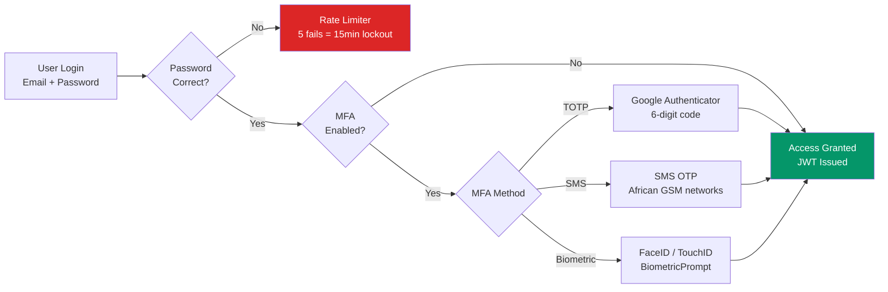
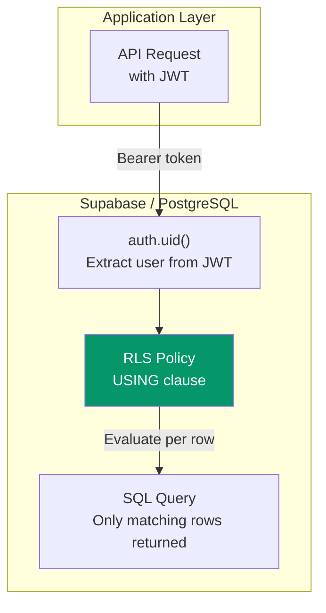
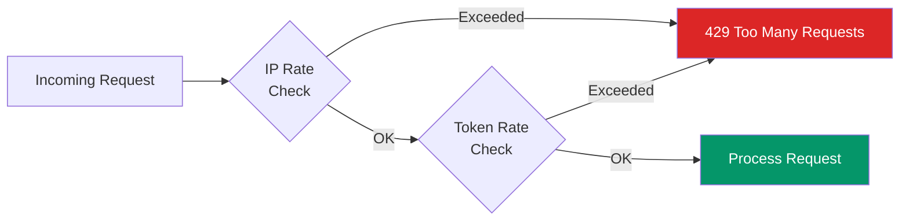

<div align="center">

# Security Patterns

**Cross-Project Security Architecture**

_How I secure real client applications — from authentication to database-level isolation._

</div>

---

> This section documents the security patterns and implementations used across all three private projects. As a Computer Science student with a **Cybersecurity specialization**, security isn't an afterthought — it's foundational to every architecture decision.

---

## 1. Authentication

### JWT Implementation

| Aspect             | BrightPath                                  | Lumière           | Light Routines            |
| ------------------ | ------------------------------------------- | ----------------- | ------------------------- |
| **Provider**       | Supabase Auth                               | Supabase Auth     | Firebase Auth             |
| **Access tokens**  | Short-lived (24h)                           | Short-lived       | Firebase ID tokens        |
| **Refresh tokens** | HTTP-only cookies (30 days)                 | HTTP-only cookies | Firebase SDK managed      |
| **Token rotation** | ✅ On refresh                               | ✅ On refresh     | ✅ Firebase auto          |
| **Secure storage** | Memory (access), HTTP-only cookie (refresh) | HTTP-only cookie  | Secure Enclave / Keystore |

### Multi-Factor Authentication



#### Used Across:

- **BrightPath**: TOTP (Google Authenticator) + SMS OTP (for African mobile-first users) + backup codes (10 recovery codes)
- **Light Routines**: Biometric adult gate (FaceID/TouchID/BiometricPrompt) for high-risk features

### Password Hashing

| Parameter       | Value                                             |
| --------------- | ------------------------------------------------- |
| **Algorithm**   | bcrypt                                            |
| **Cost factor** | 12 (Supabase default, appropriate for production) |
| **Salt**        | Per-password random salt (bcrypt built-in)        |

---

## 2. Authorization

### Row-Level Security (RLS)

RLS is used in both **BrightPath** and **Lumière** to enforce data isolation at the PostgreSQL engine level.



**BrightPath** (Multi-tenant):

- 316 RLS policy references across 34 migrations
- `tenant_id` derived server-side via `auth.uid()` → `user_organizations` lookup
- Client **never** sends a `tenant_id` — even a compromised client cannot access another tenant's data

**Lumière** (Admin-only writes):

- Public data (services, portfolio) readable by `anon` role
- CMS mutations restricted to users in the `admin_users` whitelist table
- Contact submissions and orders only readable by admin

### RBAC (BrightPath)

99 RBAC-related files implementing a hierarchical role system:

| Level | Role                    | Scope          |
| ----- | ----------------------- | -------------- |
| 0     | Platform Admin          | Full system    |
| 10    | School Owner            | Tenant-wide    |
| 20    | Principal               | Organization   |
| 30    | Admin / Bursar          | Administrative |
| 40    | Teacher / Class Teacher | Subject/Class  |
| 80    | Parent                  | Child-scoped   |
| 100   | Student                 | Self-scoped    |

**Permission format**: `resource.action` (e.g., `students.view`, `grades.create`, `fees.manage`)

---

## 3. Input Validation & Sanitization

### Defense Against Injection

| Attack Vector         | Mitigation                                                     | Used In             |
| --------------------- | -------------------------------------------------------------- | ------------------- |
| **SQL Injection**     | Parameterized queries (Prisma ORM / Supabase client)           | All projects        |
| **XSS**               | React automatic escaping + DOMPurify + Content Security Policy | BrightPath, Lumière |
| **CSRF**              | Next.js built-in CSRF tokens + SameSite cookies                | Lumière             |
| **Command Injection** | No shell execution; all operations via ORM/SDK                 | All projects        |

### Zod Schema Validation

All API inputs are validated with Zod schemas before processing:

```typescript
// Example: Contact form validation (Lumière)
const ContactSchema = z.object({
  name: z.string().min(1).max(100),
  email: z.string().email(),
  company: z.string().max(100).optional(),
  phone: z.string().max(20).optional(),
  message: z.string().min(10).max(5000),
  serviceInterested: z.string().optional(),
});
```

---

## 4. Rate Limiting & Anti-Abuse



| Control                  | BrightPath                      | Lumière                          |
| ------------------------ | ------------------------------- | -------------------------------- |
| **Login attempts**       | 5 fails → 15min lockout         | Supabase built-in                |
| **API rate limiting**    | Per user + per IP               | IP + token on contact/newsletter |
| **Webhook verification** | HMAC signature (M-Pesa, Stripe) | Stripe signature verification    |

---

## 5. Data Protection & Compliance

| Requirement               | BrightPath                                         | Lumière                            | Light Routines                    |
| ------------------------- | -------------------------------------------------- | ---------------------------------- | --------------------------------- |
| **Encryption at rest**    | PostgreSQL TDE + field-level PII encryption        | PostgreSQL (Supabase managed)      | SQLite (device-level encryption)  |
| **Encryption in transit** | TLS 1.3                                            | TLS 1.3                            | TLS 1.3                           |
| **Soft deletes**          | `deleted_at` columns                               | `deletedAt` columns                | N/A                               |
| **Audit logging**         | `audit_logs` table (action, resource, changes, IP) | `ContentVersion` table (snapshots) | Session history with stop reasons |
| **Data export**           | GDPR export edge function                          | N/A                                | User-initiated JSON export        |
| **Right to erasure**      | GDPR delete edge function                          | N/A                                | Local data deletion               |
| **Consent tracking**      | `data_processing_consents` table                   | N/A                                | Telemetry opt-in (OFF by default) |

### Regulatory Coverage (BrightPath)

| Regulation | Region           | Status         |
| ---------- | ---------------- | -------------- |
| **GDPR**   | EU/International | ✅ Implemented |
| **POPIA**  | South Africa     | ✅ Implemented |
| **NDPR**   | Nigeria          | ✅ Implemented |

---

## 6. Security Headers & Transport

| Header                      | Value                                 | Used In             |
| --------------------------- | ------------------------------------- | ------------------- |
| `Strict-Transport-Security` | `max-age=31536000; includeSubDomains` | BrightPath, Lumière |
| `Content-Security-Policy`   | Restrictive (no inline scripts)       | BrightPath          |
| `X-Frame-Options`           | `DENY`                                | BrightPath, Lumière |
| `X-Content-Type-Options`    | `nosniff`                             | BrightPath, Lumière |
| `CORS`                      | Restricted to application origins     | Both web projects   |

---

## 7. Secret Management

| Practice                  | Implementation                                       |
| ------------------------- | ---------------------------------------------------- |
| **No secrets in code**    | All sensitive values in `.env` (git-ignored)         |
| **Environment examples**  | `.env.example` with placeholder values               |
| **Production injection**  | CI/CD environment variables (Vercel, GitHub Secrets) |
| **Maintenance endpoints** | Protected by `SEED_SECRET_TOKEN`                     |
| **Webhook verification**  | HMAC signatures for all payment webhooks             |

---

<div align="center">

[← Back to Portfolio](../README.md)

</div>
