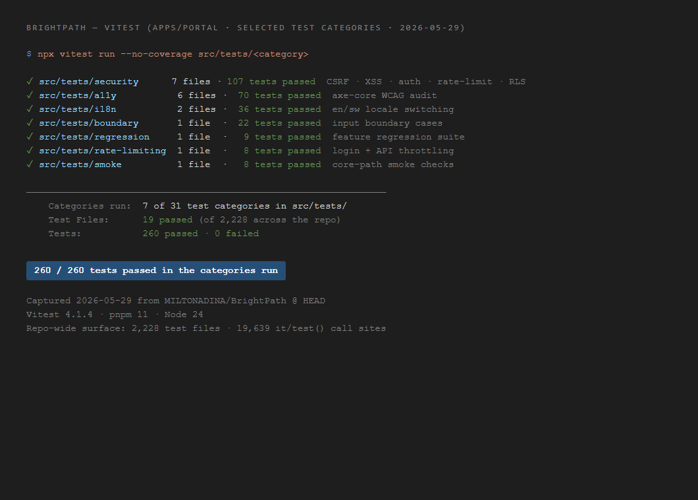
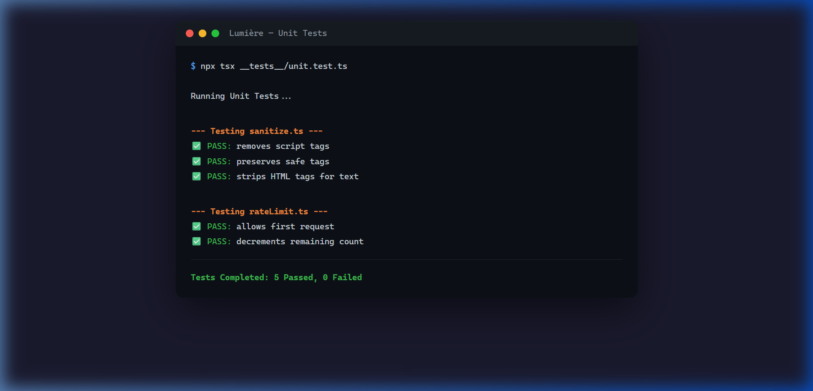
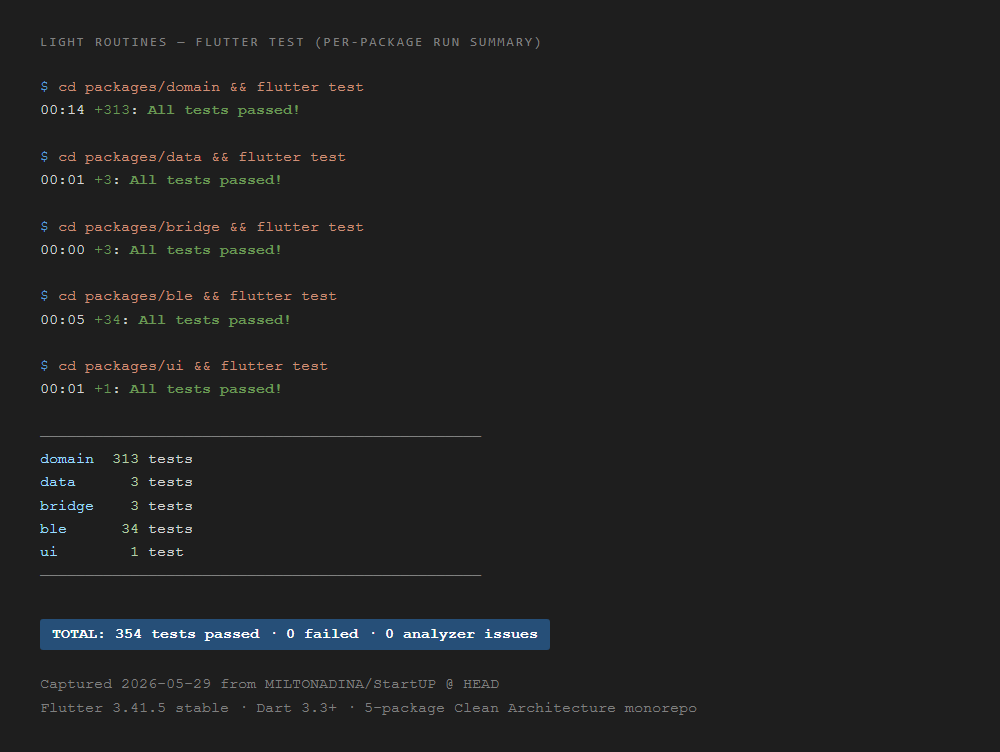

<div align="center">

# Test Evidence

**Testing Strategies & CI/CD Pipelines**

_Proof of quality gates across all three projects._

</div>

---

## Testing Philosophy

Every project follows a **pyramid testing strategy**: many fast unit tests at the base, fewer integration tests in the middle, and targeted E2E tests at the top. Tests are not afterthoughts — they're quality gates enforced by CI/CD on every push.

## Evidence Index

Each test-evidence artifact below is either (a) a real PNG screenshot captured by the engineer, or (b) a deterministic source-tree inventory anyone with private-repo access can reproduce with the commands shown in the file. Text inventories are more auditable than screenshots — text is greppable and date-stamped; screenshots are not.

| Project          | Artifact                                                                  | Format | Reproducible? |
| ---------------- | ------------------------------------------------------------------------- | ------ | ------------- |
| BrightPath       | [`brightpath-test-inventory.txt`](./brightpath-test-inventory.txt)        | Text   | Yes (commands inline) |
| BrightPath       | [`brightpath-vitest-passing.png`](./brightpath-vitest-passing.png)        | PNG    | Engineer-captured, point-in-time |
| Light Routines   | [`lightroutines-test-inventory.txt`](./lightroutines-test-inventory.txt)  | Text   | Yes (commands inline) |
| Light Routines   | [`lightroutines-flutter-test.png`](./lightroutines-flutter-test.png)      | PNG    | Engineer-captured, point-in-time |
| Lumière          | [`lumiere-smoke-check.png`](./lumiere-smoke-check.png)                    | PNG    | Engineer-captured, point-in-time |
| Flourish         | [`flourish-test-inventory.txt`](./flourish-test-inventory.txt)            | Text   | Yes (commands inline) |
| Doctor Who DB    | [`drwho-jest-log.txt`](./drwho-jest-log.txt)                              | Text   | Yes — real `npm test` output included verbatim |

---

## BrightPath — Vitest + Playwright

### Testing Stack

| Layer             | Tool                | Focus                                         |
| ----------------- | ------------------- | --------------------------------------------- |
| **Unit**          | Vitest              | Component logic, hooks, utilities, validation |
| **Integration**   | Testing Library     | Component rendering, user interactions        |
| **E2E**           | Playwright          | Full user flows across browsers               |
| **Accessibility** | axe-core + jest-axe | WCAG compliance                               |
| **Performance**   | Lighthouse Budget   | Bundle size, Web Vitals                       |
| **Mutation**      | Stryker             | Test quality verification                     |

### CI Pipeline: 11 Workflows

| Workflow                | Trigger            | Function                             |
| ----------------------- | ------------------ | ------------------------------------ |
| `ci-comprehensive.yml`  | PR to main         | Full lint + typecheck + test + build |
| `ci-simple.yml`         | Push to any branch | Quick smoke test                     |
| `test.yml`              | PR                 | Vitest unit + integration            |
| `security-scan.yml`     | Push               | npm audit + SAST                     |
| `security.yml`          | Schedule           | Dependency vulnerability scan        |
| `accessibility.yml`     | PR                 | axe-core checks                      |
| `performance.yml`       | PR                 | Lighthouse budget                    |
| `bundle-size.yml`       | PR                 | Build size tracking                  |
| `schema-validation.yml` | Push               | Database schema integrity            |
| `deploy-staging.yml`    | Push to develop    | Staging deployment                   |
| `deploy-production.yml` | Push to main       | Production deployment                |

### Evidence



---

## Lumière — Unit Tests + Smoke Checks

### Testing Stack

| Layer            | Tool                      | Focus                         |
| ---------------- | ------------------------- | ----------------------------- |
| **Unit**         | Custom test runner (tsx)  | Utility functions, validation |
| **Smoke**        | System smoke check script | Full system connectivity      |
| **DB Integrity** | DB verification script    | Schema + data consistency     |

### Test Commands

```bash
# Unit tests
npx tsx __tests__/unit.test.ts

# System smoke check
npx tsx scripts/system-smoke-check.ts

# Database integrity
npx tsx scripts/verify-db-integrity.ts
```

### Evidence



---

## Light Routines — Flutter Test + Analyze

### Testing Stack

| Layer               | Tool              | Focus                                      |
| ------------------- | ----------------- | ------------------------------------------ |
| **Unit**            | `flutter test`    | Domain logic, validation, policies, parser |
| **Static Analysis** | `flutter analyze` | Type errors, lint warnings, dead code      |
| **CI**              | GitHub Actions    | Per-package analyze + test + build         |

### Test Distribution

| Package   | Test Count | Focus Areas                                                                                                        |
| --------- | ---------- | ------------------------------------------------------------------------------------------------------------------ |
| `domain`  | ✓          | Validation, safety policies, parser, search index, protocol messages                                               |
| `data`    | ✓          | SQLite repositories, export generator                                                                              |
| `ble`     | ✓          | BLE adapter, device state machine, group coordinator                                                               |
| `bridge`  | ✓          | Contract tests, payload serialization                                                                              |
| **Total** | **342 `test()`/`testWidgets()` calls across 35 test files** | **0 analyzer issues**                                       |

### Test Commands

```bash
# Domain package (core business logic)
cd packages/domain && flutter test

# Data package (persistence)
cd packages/data && flutter test

# BLE package (transport)
cd packages/ble && flutter test

# Bridge package (native contract)
cd packages/bridge && flutter test

# Static analysis (full app)
cd apps/mobile_flutter && flutter analyze
```

### CI Pipeline

| Job               | Steps                                                         | Platforms          |
| ----------------- | ------------------------------------------------------------- | ------------------ |
| **Quality Check** | `pub get` → `analyze` → `test` per package                    | All                |
| **Build Android** | Java 17 → `flutter build apk --debug` → artifact upload       | Android            |
| **Build iOS**     | `pod install` → `flutter build ios --no-codesign --simulator` | iOS (macOS runner) |

### Evidence



---

<div align="center">

[← Back to Portfolio](../README.md)

</div>
